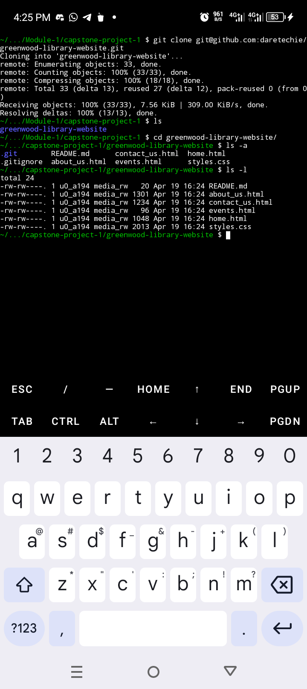

# Greenwood Library Website - Git Collaboration Guide 🌱


[](https://github.com/daretechie/greenwood-library-website/blob/main/LICENSE)
<--[](https://github.com/daretechie/greenwood-library-website)-->

**Repository**: [github.com/daretechie/greenwood-library-website](https://github.com/daretechie/greenwood-library-website)


## Objectives 🎯
1. Practice collaborative Git workflows with multiple contributors
2. Implement feature branching strategy
3. Manage pull requests (PRs) and conflict resolution
4. Maintain clean commit history
5. Simulate real-world team collaboration between:
   - **Morgan** (Book Reviews Section)
   - **Jamie** (Events Page Updates)

## Project Setup 💻

### 1. Clone Repository
```bash
git clone https://github.com/daretechie/greenwood-library-website.git
cd greenwood-library-website
```


### 2. Initial Commit Structure
```bash
main
├── home.html
├── about_us.html
├── events.html
├── contact_us.html
└── README.md

```

## Contributor Workflows 🔄

### Morgan's Task: Add Book Reviews
```bash
# Create feature branch
git checkout -b morgan/add-book-reviews
```


```sh
# Add new feature
touch book_reviews.html
git add book_reviews.html
git commit -m "feat: add book reviews section"

# Push to remote
git push origin morgan/add-book-reviews
```

**PR Process:**
1. Create PR from `add-book-reviews` ➔ `main`
2. Request review from Jamie
3. Address feedback (if any)
4. Merge using **Squash and Merge**


### Jamie's Task: Update Events Page
```bash
# Sync with main first
git checkout main
git pull origin main
```


# Create feature branch

```sh
git checkout -b jamie/update-events
```


```sh
# Make changes
git add events.html
git commit -m "feat: update community events"

# Push to remote
git push origin jamie/update-events
```

**PR Process:**
1. Create PR from `update-events` ➔ `main`
2. Ensure branch is updated with latest `main`:
   ```bash
   git checkout update-events
   git merge main
   ```


3. Resolve conflicts (if any)
4. Merge using **Rebase and Merge**

## Conflict Resolution Protocol ⚠️
1. Identify conflicting files
2. Discuss changes with team
3. Use VS Code merge editor
4. Test merged code locally
5. Commit resolution:
   ```bash
   git add .
   git commit -m "fix: resolve merge conflicts"
   ```

## Workflow Summary Table 📋

| Action                | Morgan's Command                          | Jamie's Command                          |
|-----------------------|-------------------------------------------|------------------------------------------|
| Create Branch         | `git checkout -b add-book-reviews`        | `git checkout -b update-events`          |
| Daily Sync            | `git pull origin main`                    | `git fetch && git rebase origin/main`    |
| Commit Message        | `git commit -m "feat: add review card"`   | `git commit -m "feat: update event"`     |
| Push Changes          | `git push origin add-book-reviews`        | `git push origin update-events`          |
| PR Merge Strategy     | Squash                                    | Rebase                                   |

--- 

**Happy Collaborating!** 👥💻  
*Maintain clean history, write meaningful messages, and communicate often!*

