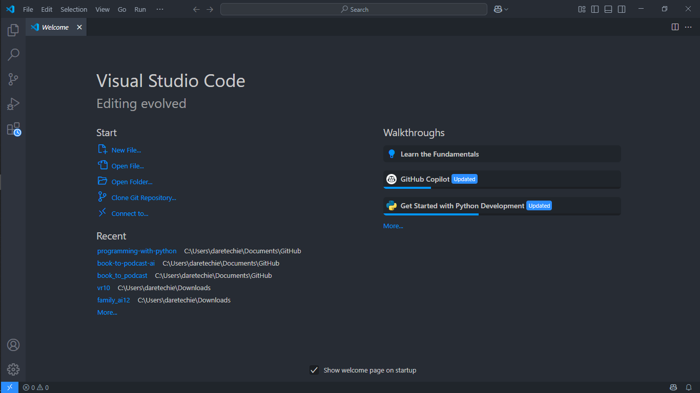
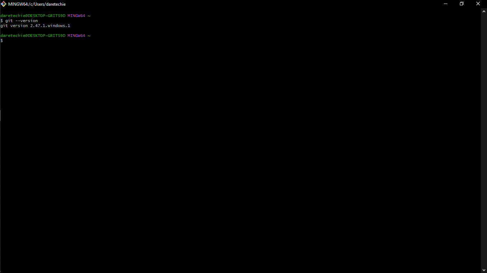
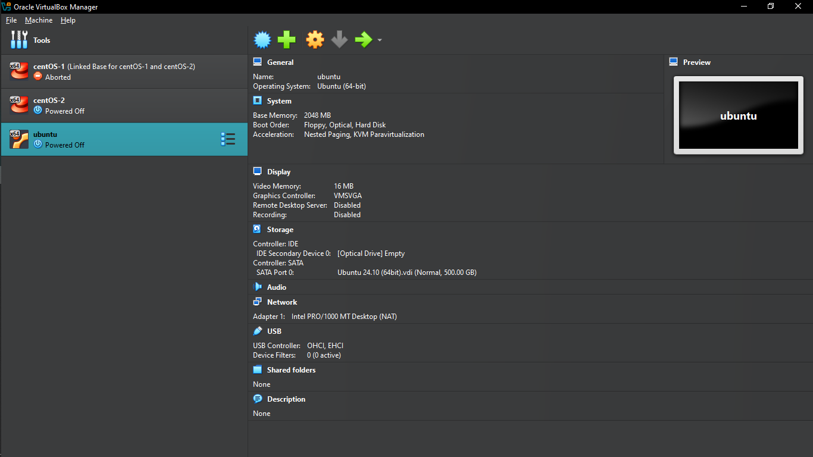
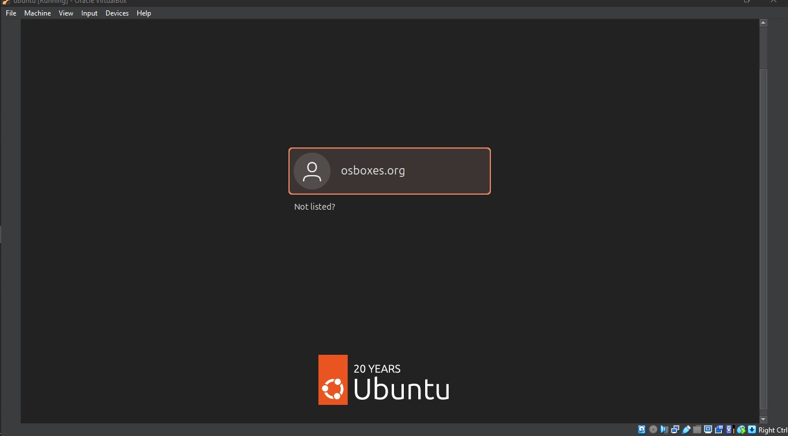

# **Tech Environment Setup (Windows)**

## **Introduction**
This guide provides step-by-step instructions for setting up a tech environment on Windows for the DevOps program. It covers essential software installations, account setups, and troubleshooting tips, along with verification steps and screenshots.

## **Prerequisites**
- **Internet Connection** – Required for downloading tools and accessing online resources.
- **Computer Requirements** – Minimum **8GB RAM** (64-bit recommended) for running virtual machines.

## **Required Installations**

### **1. Visual Studio Code (VS Code)**
- **Download**: [VS Code Official Website](https://code.visualstudio.com/)
- **Installation Steps**:
  1. Download the Windows installer.
  2. Run the installer (`.exe` file).
  3. Click "Next" through the installation wizard.
  4. Click "Finish" to complete the installation.
  5. **Launch**: Open from the Start Menu or search for **VS Code** in Windows search.



### **2. Git**
- **Download**: [Git for Windows](https://git-scm.com/download/win)
- **Installation Steps**:
  1. Download and run the `.exe` installer.
  2. Select default options for **command-line integration** and **OpenSSL** security.
  3. Click "Finish" to complete the installation.
- **Verification**:
  1. Open **Git Bash**.
  2. Run the following command:
     ```sh
     git --version
     ```
  

### **3. VirtualBox (For Running Ubuntu)**
- **Download**: [Oracle VirtualBox](https://www.virtualbox.org/)
- **Installation Steps**:
  1. Download the Windows **host** version.
  2. Run the `.exe` installer and follow the wizard.
  3. Click "Finish" after installation.
  

### **4. Ubuntu on VirtualBox (Linux Environment Setup)**
- **Download Ubuntu ISO**: [Ubuntu Official Site](https://ubuntu.com/download/desktop)
- **Steps to Install Ubuntu on VirtualBox**:
  1. Open VirtualBox and create a new virtual machine (**Linux → Ubuntu**).
  2. Allocate at least **2GB RAM** and create a **Virtual Hard Disk**.
  3. Select the downloaded Ubuntu `.iso` file.
  4. Start the Virtual Machine and follow the Ubuntu installation process.
  
  
## **Required Account Setups**
- **GitHub Account**: [Sign Up on GitHub](https://github.com/)
- **AWS Account**: [AWS Free Tier](https://aws.amazon.com/free/) (Requires a credit card with at least $1 balance).

## **Troubleshooting & Common Errors**

### **1. Virtualization Not Enabled**
- **Issue**: VirtualBox fails to run Ubuntu, showing an error about virtualization.
- **Solution**:
  1. Restart your computer and enter **BIOS settings** (usually by pressing `F2` or `DEL` during boot).
  2. Enable **Virtualization Technology (VT-x or AMD-V)**.
  3. Save changes and restart.

### **2. C++ Redistributable Error**
- **Issue**: VirtualBox requires Microsoft C++ Redistributable.
- **Solution**:
  1. Download and install [Microsoft Visual C++ Redistributable](https://aka.ms/vs/16/release/vc_redist.x64.exe).
  2. Restart your computer and try installing VirtualBox again.

