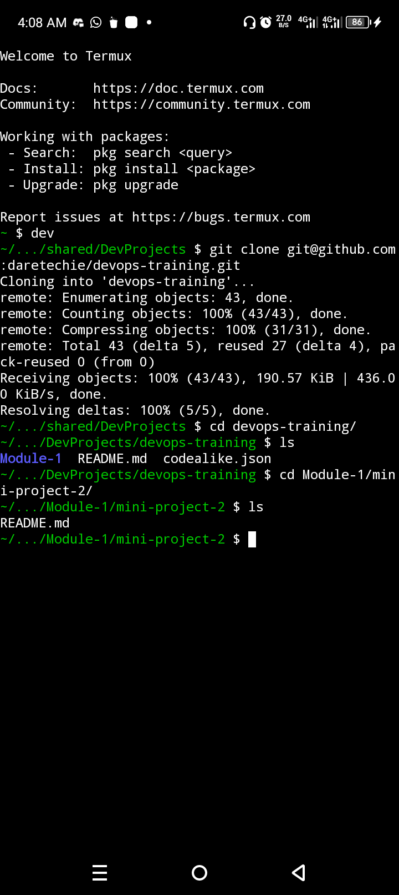
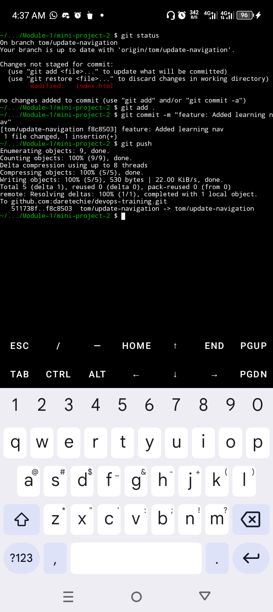
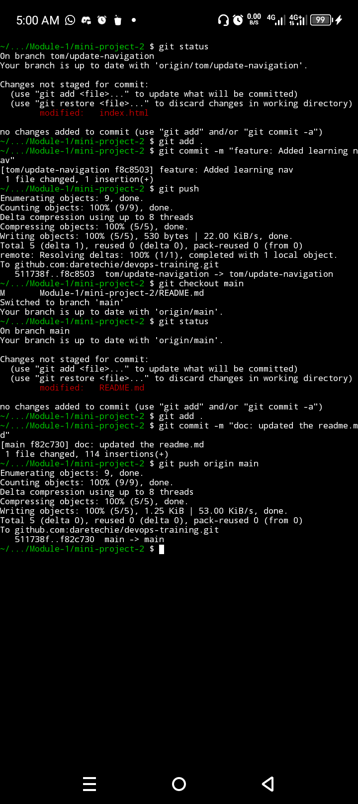
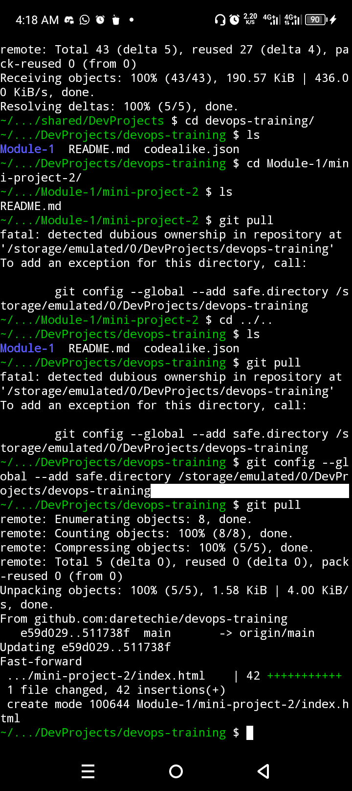
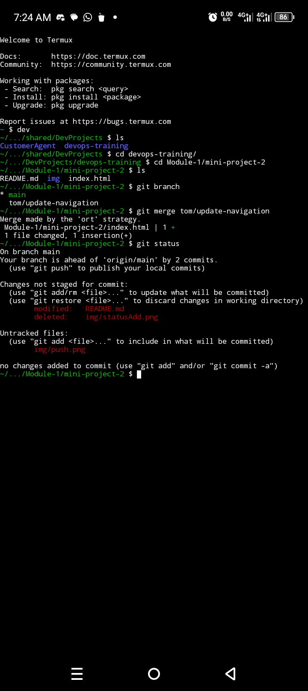
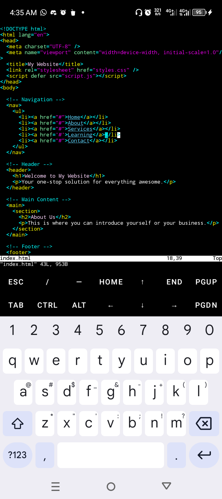
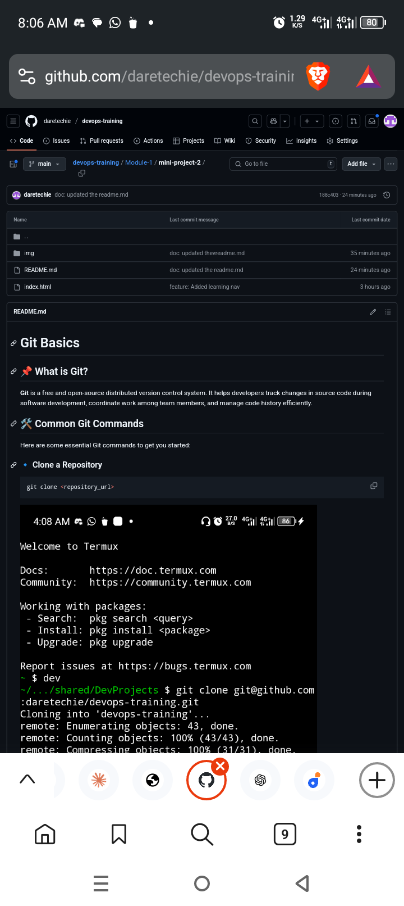

# Git Basics

## 📌 What is Git?

**Git** is a free and open-source distributed version control system. It helps developers track changes in source code during software development, coordinate work among team members, and manage code history efficiently.

## 🛠️ Common Git Commands

Here are some essential Git commands to get you started:

### 🔹 Clone a Repository
```bash
git clone <repository_url>
```


Copies a remote repository to your local machine.


---

🔹 Check Status
```sh
git status
```


Shows the current status of files in the working directory and staging area.


---

🔹 Create a Branch
```sh
git branch <branch_name>
```


Creates a new branch.


---

🔹 Switch to a Branch
```sh
git checkout <branch_name>
```


Switches to the specified branch.


---

🔹 Create and Switch to a Branch
```sh
git checkout -b <branch_name>
```


Creates a new branch and switches to it immediately.


---

🔹 Add Files to Staging
```sh
git add <file_name>
# or add all files
git add .
```


Add file(s) to stage for committing.
---

🔹 Commit Changes
```sh
git commit -m "Your commit message"
```


Saves the staged changes with a message.


---

🔹 Push to Remote Repository
```sh
git push origin <branch_name>
```

---

🔹 Pull Latest Changes
```sh
git pull
```


Fetches and merges changes from the remote repository into your current branch.


---

🔹 Merge a Branch
```sh
git merge <branch_name>
```


Merges the specified branch into your current branch.


---

🔹 The HTML
The html index is [here](/Module-1/mini-project-2/index.html).



---

🔹 GitHub Dashboard




✅ Tips

- Always pull before you push to avoid merge conflicts.

- Use meaningful commit messages.

- Branching helps in managing features, bug fixes, and experiments without affecting the main codebase.
