# Pull Requests & Merging in Git

## 🎯 Objective

This document explains the concepts and process of creating Pull Requests (PRs) and merging branches in Git. It is designed to help to understand how to contribute changes to a shared repository, collaborate with others, and maintain a clean and organized codebase. This includes creating PRs, reviewing changes, resolving merge conflicts, and finalizing the merge process.

---

## 🔄 What is a Pull Request (PR)?

A **Pull Request** (PR) is a way to propose changes to a codebase. It allows developers to notify team members about changes they've pushed to a branch in a repository, usually with the intention of merging into the `main` or `development` branch after review.

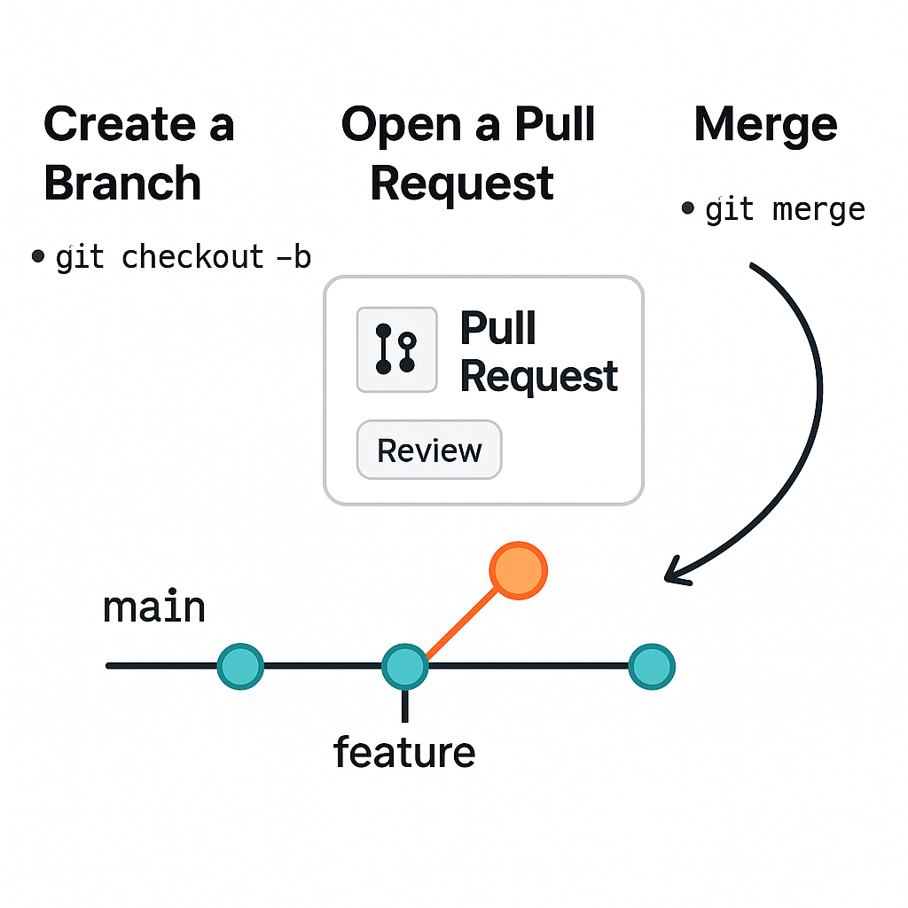

---

## 🛠️ Basic Workflow for PR and Merge

### 1. **Create a New Branch**
```bash
# Tom's branch
git checkout -b tom/update-navigation

# Jerry's branch
git checkout -b jerry/update-contact
```

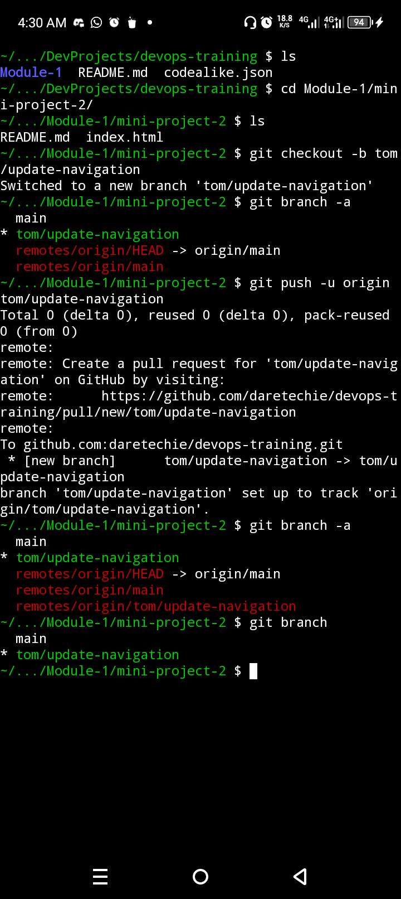

---

2. Make Your Changes

Edit, add, or delete files as needed.


---

3. Stage and Commit Your Changes

```sh
git add .
git commit -m "Add my new feature"
```

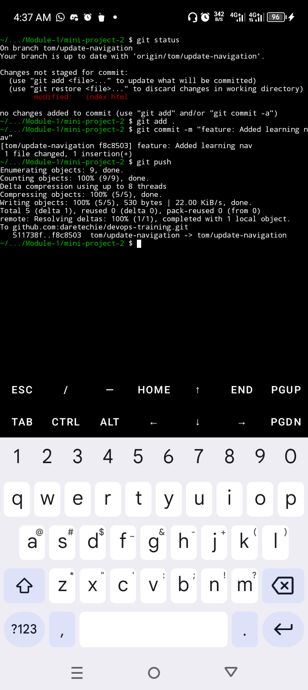
---

4. Push the Branch to Remote

git push origin feature/my-feature

```bash
# Tom's branch
git push  origin tom/update-navigation

# Jerry's branch
git push origin jerry/update-contact
```

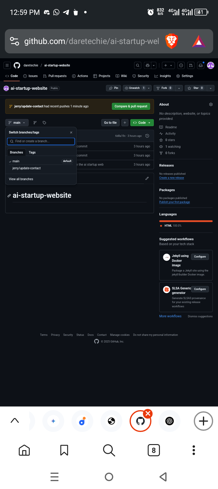
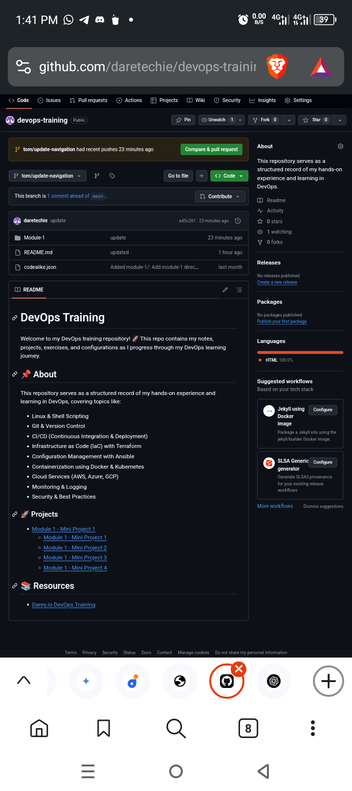
---

5. Create a Pull Request

Go to your repository on GitHub/GitLab/Bitbucket and:

Click on Compare & pull request

Add a title and description

Assign reviewers if needed

Click Create pull request


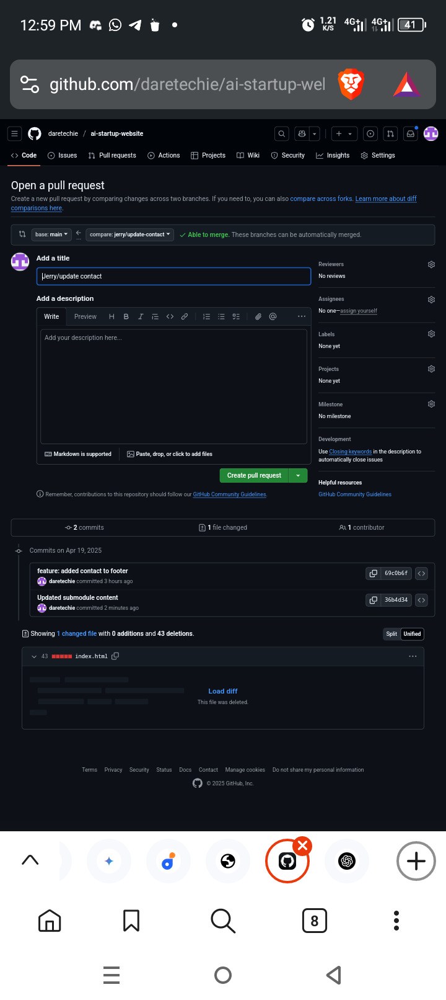
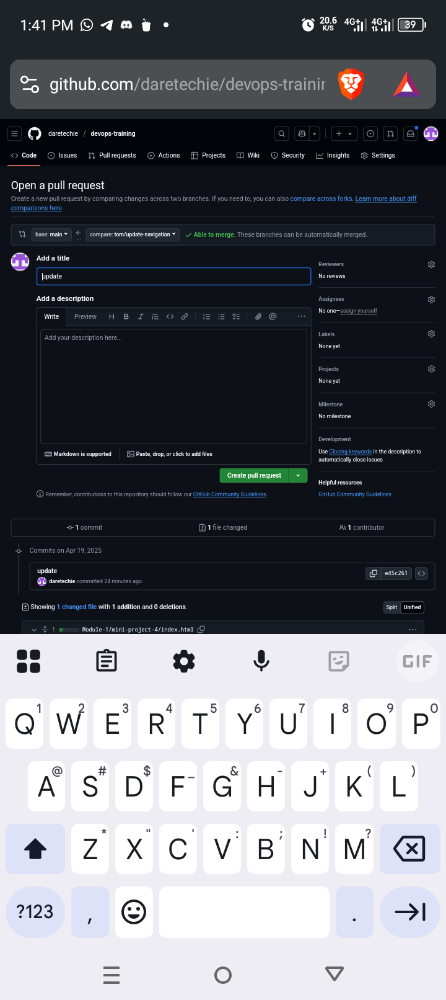

---

6. Review and Approve

Team members can:

Add comments

Request changes

Approve the PR


---

7. Merge the Pull Request

Once approved, you can merge:

Click Merge pull request

Confirm the merge

Optionally delete the branch after merging


Alternatively, from the command line:

```sh
git checkout main
git pull
git merge feature/my-feature
```
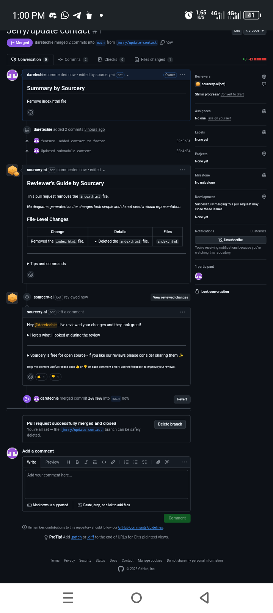
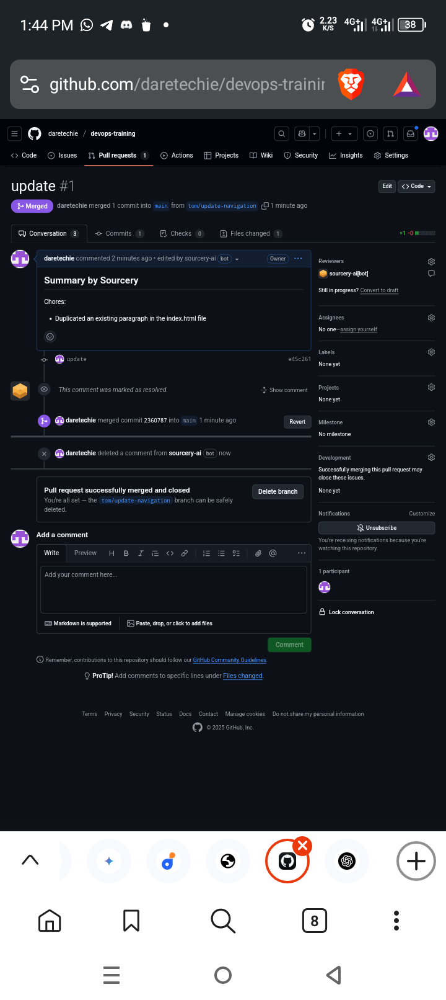
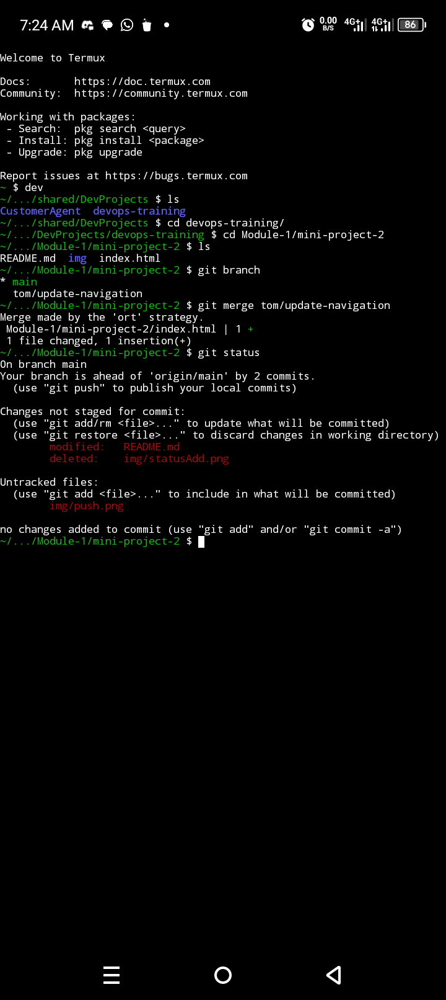
---

8. Pull Latest Changes

After merging, make sure everyone updates their local copy:

```sh
git pull origin main
```
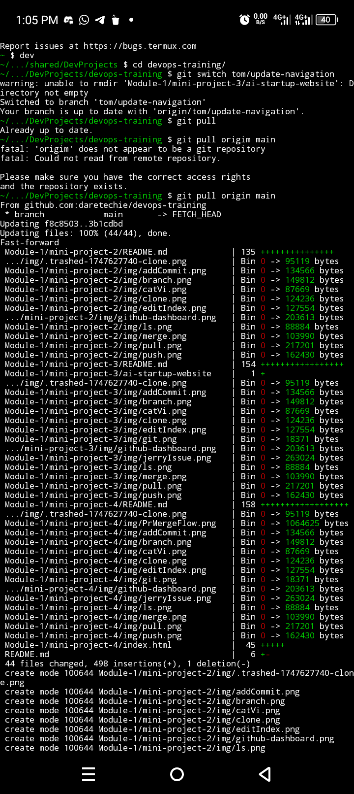

---

⚠️ Resolving Merge Conflicts

If you encounter merge conflicts:
```sh
git status
# Edit the conflicting files to resolve manually
git add <resolved_file>
git commit
```

---

---

✅ Best Practices

Always branch off from the latest main or develop.

Keep PRs focused and small.

Write clear PR titles and meaningful descriptions.

Review code carefully before merging.

Delete stale branches after merging to keep the repo clean.


---

📚 Resources

[GitHub PR Docs](https://docs.github.com/en/pull-requests)

