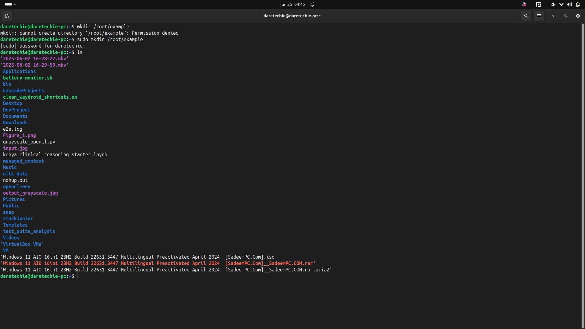
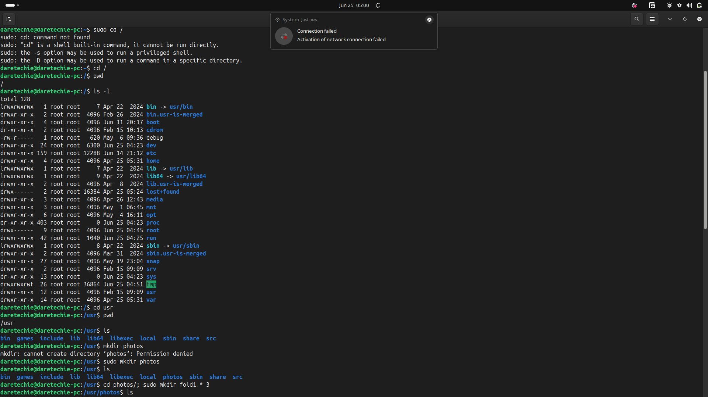
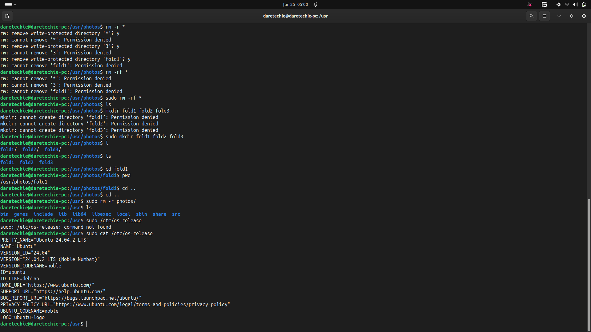
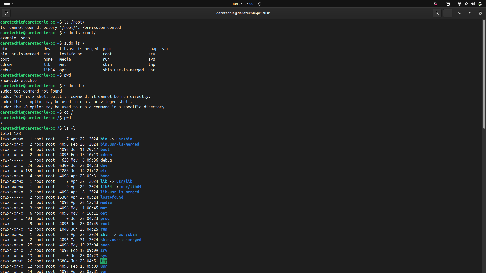
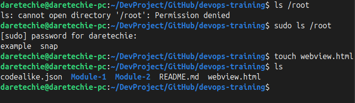
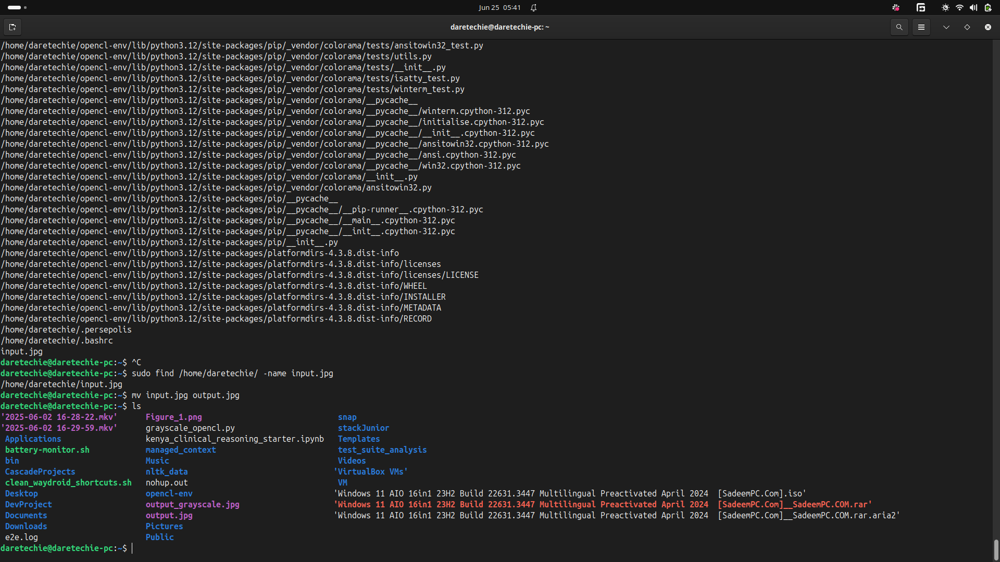

# Linux Commands Deep Dive

This guide explores foundational Linux commands that every DevOps engineer or server administrator must master. It walks through syntax, usage, examples, and a practical mini-task.

## What is a Linux Command?

A **Linux command** is a program or utility that runs in the **command-line interface (CLI)**. These commands allow you to manage files, users, permissions, packages, and system configurations.

### General Command Syntax:

```sh
CommandName [option(s)] [parameter(s)]
```

- **CommandName**: the action to perform, e.g. `ls`, `mkdir`
- **Option/Flag**: modifies behavior, e.g. `-l`, `--help`
- **Parameter/Argument**: input for the command, e.g. file or directory names

## Basic File and Directory Management Commands

### 1. `ls` — List Files

```sh
ls
ls -l     # long format
ls -a     # show hidden files
ls -lh    # human-readable size
```



### 2. `pwd` — Print Working Directory

```sh
pwd
```



### 3. `cd` — Change Directory

```sh
cd /usr
cd ..     # go up one directory
cd ~      # go to home directory
```

### 4. `mkdir` — Create Directory

```sh
mkdir photos
```



## The `sudo` Command

Some actions require **root (admin)** privileges. Use `sudo` to temporarily gain elevated rights.

### Example: Creating a folder in a protected directory

```sh
mkdir /root/example      # Fails
sudo mkdir /root/example # Succeeds
```


## Side Hustle Task)

### View contents with sudo:

```sh
sudo ls /root
```


## Exploring the Linux Filesystem

### Root `/` contains:

- `/bin` — Essential commands like `ls`, `cp`
- `/etc` — Configuration files
- `/home` — User folders
- `/root` — Root user’s home
- `/usr` — User programs/utilities
- `/var` — Logs and variable data

Use `ls` and `cd` to explore.

```sh
sudo cd /
pwd
sudo ls -l
```



## Side Hustle Task 1 ✅

```sh
sudo mkdir /usr/photos
cd /usr/photos
mkdir fold1 fold2 fold3
ls
cd fold1
pwd
```


## Useful File Handling Commands

### 1. `cat` — View File Contents

```sh
sudo cat /etc/os-release
```


### 2. `cp` — Copy Files & Directories

```sh
cp file.txt /home/ubuntu/Documents
cp file1.txt file2.txt /home/ubuntu
cp -R folder1 folder2
```

### 3. `mv` — Move or Rename

```sh
mv file.txt /home/ubuntu
mv old.txt new.txt
```

### 4. `rm` — Delete Files/Directories

```sh
rm file.txt
rm file1 file2
rm -r folder/
rm -f force.txt
```

### 5. `touch` — Create Empty Files

```sh
touch /home/ubuntu/Documents/Web.html
```



### 6. `find` — Search for Files

```sh
find /home -name notes.txt
```



## Final Tips

- Commands are **case-sensitive**.
- Use `man command` to learn more about any command.
- Use `history` to view previous commands.

Stay safe with `sudo` and practice consistently!
