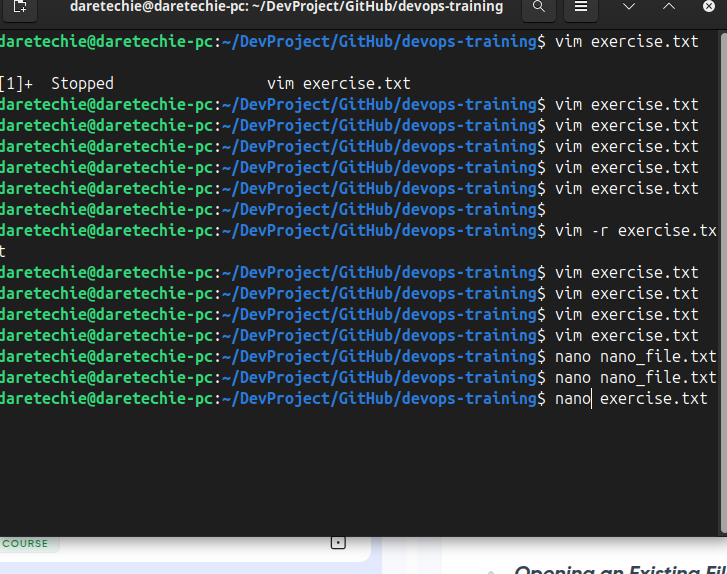

# Linux Text Editors

Text editors are essential tools in any Linux environment. They allow you to create, edit, and manage text-based files such as scripts, configuration files, logs, and more.

This guide introduces two widely-used Linux text editors: **Vim** and **Nano**, including step-by-step instructions and image placeholders for hands-on practice.

---

## VIM Text Editor

Vim (Vi Improved) is a powerful, modal text editor known for its efficiency and steep learning curve.

### **Open or Create a File in Vim**

```sh
vim exercise.txt
```

This opens (or creates) `exercise.txt` in Vim.


### **Enter Insert Mode**

- Press `i` to switch to **Insert Mode**.
- Type:

```text
Hello, this is a Vim hands-on project.
Welcome to darey.io.
```


### **Navigation in Normal Mode**

- Use `ESC` to exit Insert Mode.
- Move around using:

  - Arrow keys or
  - `h` (left), `j` (down), `k` (up), `l` (right)

### **Deleting Content**

- **Character**: Place cursor and press `x`
- **Line**: Press `dd`

### **Undo Changes**

- Press `u` in Normal Mode

### **Save and Quit**

```sh
:wq
```

- `w` to write (save), `q` to quit

### **Quit Without Saving**

```sh
:q!
```

---

## Nano Text Editor

Nano is a user-friendly, non-modal editor that's easier for beginners.

### **Create or Open a File**

```sh
nano nano_file.txt
```



### **Enter Insert Mode**

- Press `i`)

### **Type and Edit Text**

- Begin typing immediately.
- Example content:

```text
Hello, this is a Vim hands-on project.
Welcome to darey.io.
```

### **Save Changes**

- Press `Ctrl + O`, then `Enter`

### **Exit Nano**

- Press `Ctrl + X`
- Confirm save if prompted

### **Open Existing File**

```sh
nano exercise.txt
```

- Use arrow keys to navigate and make changes

---

## Final Note

- **Vim** is preferred for advanced users working on large-scale or automation scripts.
- **Nano** is best for quick edits or beginners.

Use these editors often and get comfortable — you'll use them frequently in any Linux or DevOps role!
