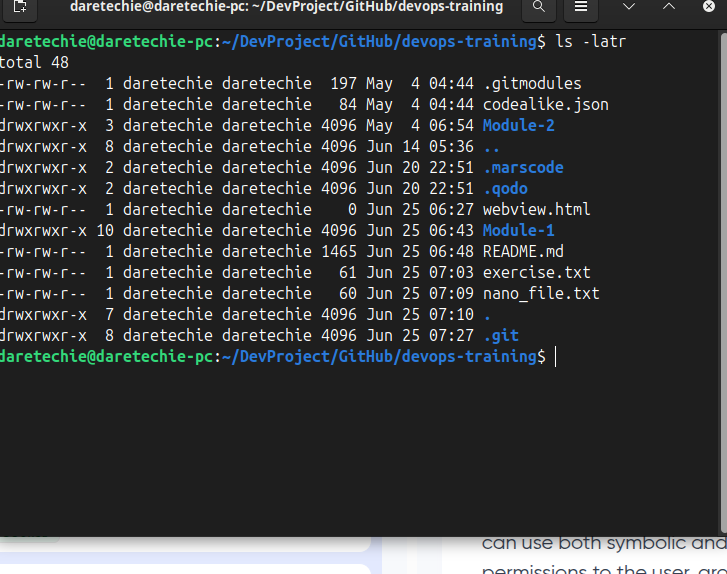
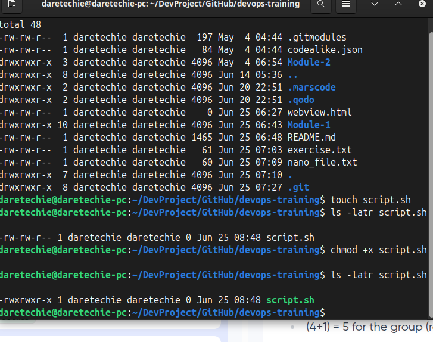
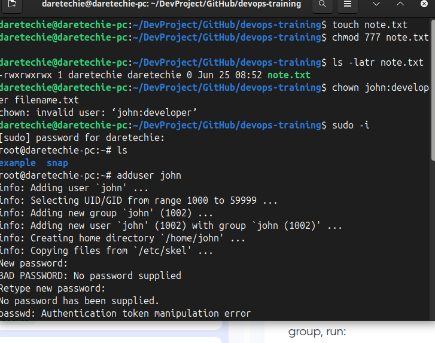
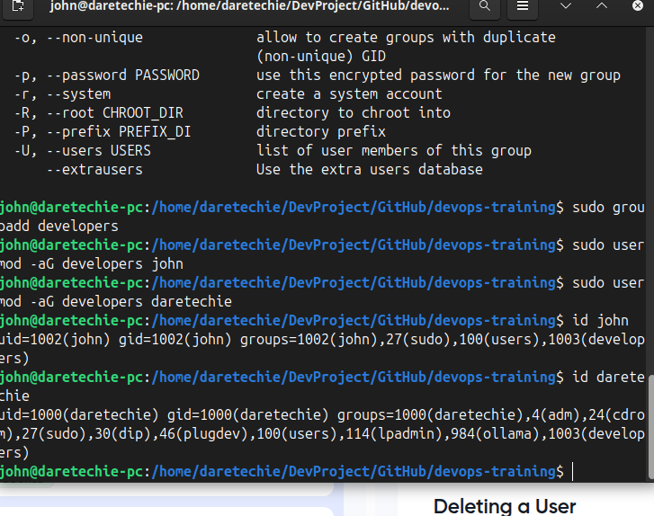
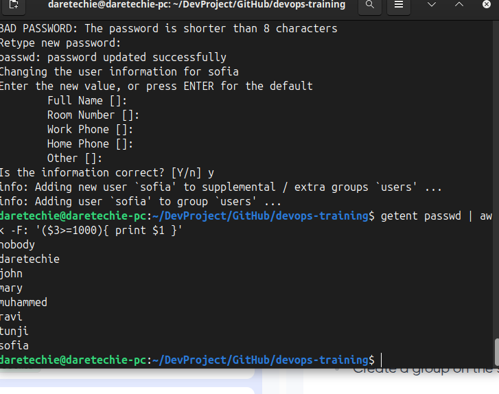
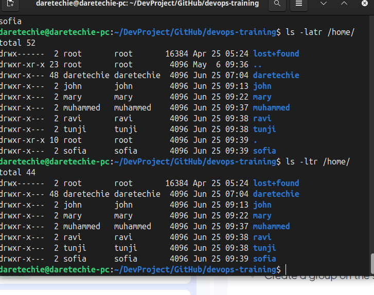
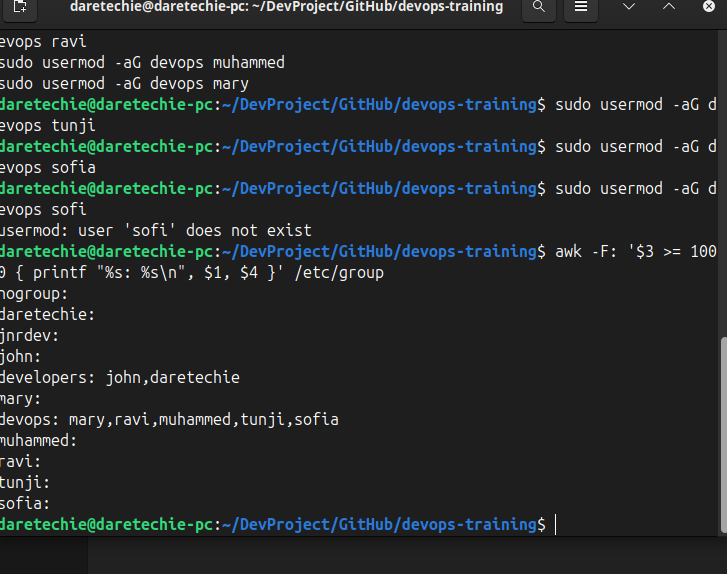

# Advanced Linux Commands: File Permissions, Ownership, and User Management

This guide introduces essential advanced Linux concepts: file permissions, ownership, and user management—critical for every DevOps or system administrator.

---

## 🔐 File Permissions and Access Rights

Understanding how to manage file permissions and ownership is crucial for securing your system.

### 🔢 Numeric Representation of Permissions

- **0** = no permissions
- **4** = read (r)
- **2** = write (w)
- **1** = execute (x)

| Value | Symbolic | Meaning              |
| ----- | -------- | -------------------- |
| 7     | rwx      | Read, write, execute |
| 6     | rw-      | Read, write          |
| 5     | r-x      | Read, execute        |

### 🧑 User Classes

- **Owner (User)**
- **Group**
- **Others**

The permission string `-rwxr-xr-x` or `drwxr-xr-x` breaks down as:

- `-` = regular file
- `d` = directory
- `rwxr-xr-x` = permissions
- `rwx` = Owner permissions
- `r-x` = Group permissions
- `r-x` = Others permissions

### 📂 View File Permissions

```sh
ls -latr
```



Use `ls -latr` to list files and see their permission strings.

If you see permission issues, verify your user's group or ownership of the file using `ls -l filename` or `id`.

---

## 🔧 File Permission Commands

### `chmod` — Change Permissions

```sh
touch script.sh
ls -latr script.sh
chmod +x script.sh
ls -latr script.sh
chmod 755 script.sh
chmod 777 note.txt
```



---

### `chown` — Change Ownership

```sh
chown john:developer filename.txt
ls -latr filename.txt
```



⚠️ **Troubleshooting Tip:**
If you encounter an error like `invalid group: 'developer'`, ensure the group exists:

```sh
groupadd developer
```

Use `getent group developer` to confirm.

---

## 👑 Superuser Privileges

To temporarily access root permissions:

```sh
sudo -i
exit
```

---

## 👥 User Management on Linux

### Add a New User

```sh
sudo adduser john
```


### Grant Sudo Privileges

```sh
sudo usermod -aG sudo john
```

### 🧪 Task:

- Log in as `john`
- Navigate to `/home/john`

### Switch Users

```sh
su john
```

### Change Password

```sh
sudo passwd john
```

---

## 👨‍👩‍👧‍👦 Group Management

### Create a Group

```sh
sudo groupadd developers
```

### Add Users to Group

```sh
sudo usermod -aG developers john
```

### Verify Group Membership

```sh
id john
```



### Delete a User

```sh
sudo userdel username
```

### Manage Group Permissions

```sh
sudo chown :developers /path/to/dir
sudo chmod g+rw /path/to/dir
```

---

## ⏰ Bonus: Task Scheduling for Automation

In real-world DevOps work, managing users or permissions manually every time is inefficient. Task scheduling automates this using `cron` jobs.

### Example: Automatically check permission of user home folders daily

```sh
crontab -e
```

Add the following:

```sh
0 2 * * * /usr/bin/ls -lh /home > /var/log/home-permissions.log
```

This logs all home folder permissions every day at 2 AM.

---

## 💼 Side Hustle Task 3

1. Create a group named `devops`
2. Create users: `mary`, `mohammed`, `ravi`, `tunji`, `sofia`
3. Add each user to the `devops` group
4. Create a home folder for each user under `/home`
5. Ensure group ownership of each folder is set to `devops`

```sh
sudo groupadd devops
for user in mary mohammed ravi tunji sofia; do
  sudo adduser $user
  sudo usermod -aG devops $user
  sudo mkdir /home/$user
  sudo chown $user:devops /home/$user
  sudo chmod 770 /home/$user
done
```



---



---



---

Mastering permissions and user management helps protect your Linux environment and ensures organized, secure team workflows.
