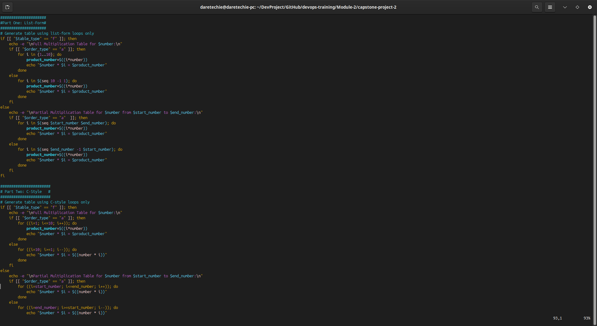
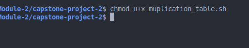
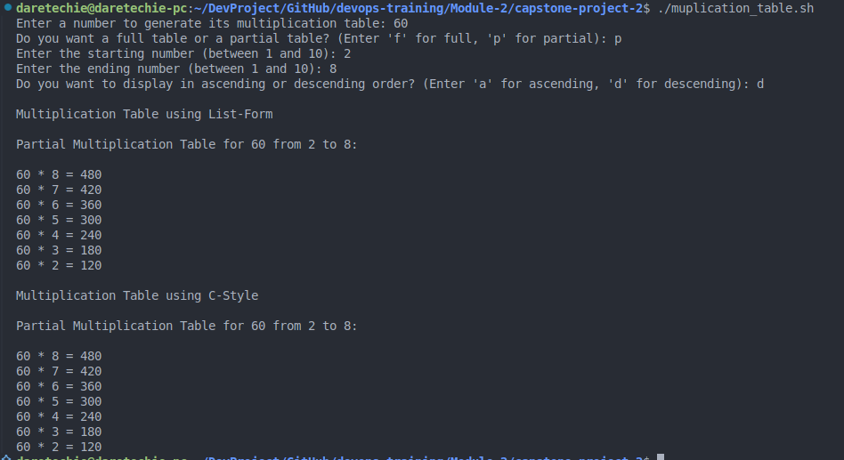

# 📊 Bash Script for Generating a Multiplication Table

A Bash scripting project to generate a multiplication table based on user input. This task demonstrates the use of **loops**, **conditional logic**, **input validation**, and **user interaction** in real Bash scripting scenarios. Both list-form and C-style loops will be used.

---

## 🧠 Objective

Create a Bash script that:

- Prompts the user to enter a number.
- Asks if they want a full (1–10) or partial table.
- Uses **both list-form and C-style loops** to print the table.
- Includes input validation and error handling.
- Offers clear, well-formatted output.

---

## 📁 Step-by-Step Instructions

### 1. **Create the Script File**

```bash
vim multiplication_table.sh
```

```bash
#!/bin/bash

# Prompt the user
read -p "Enter a number to generate its multiplication table: " number
number=$(echo "$number" | xargs)  # Trim whitespace

while [[ ! "$number" =~ ^[0-9]+$ ]]; do
    echo -e "Invalid input. Please enter a valid number.\n"
    read -p "Enter a number to generate its multiplication table: " number
    number=$(echo "$number" | xargs)  # Trim whitespace
done

# Table type
read -p "Do you want a full table or a partial table? (Enter 'f' for full, 'p' for partial): " table_type
while [[ ! "$table_type" =~ ^[fp]$ ]]; do
    echo -e "Invalid input. Enter 'f' for full or 'p' for partial.\n"
    read -p "Do you want a full table or a partial table? (Enter 'f' for full, 'p' for partial): " table_type
done

# Start and end only required for partial
if [[ "$table_type" == "p" ]]; then
    read -p "Enter the starting number (between 1 and 10): " start_number
    read -p "Enter the ending number (between 1 and 10): " end_number

    # Validate start and end numbers
    while [[ ! "$start_number" =~ ^[1-9][0-9]*$ || ! "$end_number" =~ ^[1-9][0-9]*$ || "$start_number" -gt "$end_number" ]]; do
        echo -e "Invalid input. Please enter valid start and end numbers.\n"
        read -p "Enter the starting number (between 1 and 10): " start_number
        read -p "Enter the ending number (between 1 and 10): " end_number
    done
fi

# Ask for order
read -p "Do you want to display in ascending or descending order? (Enter 'a' for ascending, 'd' for descending): " order_type

# Validate order type
while [[ ! "$order_type" =~ ^[ad]$ ]]; do
    echo -e "Invalid input. Please enter 'a' for ascending or 'd' for descending.\n"
    read -p "Do you want to display in ascending or descending order? (Enter 'a' for ascending, 'd' for descending): " order_type
done

#####################
#Part One: List-Form#
#####################
# Generate table using list-form loops only
if [[ "$table_type" == "f" ]]; then
    echo -e "\nFull Multiplication Table for $number:\n"
    if [[ "$order_type" == "a" ]]; then
        for i in {1..10}; do
            product_number=$((i*number))
            echo "$number * $i = $product_number"
        done
    else
        for i in $(seq 10 -1 1); do
            product_number=$((i*number))
            echo "$number * $i = $product_number"
        done
    fi
else
    echo -e "\nPartial Multiplication Table for $number from $start_number to $end_number:\n"
    if [[ "$order_type" == "a"  ]]; then
        for i in $(seq $start_number $end_number); do
            product_number=$((i*number))
            echo "$number * $i = $product_number"
        done
    else
        for i in $(seq $end_number -1 $start_number); do
            product_number=$((i*number))
            echo "$number * $i = $product_number"
        done
    fi
fi

#######################
# Part Two: C-Style   #
#######################
# Generate table using C-style loops only
if [[ "$table_type" == "f" ]]; then
    echo -e "\nFull Multiplication Table for $number:\n"
    if [[ "$order_type" == "a" ]]; then
        for ((i=1; i#####################
#Part One: List-Form#
#####################<=10; i++)); do
            product_number=$((i*number))
            echo "$number * $i = $product_number"
        done
    else
        for ((i=10; i>=1; i--)); do
            echo "$number * $i = $((number * i))"
        done
    fi
else
    echo -e "\nPartial Multiplication Table for $number from $start_number to $end_number:\n"
    if [[ "$order_type" == "a" ]]; then
        for ((i=start_number; i<=end_number; i++)); do
            echo "$number * $i = $((number * i))"
        done
    else
        for ((i=end_number; i>=start_number; i--)); do
            echo "$number * $i = $((number * i))"
        done
    fi
fi

```



---

## 🔐 Make the Script Executable

```bash
chmod +x multiplication_table.sh
```



---

## ▶️ Run the Script

```bash
./multiplication_table.sh
```



---

## ⚙️ Sample Outputs

### Full Table:

```
Enter a number: 3
The full multiplication table for 3:
3 x 1 = 3
3 x 2 = 6
...
3 x 10 = 30
```

### Partial Table:

```
Enter a number: 4
Do you want full or partial? p
Start: 2  End: 4
4 x 2 = 8
4 x 3 = 12
4 x 4 = 16
```

### Invalid Range:

```
Start: 9  End: 2
Invalid range. Showing full table instead.
```

---

## 🛠️ Troubleshooting Tips

| Problem                       | Cause                        | Solution                               |
| ----------------------------- | ---------------------------- | -------------------------------------- |
| Permission denied             | File not executable          | Run `chmod +x multiplication_table.sh` |
| Wrong input (letters/symbols) | Invalid number entered       | Use `[[ $number =~ ^[0-9]+$ ]]`        |
| Range error for partial table | End < Start or out of bounds | Fallback to full table automatically   |

---

## 🏁 Conclusion

This Bash project strengthens your understanding of:

- **List-form loops** (`for i in $(seq ...)`) for dynamic ranges
- **C-style loops** (`for ((i = ...))`) for fixed sequences
- Conditional logic and input validation
- User interaction and formatted output

By practicing with this script, one is developing skills used in real-world automation and DevOps scripting.
