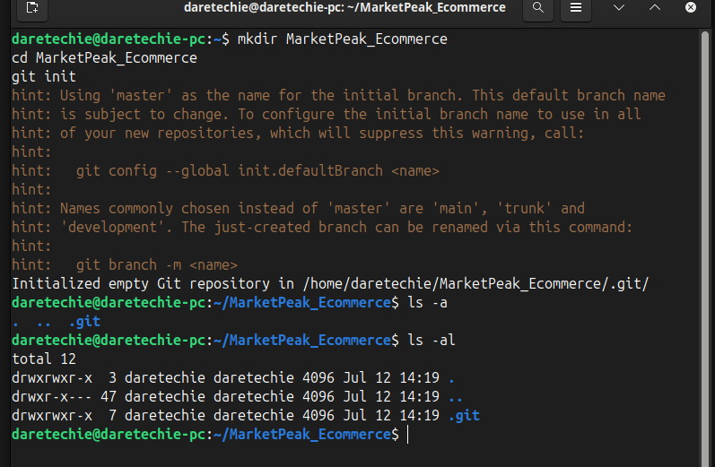
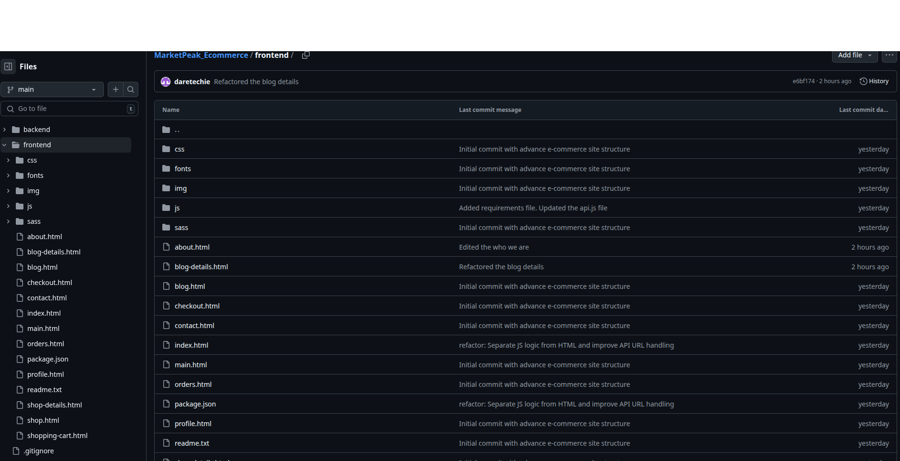
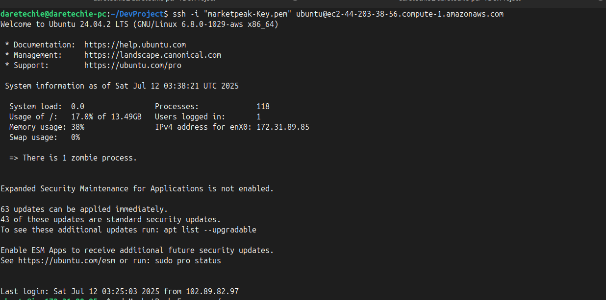
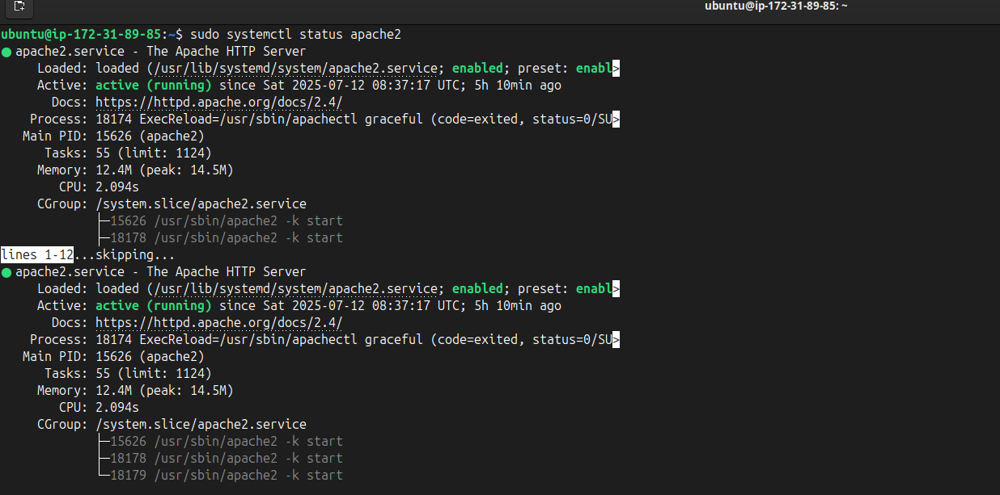
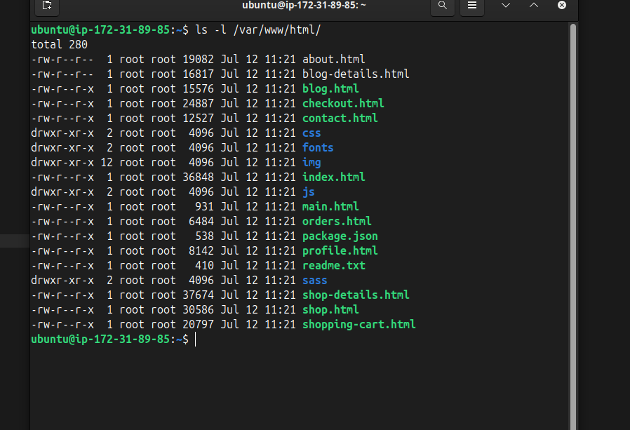
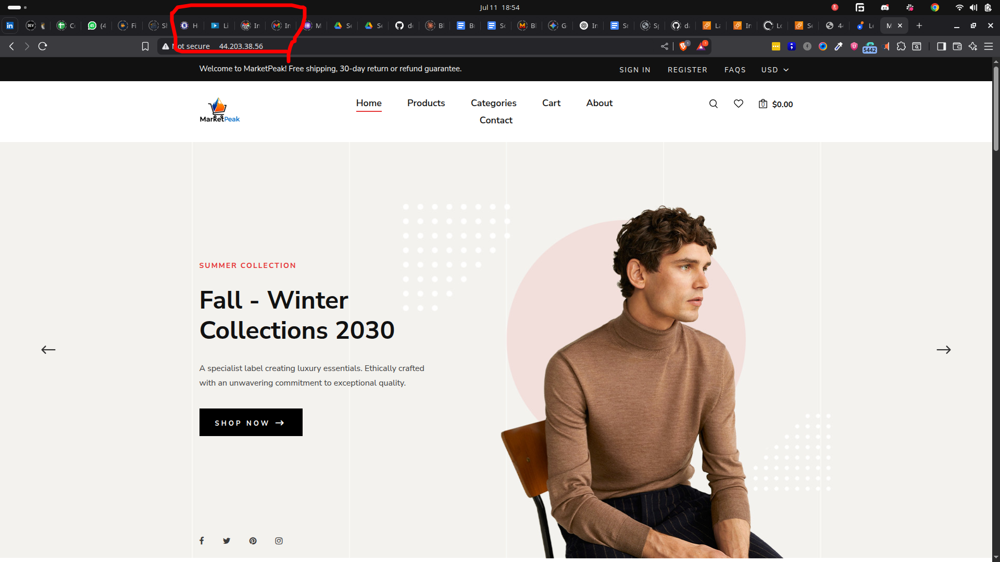
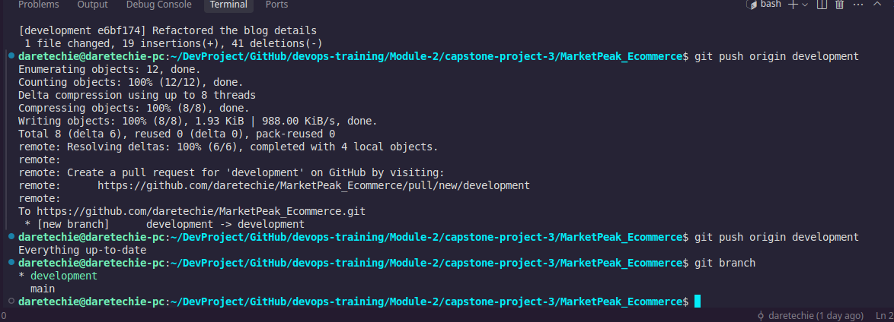
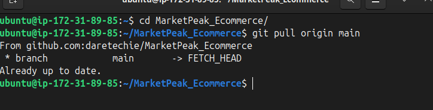

# MarketPeak E-Commerce Deployment with Git, Linux, and AWS

This guide documents the full development and deployment flow of the **MarketPeak** E-Commerce platform as a capstone project using Git for version control, Apache as the web server, AWS EC2 for cloud deployment as the production environment, a Linux environment for development, and backend enhancement using Django + Gunicorn.

---

## 🌍 About the Project

**MarketPeak** simulates a real-world e-commerce deployment process. The focus is on DevOps practices like version control, server configuration, and CI/CD. Enhancements include a Django backend with Gunicorn.

---

## 🛠️ Technologies Used

- HTML/CSS, JS (Tooplate Template)
- Git & GitHub
- Apache (httpd)
- Amazon EC2 (Amazon Linux)
- SSH, SCP
- Gunicorn & Django (for enhancement)
- Linux (Command Line Operations)

---


## 📦 Project Structure

```

MarketPeak\_Ecommerce/
│
├── backend/                # Django backend (enhancement)
│   ├── marketpeak/         # Django project folder
│   └── templates/
│
├── frontend/               # HTML/CSS Static Template
│   └── index.html, etc.
├── .git/                   # Git version control
├── README.md               # Project documentation
└── .gitignore

````


## 1. 📂 Project Initialization with Git

### 1.1 Initialize Repository

```bash
mkdir MarketPeak_Ecommerce
cd MarketPeak_Ecommerce
git init
```



### 1.2 Add Website Template

* Download a template from [Tooplate](https://www.tooplate.com/) or similar.
* Extract files into `MarketPeak_Ecommerce`.
* Customise: Customised the website with new logo, brand color, text, etc.

### 1.3 Commit Template to Git

```bash
git add .
git config --global user.name "YourUsername"
git config --global user.email "your@email.com"
git commit -m "Initial commit with basic e-commerce site structure"
```


### 1.4 Push to GitHub

```bash
git remote add origin https://github.com/daretechie/MarketPeak_Ecommerce.git
git push -u origin main
```



---

## 2. ☀ AWS EC2 Deployment

### 2.1 Launch & Connect to EC2

* Launch a new EC2 instance (Amazon Linux).
* Allow ports: 22 (SSH), 80 (HTTP)
* Connected via SSH

```bash
ssh -i "your-key.pem" ec2-user@your-ec2-public-ip
```



### 2.2 Clone Repository to EC2

**Option A – SSH Method:**

```bash
ssh-keygen
cat ~/.ssh/id_rsa.pub
```

* Add the key to GitHub SSH keys.

```bash
git clone git@github.com:yourusername/MarketPeak_Ecommerce.git
```

**Option B – HTTPS Method:**

```bash
git clone https://github.com/yourusername/MarketPeak_Ecommerce.git
```


### 2.3 Install Apache Web Server

```bash
sudo apt update -y
sudo apt install apache2 -y
sudo systemctl start apache2
sudo systemctl enable apache2
```



### 2.4 Deploy Website to Apache

```bash
sudo rm -rf /var/www/html/*
sudo cp -r ~/MarketPeak_Ecommerce/* /var/www/html/
sudo systemctl reload httpd
```



### 2.5 Access the Site

* Visit your EC2 Public IP in a browser.


---

## 3. ♻ Continuous Integration & Deployment (CI/CD)

### 3.1 Create a Development Branch

```bash
git branch development
git checkout development
```

* Make changes (e.g., update banner, fix links).

### 3.2 Commit & Push Changes

```bash
git add .
git commit -m "Update homepage layout"
git push origin development
```



### 3.3 Merge via Pull Request (PR)

* Create a PR on GitHub.
* Review → Merge into `main`.

### 3.4 Update EC2 Server

```bash
cd MarketPeak_Ecommerce
git pull origin main
sudo systemctl reload httpd
```



### 3.5 Test Website

* Reload the browser → Confirm updates are live.

---


## 4. 🧱 Backend Enhancement

* Full-featured online marketplace with:

  * User registration/login
  * Product listing & detail pages
  * Cart & checkout
  * Admin dashboard
* Django backend with SQLite in dev

To add dynamic behavior:

* Added a Django backend (`marketpeak` project)
* Configured Gunicorn and Nginx for WSGI serving


### ⚙️ Setup Instructions

#### 1. Clone the Repository

```bash
git clone git@github.com:daretechie/MarketPeak_Ecommerce.git
cd MarketPeak_Ecommerce
```

#### 2. Create Virtual Environment

```bash
python3 -m venv venv
source venv/bin/activate
```

#### 3. Install Requirements

```bash
pip install -r backend/requirements.txt
```

#### 4. Run Migrations & Start Server

```bash
cd backend
python manage.py migrate
python manage.py runserver
```

Serve with Gunicorn:

```bash
gunicorn marketpeak.wsgi:application --bind 127.0.0.1:8001
```

---

### 📦 Deployment after changes (Manual - EC2 + Apache2)

#### Step-by-Step:

1. **SSH into your EC2 instance**

   ```bash
   ssh -i your-key.pem ubuntu@your-ec2-ip
   ```

2. **Pull the latest changes**

   ```bash
   cd ~/MarketPeak_Ecommerce
   git pull origin master
   ```

3. **(Optional) Collect static files**

   ```bash
   python manage.py collectstatic
   ```

4. **Reload Apache**

   ```bash
   sudo systemctl reload apache2
   ```

✅ Your site should now reflect the new changes!

---

## 5.  ⚠️ Issues and Fixes

| **Issue**                                                | **Cause**                             | **Solution**                                              |
| -------------------------------------------------------- | ------------------------------------- | --------------------------------------------------------- |
| 🔒 `Permission denied` on SSH key                        | Incorrect permissions on private key  | Run: `chmod 400 your-key.pem`                             |
| 🔐 Git authentication failed                             | Wrong credentials or SSH misconfig    | Re-add your SSH key or switch to HTTPS clone URL          |
| 🌐 Apache default page still shows                       | Project files not copied correctly    | Run: `sudo cp -r ~/MarketPeak_Ecommerce/* /var/www/html/` |
| 🚫 Static files not loading                              | Static files not collected            | Run: `python manage.py collectstatic`                     |
| ❌ `CSRF verification failed` when logging in             | Missing trusted IP/domain in settings | Add IP to `CSRF_TRUSTED_ORIGINS` in `settings.py`         |
| 🔁 Gunicorn port already in use                          | Port conflict or zombie process       | Run: `lsof -i:8001`, then `kill -9 <PID>`                 |
| 🐍 Gunicorn error: `No module named 'your_project_name'` | Incorrect app name in command         | Use: `gunicorn marketpeak.wsgi:application`               |
| 🔄 Nginx/Gunicorn not restarting                         | Inactive or stale Gunicorn process    | Run: `pkill gunicorn` then re-run the `gunicorn` command  |

---

## 6. 📄 How to Run Locally

1. Clone the repo
2. Install Apache (or use Django dev server)
3. Serve `frontend/` or run `python manage.py runserver` in `backend/`

---


## 7. 📬 Contact & Submission

* Repository: [GitHub - MarketPeak\_Ecommerce](https://github.com/daretechie/MarketPeak_Ecommerce)
* Submission Platform: [Darey.io](https://darey.io)
* Author: \[Your Name]

---

## 8. 🏁 Conclusion

Deployed a full-stack e-commerce platform on AWS EC2 using Git for version control and Apache for production hosting. Implemented essential DevOps workflows such as SSH configuration, environment setup, and CI/CD practices(manual), laying the groundwork for modern infrastructure automation and scalability.


