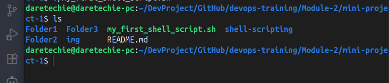

# Shell Scripting: Automating with the Command Line

Shell scripting helps automate repetitive tasks using command-line instructions. This section covers a beginner-friendly project to create directories and user accounts using a shell script on an Ubuntu server.

---

## 📁 **Step-by-Step: Create and Execute a Shell Script**

### 1. **Create a Directory for Your Script**

```bash
mkdir shell-scripting
cd shell-scripting
```

### 2. **Create a Script File Using vim**

```bash
vim my_first_shell_script.sh
```

Paste this code into the file:

```bash
#!/bin/bash

# Create directories
mkdir Folder1
mkdir Folder2
mkdir Folder3

# Create users
sudo useradd user1
sudo useradd user2
sudo useradd user3
```


### 3. **Confirm Script Exists**

```bash
ls -latr
```


## 🔒 **Check File Permissions**

Use `ls -l` to view permissions:

```bash
ls -l my_first_shell_script.sh
```

Expected output: `-rw-r--r--` (No execute permission)


---

## 🚫 **Try to Execute (Expect Failure)**

```bash
./my_first_shell_script.sh
```

You should see:
`bash: ./my_first_shell_script.sh: Permission denied`


---

## ✅ **Fix Permissions and Re-run**

```bash
chmod +x my_first_shell_script.sh
./my_first_shell_script.sh
```


## ✅ **Verify Results**

### Check folders:

```bash
ls
```

Expected: `Folder1  Folder2  Folder3`



### Check users:

```bash
id user1
id user2
id user3
```


---

## ⚡ Error Handling in Shell Scripts

To make scripts robust and avoid errors when folders or users already exist, we use checks like:

```bash
[ ! -d "$dir" ] && mkdir "$dir"           # Only create if folder doesn't exist
id "$user" &>/dev/null || useradd "$user" # Only add user if not found
```

This prevents crashes and makes your scripts reusable and reliable.

---

## ⚠️ Troubleshooting & Common Issues

| Problem                                 | Cause                                | Solution                                                          |
| --------------------------------------- | ------------------------------------ | ----------------------------------------------------------------- |
| `Permission denied` when running script | File isn’t marked executable         | Run: `chmod +x my_first_shell_script.sh`                          |
| `command not found: vim`                | Vim editor isn’t installed           | Run: `sudo apt install vim`                                       |
| `useradd: user already exists`          | You’ve already created the user      | Run: `sudo deluser user1` before re-running script                |
| `mkdir: cannot create directory`        | Folder already exists                | Use `rm -r Folder1` before running the script again               |
| No output or visible effect             | Commands are being silently executed | Add `echo` statements to print progress, or use `set -x` to debug |

---

## 🫠 What is a Shebang?

At the top of your script:

```bash
#!/bin/bash
```

This line tells the system to use the **Bash shell** to run your script. It’s called a **shebang**.

### ❀ Significance of Shebang

- **Defines the Interpreter**: Ensures the correct shell (e.g., bash, sh, zsh) is used.
- **Enables Portability**: Scripts run consistently across different systems.
- **Avoids Confusion**: Without it, the system might not execute the script as expected.

Alternative example:

```bash
#!/bin/sh   # for POSIX-compliant shell
```

---

## 🤖 Script Debugging with `set -x`

To trace and debug script execution:

```bash
#!/bin/bash
set -x   # Enable debugging

# Commands here...
```

### Use Cases:

- Logs each command before execution.
- Helps trace failures or logic bugs.

You can disable debugging mid-script with:

```bash
set +x
```

---

## 🔤 Shell Variables

### Declare:

```bash
name="John"
```

### Use:

```bash
echo $name
```

Output:

```
John
```

Variables store data like strings or numbers. `echo` is used to display them.


---

## 🏁 Conclusion

This hands-on scripting task demonstrated how to automate folder and user creation, manage permissions, and use variables in Bash. Shell scripting is essential for every DevOps engineer—helping you automate, replicate, and scale tasks efficiently.

---
