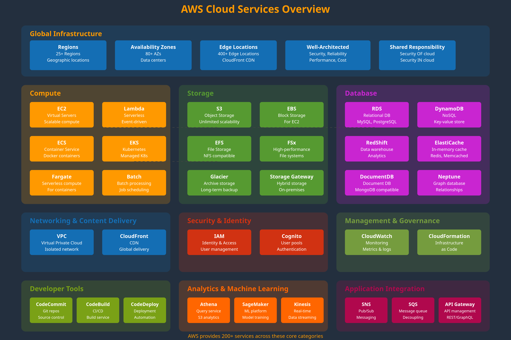
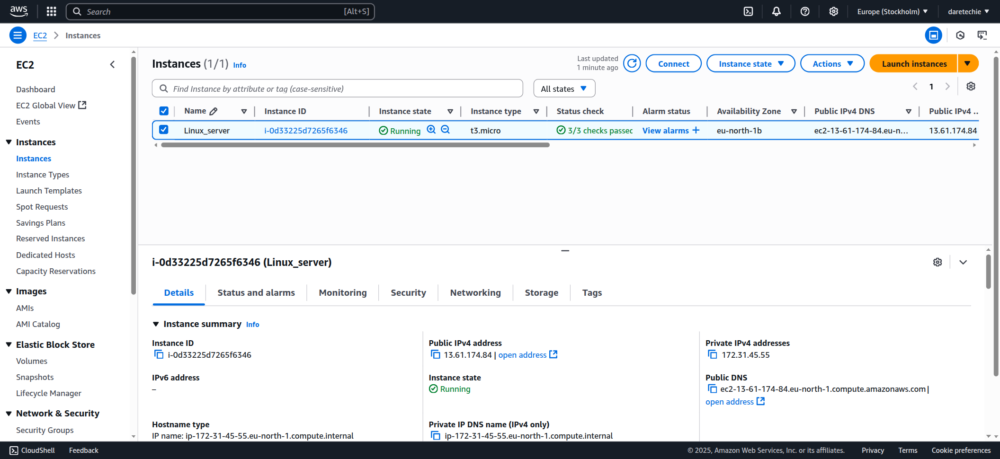

# ☁️ AWS Account Creation Project

**Objective**: Learn how to create and configure an AWS account while understanding the basics of cloud computing.

---

## 🌐 What is the Cloud?

Imagine storing your files in a magical backpack you can open from anywhere with internet access. The **cloud** is a network of powerful computers storing and managing your data, apps, and services remotely.

---

## 🚀 What is AWS Cloud?

**Amazon Web Services (AWS)** is a leading cloud provider offering services like servers, storage, databases, and networking—accessible globally over the internet.

* ⚙️ **Use Case**: Rent computing resources without buying expensive hardware.
* 💳 **Billing**: **Pay-as-you-go** – only pay for what you use.

---

## 🎯 Learning Goals

* Understand the basics of cloud computing and AWS.
* Create and verify a fully functional AWS account.
* Explore the AWS Management Console.
* Learn to navigate billing, security, and service access.

---

## 📝 Step-by-Step AWS Account Setup

### 1. Go to [aws.amazon.com](https://aws.amazon.com/)

* Click **Create an AWS account**.

---

### 2. Enter Your Details

* Provide your **email**, **password**, and **account name**.
* Click **Verify email address**.

---

### 3. Verify Email

* Enter the **verification code** sent to your inbox.

---

### 4. Set Your Password

* Set a secure root user password and continue.

---

### 5. Personal Information

* Fill out your name, phone number, and address.

---

### 6. Add Payment Method

* Use a **credit/debit card** (a \$1 authorization may apply).

---

### 7. Phone Verification

* Choose SMS or call.
* Enter the **OTP** sent to your phone.

---

### 8. CAPTCHA and Plan Selection

* Solve the CAPTCHA.
* Choose **Basic Support (Free)**.

---

### 9. Access AWS Console

* Click **Go to the AWS Management Console**.
* Sign in using your root user credentials.

---

## ✅ After Login

* Enter **personalization preferences** if prompted.
* You now have full access to the AWS Management Console.

---

## 🛠️ Troubleshooting Tips

| Issue                           | Cause                        | Solution                            |
| ------------------------------- | ---------------------------- | ----------------------------------- |
| Verification email not received | Delay or spam filter         | Check spam/junk or request new code |
| Card declined                   | Invalid or unsupported card  | Use another card or contact bank    |
| OTP not received                | Network issues               | Try voice call option               |
| Console login fails             | Wrong credentials or CAPTCHA | Reset password or reload CAPTCHA    |

---

## 🔍 Reflection & Key Takeaways

* **Cloud Simplified**: One don’t need to own big servers—AWS lets you rent computing power and storage affordably.
* **Flexible Growth**: Scale up when needed, scale down when usage drops—ideal for startups and learners.
* **Hands-On Learning**: Learned to register, verify, and access AWS with confidence.

---