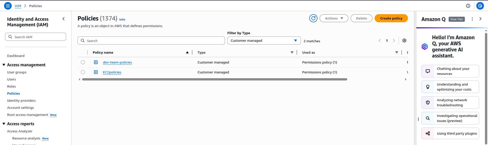
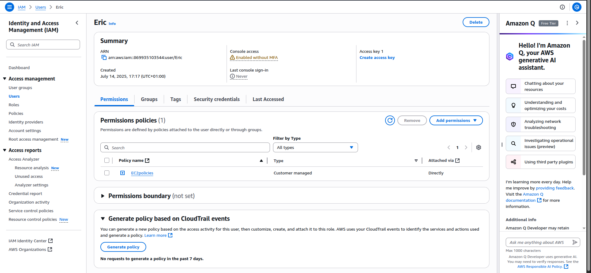
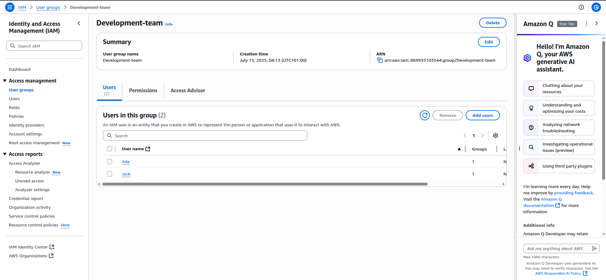
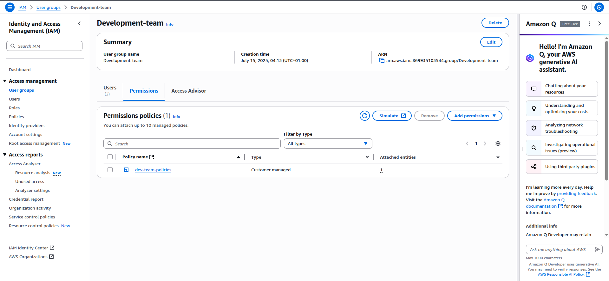
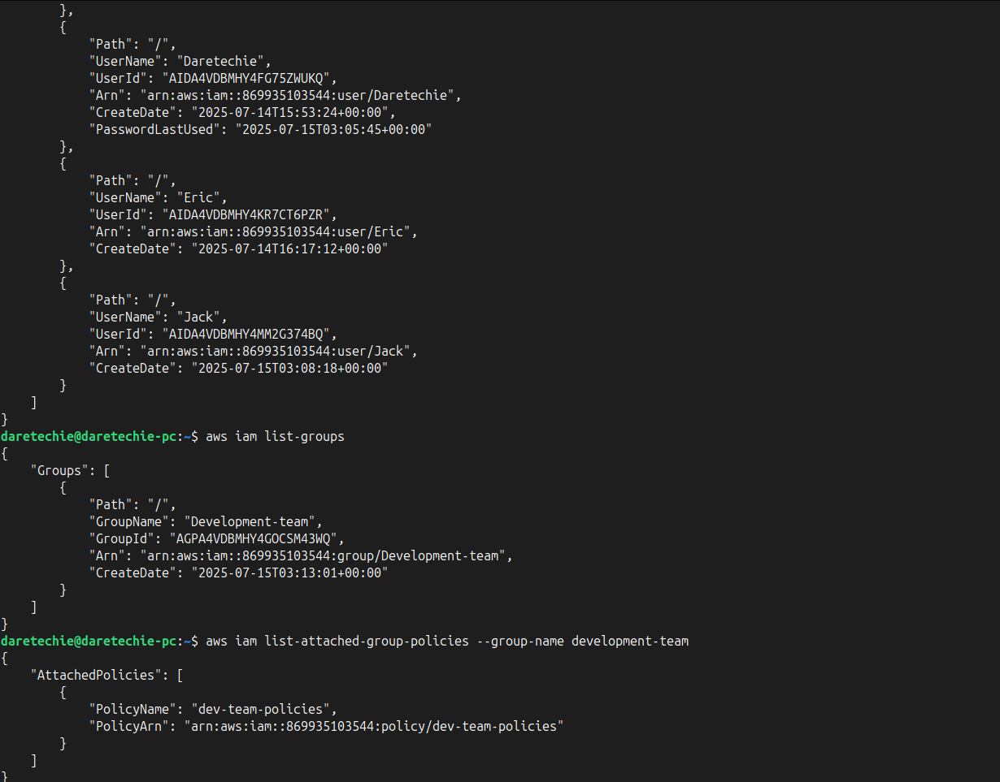

# AWS IAM Mini Project: Access Management in Action

In this practical hands-on IAM (Identity and Access Management) project on AWS, I will control access to AWS using IAM users, groups, roles, and policies to secure AWS resources like EC2 and S3.

---

## 🧠 What is IAM?

IAM is like the security guard of one AWS account. It defines **who** can do **what** to **which resources**. IAM uses:

- **Users** – individual accounts
- **Groups** – teams of users
- **Roles** – temporary access or service permissions
- **Policies** – rulebooks that define what actions are allowed

---

## 🎯 Project Objectives

- Create and manage IAM users, groups, and policies
- Understand and apply IAM best practices
- Assign access permissions for EC2 and S3 services

---

## 📦 PART 1: Create IAM Policy + User

### Step 1: Create a Policy for EC2 Access

1. Go to **IAM > Policies**
2. Click **Create Policy**
3. Choose **Service: EC2**
4. Select **All EC2 actions** and **All Resources**
5. Click **Next > Create Policy**



### Step 2: Create User Eric

1. Go to **IAM > Users** > Click **Create User**
2. Username: `Eric`
3. Enable **Console Access**, set a password
4. Check: _User must reset password at next sign-in_
5. Attach the policy you just created (`policy_for_eric`)



### 💡 Troubleshooting Tips

| Issue                 | Solution                          |
| --------------------- | --------------------------------- |
| Can't find EC2 policy | Use filter: **Customer managed**  |
| Login fails for Eric  | Check password and console access |

---

## 👥 PART 2: Create Group + Add Users + Attach Multi-Service Policy

### Step 1: Create IAM Group

1. Navigate to **IAM > User Groups**
2. Name: `development-team`
3. Click **Create Group**

### Step 2: Create Users Jack & Ade

1. Go to **Users > Create User**
2. Usernames: `Jack`, then `Ade`
3. Add them to **development-team** group



### Step 3: Create Policy for EC2 & S3 Access

1. Go to **Policies > Create Policy**
2. Choose services: **EC2** and **S3**
3. Allow **All Actions**, **All Resources**
4. Name: `development-policy`



### Step 4: Attach Policy to Group

1. Go to **User Groups > development-team**
2. Click **Add Permissions > Attach Policy**
3. Filter: **Customer Managed** > Select `development-policy`


---

## 🔒 IAM Best Practices

- 🔐 Use **least privilege**: grant only what's needed
- 📁 Use **groups** to manage permissions efficiently
- 🔄 **Rotate passwords** and use strong password policies
- 🕵️ Enable **MFA** (Multi-Factor Authentication) for critical users
- 📜 Use **customer-managed policies** for clarity and reuse
- 🧪 Always **test policies** before wide application

---

## 🔁 Users vs. Roles

- **Users** = permanent access (your own house key)
- **Roles** = temporary/assigned access (guest key with time limits)

---

## 🧪 Bonus: Verify Setup

### For Users:

```bash
aws iam list-users
```

### For Groups:

```bash
aws iam list-groups
```

### For Attached Policies:

```bash
aws iam list-attached-group-policies --group-name development-team
```



---

## 📝 Project Reflection

This project helped to:

- Understand IAM concepts by analogy and action
- Apply IAM policies to individual users and groups
- Use best practices to manage access securely in AWS

This project helped me to be more confident in managing **cloud security** using IAM!
