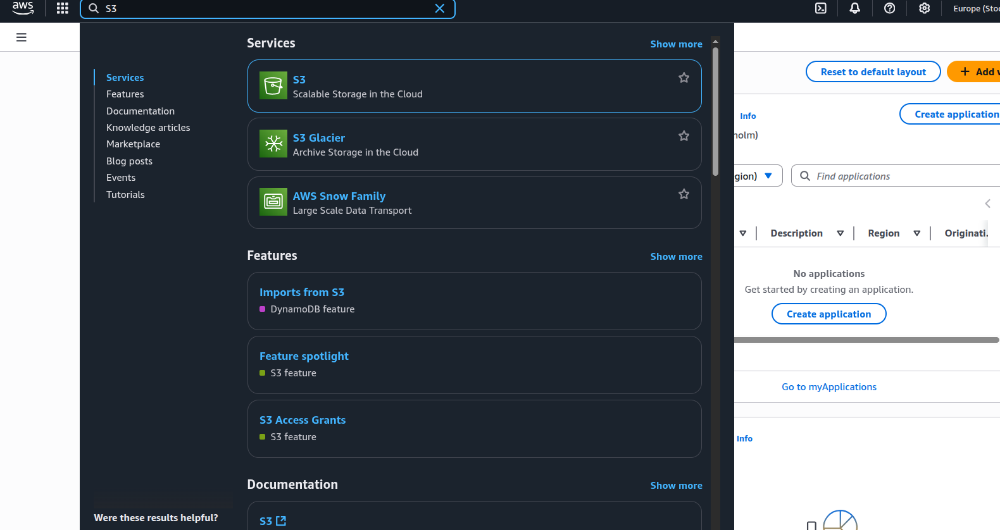
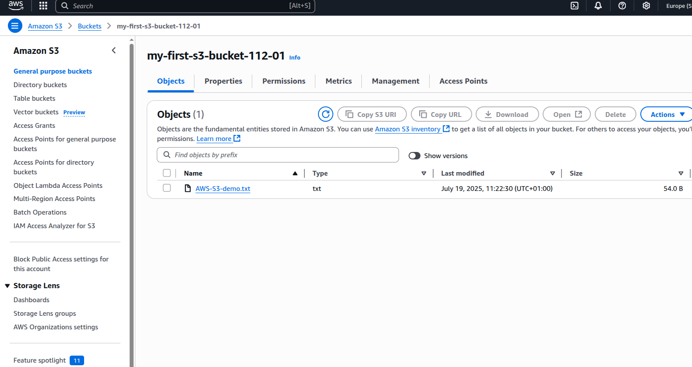
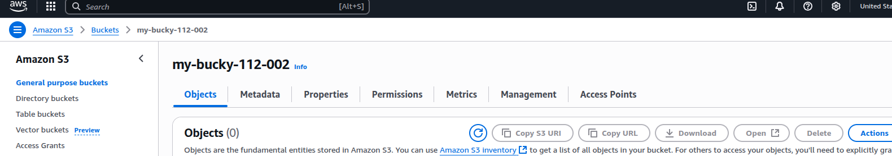
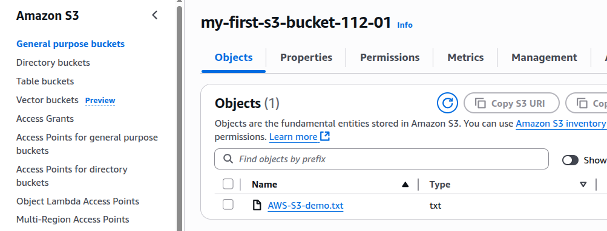
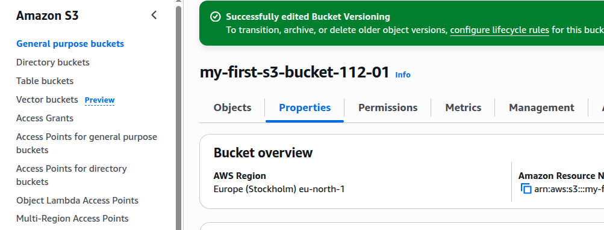
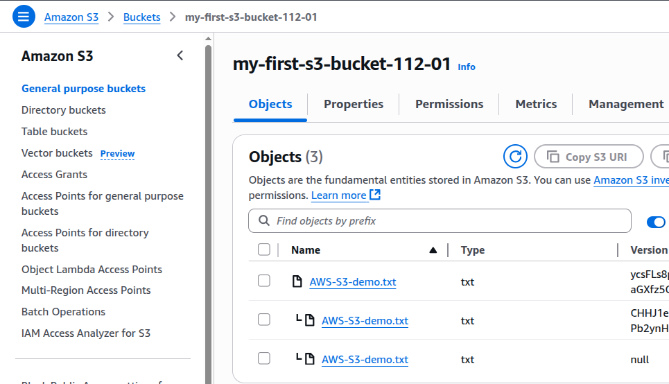
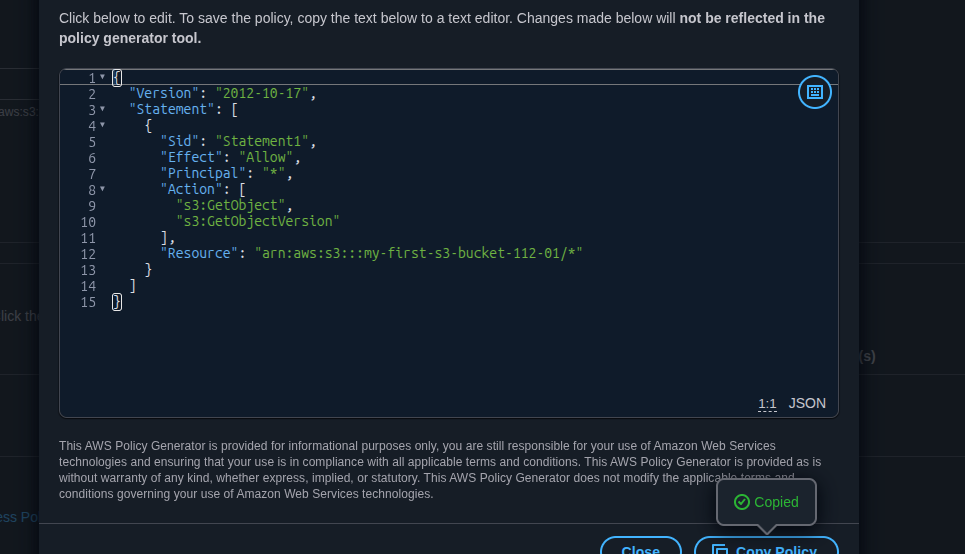
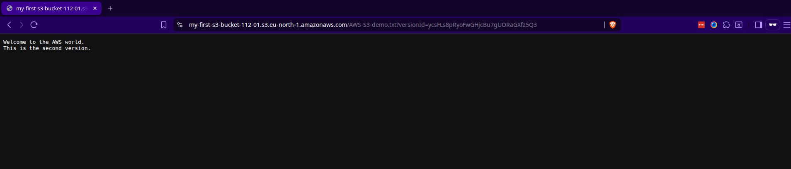

# ☁️ AWS S3 Management Guide: Practical Guide for DevOps

Amazon S3 (Simple Storage Service) is a scalable, reliable, and secure service used to store and retrieve any amount of data from anywhere on the web. This guide covers practical, hands-on experience with creating essential S3 operations including bucket creation, object management, versioning, permissions, and lifecycle policies.

---

## 🎯 Project Goals

- Create and configure an S3 bucket
- Upload and version objects
- Configure public access permissions
- Implement lifecycle policies to manage costs

---

## Prerequisites

- AWS Account with appropriate permissions
- Access to AWS Management Console
- AWS CLI installed and configured
- Basic understanding of cloud storage concepts
- jq (optional, for JSON processing)

---

## ✅ Learning Outcomes

By the end of this project:

- Confidently create and manage buckets and files in S3
- Understand and enable versioning
- Set access permissions and public policies
- Automate storage class transitions using lifecycle rules

---

## 🔧 Key Concepts

| Concept            | Description                                                                                                  |
| ------------------ | ------------------------------------------------------------------------------------------------------------ |
| Buckets            | Containers for storing objects (with globally unique names) and act as the top-level namespace for Amazon S3 |
| Objects            | Individual files stored in S3                                                                                |
| Keys               | Unique identifiers for each object                                                                           |
| Storage Classes    | Cost/durability options (e.g., Standard, IA, Glacier)                                                        |
| Access Control     | ACLs, bucket policies, and IAM for permission control                                                        |
| Versioning         | Keep multiple versions of the same object                                                                    |
| Lifecycle Policies | Automate transitions and deletion to reduce costs                                                            |

---

### Storage Classes

- **Standard**: Frequently accessed data
- **Standard-IA**: Infrequently accessed data
- **One Zone-IA**: Lower-cost option for infrequently accessed data
- **Intelligent-Tiering**: Automatic cost optimization
- **Glacier**: Long-term archival
- **Glacier Deep Archive**: Lowest-cost archival

---

## 🧭 Step-by-Step: Setup and Manage S3

### 1. **Search for S3 in AWS Console**



---

### 2. **Create a New Bucket**

- **Bucket name**: Choose a globally unique name
- **Object Ownership**: Select "ACL Disabled" (recommended)
- **Public Access**: Check "Block all public access" (initially)
- **Versioning**: Leave disabled for now
- **Default settings**: Keep as-is

> Click "Create bucket"



---

#### CLI Method

```bash
# Create bucket
aws s3 mb s3://your-unique-bucket-name --region us-east-1

# Create bucket with specific configuration
aws s3api create-bucket \
    --bucket your-unique-bucket-name \
    --region us-east-1 \
    --object-ownership BucketOwnerEnforced \
    --public-access-block-configuration "BlockPublicAcls=true,IgnorePublicAcls=true,BlockPublicPolicy=true,RestrictPublicBuckets=true"
```



The automation script is [here](./create-s3-bucket.sh)

**Troubleshooting:**

- **Error: Bucket name already exists**: Choose a different, globally unique name
- **Error: Invalid bucket name**: Follow naming conventions (lowercase, no spaces, 3-63 characters)

---

### 3. **Upload a File or Object to the Bucket**

- Create a file on your computer (e.g., `welcome.txt`)
- Click **Upload > Add file** > select your file
- Click **Upload**



#### CLI Method

```bash
# Create test file
echo "Welcome to the AWS world" > test-file.txt

# Upload single file
aws s3 cp test-file.txt s3://your-bucket-name/

# Upload with metadata
aws s3 cp test-file.txt s3://your-bucket-name/ \
    --metadata "creator=devops-team,environment=production"

# Upload entire directory
aws s3 sync ./local-directory s3://your-bucket-name/remote-directory/
```

**Troubleshooting:**

- **Upload fails**: Check file size limits (5GB max via console)
- **Permission denied**: Verify IAM permissions for S3 operations

---

### 4. **Enable Bucket Versioning**

- Go to **Properties > Bucket Versioning > Edit**
- Select **Enable** and click **Save**



Re-upload the modified file to create a new version.



#### CLI Method

```bash
# Enable versioning
aws s3api put-bucket-versioning \
    --bucket your-bucket-name \
    --versioning-configuration Status=Enabled

# Check versioning status
aws s3api get-bucket-versioning --bucket your-bucket-name

# List all versions of objects
aws s3api list-object-versions --bucket your-bucket-name
```

**Troubleshooting:**

- **Cannot enable versioning**: Check bucket permissions
- **Versions not showing**: Ensure "Show versions" toggle is enabled

---

### 5. **Make Files Public (Permission Settings)**

⚠️ **Security Warning**: Only enable public access when necessary and understand the implications.

- Go to **Permissions > Block public access > Edit**
- Uncheck all, then type `confirm` to apply


#### CLI Method

```bash
# Remove public access block
aws s3api delete-public-access-block --bucket your-bucket-name

# Verify public access block status
aws s3api get-public-access-block --bucket your-bucket-name
```

#### Creating Bucket Policy

- Go to **Bucket policy** > **Edit**
- Use **Policy Generator**:

  - Effect: Allow
  - Principal: \*
  - Action: `s3:GetObject`, `s3:GetObjectVersion`
  - Resource: `arn:aws:s3:::your-bucket-name/*`



##### CLI Method

```bash
# Create policy file
cat > bucket-policy.json << EOF
{
  "Version": "2012-10-17",
  "Statement": [
    {
      "Sid": "PublicReadGetObject",
      "Effect": "Allow",
      "Principal": "*",
      "Action": [
        "s3:GetObject",
        "s3:GetObjectVersion"
      ],
      "Resource": "arn:aws:s3:::your-bucket-name/*"
    }
  ]
}
EOF

# Apply bucket policy
aws s3api put-bucket-policy \
    --bucket your-bucket-name \
    --policy file://bucket-policy.json

# Get current bucket policy
aws s3api get-bucket-policy --bucket your-bucket-name
```

**Troubleshooting:**

- \*_ Make sure ARN includes `/_` to apply to all objects.
- **Policy validation error**: Check JSON syntax and ARN format
- **Access denied after policy**: Wait for propagation (up to 5 minutes)
- **Objects still not accessible**: Verify object-level permissions

---

### 6. **Test Object URLs**

- Navigate to **Objects > Click File > Object URL**
- Open links for old and new versions



---

### 7. **Implement Lifecycle Policy**

#### Console Method


1. Navigate to "Management" tab
2. Click "Create lifecycle rule"


3. Configure rule:
   - **Rule name**: Descriptive name
   - **Status**: Enabled
   - **Scope**: Choose files to apply rule to
   - **Transitions**: Define storage class changes

Example configuration:

- Transition to Standard-IA after 30 days
- Transition to Glacier after 90 days
- Delete after 365 days

#### CLI Method

```bash
# Create lifecycle configuration file
cat > lifecycle-config.json << EOF
{
  "Rules": [
    {
      "ID": "OptimizeStorageCosts",
      "Status": "Enabled",
      "Filter": {
        "Prefix": ""
      },
      "Transitions": [
        {
          "Days": 30,
          "StorageClass": "STANDARD_IA"
        },
        {
          "Days": 90,
          "StorageClass": "GLACIER"
        },
        {
          "Days": 365,
          "StorageClass": "DEEP_ARCHIVE"
        }
      ],
      "Expiration": {
        "Days": 2555
      },
      "NoncurrentVersionTransitions": [
        {
          "NoncurrentDays": 30,
          "StorageClass": "STANDARD_IA"
        },
        {
          "NoncurrentDays": 90,
          "StorageClass": "GLACIER"
        }
      ],
      "NoncurrentVersionExpiration": {
        "NoncurrentDays": 365
      }
    }
  ]
}
EOF

# Apply lifecycle configuration
aws s3api put-bucket-lifecycle-configuration \
    --bucket your-bucket-name \
    --lifecycle-configuration file://lifecycle-config.json

# Get current lifecycle configuration
aws s3api get-bucket-lifecycle-configuration --bucket your-bucket-name
```

---

## 🛠️ Troubleshooting Table

| Problem                    | Cause           | Solution                        |
| -------------------------- | --------------- | ------------------------------- |
| Bucket name error          | Name not unique | Use another name                |
| Object not public          | Missing policy  | Add correct ARN and permissions |
| Lifecycle rule not working | Wrong filter    | Ensure correct prefix/timing    |

---

## 📦 Additional Notes

- **Shebang in CLI scripts:** Use `#!/bin/bash` to ensure the script runs under bash shell
- **Use AWS CLI:** Automate bucket creation, file uploads, and permissions via command line
- **Debug CLI commands:** Add `--debug` to AWS CLI commands for verbose output

---

## 🚀 Advanced Automation Concepts (Optional Add-On)

### 🔁 Infrastructure as Code

Infrastructure can be provisioned automatically using **CloudFormation** or **Terraform**, allowing consistent and reusable S3 deployments with versioning, encryption, and lifecycle rules configured from the start.

> CloudFormation templates can be found [here](./s3-bucket-template.yaml)
> Deploy with:

```bash
aws cloudformation deploy \
    --template-file s3-bucket-template.yaml \
    --stack-name my-s3-stack \
    --parameter-overrides BucketName=my-app Environment=prod
```

> Terraform configuration can be found [here](./main.tf)
> Deploy with:

```bash
terraform init
terraform plan -var="bucket_name=my-app" -var="project_name=my-project"
terraform apply
```

### ⚙️ CI/CD Integration

Use GitHub Actions or GitLab CI pipelines to deploy files automatically to S3 after code changes. Integrate bucket creation, versioning setup, and object sync operations into the DevOps workflow.

> GitHub Action deploying to S3 is [here](./.github/workflows/s3-deploy.yml)


### 🔍 Monitoring and Cost Optimization

Monitor S3 usage with CloudWatch and automate alerts for high storage or access errors. Use lifecycle rules and cost-analysis scripts to prevent unnecessary charges.

---

## Resources

- [AWS S3 Documentation](https://docs.aws.amazon.com/s3/)
- [S3 Pricing Calculator](https://calculator.aws/)
- [S3 Best Practices](https://docs.aws.amazon.com/s3/latest/userguide/security-best-practices.html)
- [Bucket Naming Rules](https://docs.aws.amazon.com/s3/latest/userguide/bucketnamingrules.html)

---

## 🧠 Reflection

Amazon S3 is a powerful cloud storage tool. This project demonstrated real-world use of:

- S3 buckets and objects
- Versioning and permissions
- Lifecycle automation

These practices help streamline DevOps operations while optimizing cost and security.