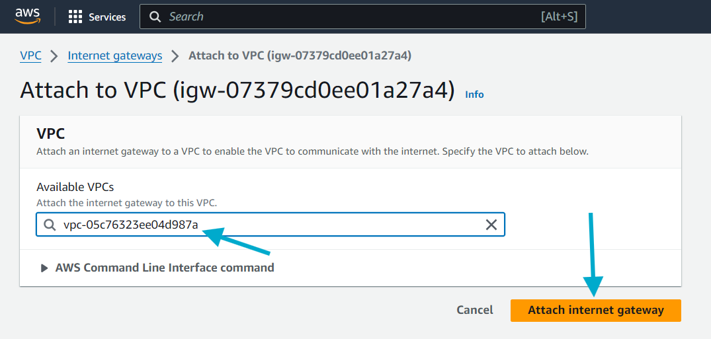
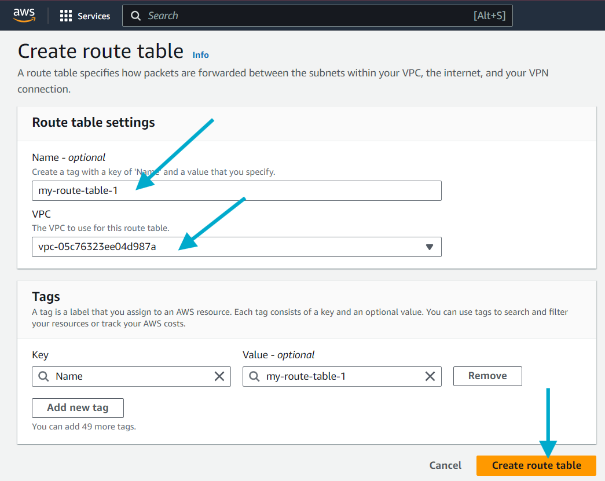

# AWS VPC Network Mastery - Complete Guide

## Overview

**In one statement:** We are setting up a secure and structured cloud network in AWS by creating a VPC with public and private subnets, enabling internet access through Internet and NAT Gateways, and establishing VPC peering for cross-VPC communication.

This guide covers practical VPC implementation to securely manage network traffic, control internet access, and enable communication between different parts of cloud infrastructure—ensuring better organization, security, and scalability.

## When You Need This Setup

This VPC architecture is essential when:

- **Hosting applications** with both public (internet-facing) and private (internal) components
- **Separating environments** like dev, staging, and production using different VPCs
- **Ensuring security** by restricting direct internet access to sensitive resources
- **Enabling communication** between different services or teams in separate VPCs
- **Scaling infrastructure** where structured networking becomes essential

### 🔧 Real-World Scenario: E-commerce Application

**Company launching a web application (online bookstore):**

| Component                | Location       | Internet Access        | Purpose                      |
| ------------------------ | -------------- | ---------------------- | ---------------------------- |
| Web Server/Load Balancer | Public Subnet  | ✅ Bidirectional       | Serves frontend to users     |
| Backend API Server       | Private Subnet | ❌ Outbound only (NAT) | Processes orders securely    |
| Database (RDS)           | Private Subnet | ❌ No internet         | Stores customer/product data |
| Analytics Service        | Separate VPC   | ✅ Via VPC Peering     | Accesses data for reporting  |

**Traffic Flow:**

1. Users hit `www.bookstore.com` → Public subnet (web server)
2. Web server forwards requests → Private subnet (API server)
3. API server queries → Private subnet (database)
4. Analytics team accesses data → Cross-VPC via peering


## Prerequisites

- AWS Account with appropriate permissions
- Basic understanding of networking concepts
- AWS CLI installed (optional but recommended)

## Learning Objectives

- Understand VPC architecture and components
- Configure subnets, gateways, and routing tables
- Implement secure internet connectivity
- Establish VPC peering connections
- Apply network security best practices
- Deploy real-world applications using VPC infrastructure

- Understand VPC architecture and components
- Configure subnets, gateways, and routing tables
- Implement secure internet connectivity
- Establish VPC peering connections
- Apply network security best practices

## Core Concepts

### Virtual Private Cloud (VPC)

A logically isolated section of AWS cloud where you can launch resources in a virtual network you define. Think of it as your private data center in the cloud.

### Subnets

Subdivisions of VPC IP address range where you can place groups of isolated resources.

- **Public Subnet**: Resources can communicate with the internet
- **Private Subnet**: Resources cannot directly access the internet

### Internet Gateway (IGW)

Enables communication between VPC and the internet. Acts as a bridge for bidirectional traffic.

### NAT Gateway

Allows outbound internet access for private subnet resources while preventing inbound internet traffic.

### Route Tables

Define rules for directing network traffic within your VPC and to external networks.

### IP Addressing & CIDR

**IP Address Types:**

- **Public IP**: Globally unique, internet-accessible
- **Private IP**: Used within networks, not internet-routable

**CIDR Notation:**

- Format: `192.168.1.0/24`
- `/24` means first 24 bits are network portion
- Remaining 8 bits for host addresses

**Calculate available IPs:**

```
Available IPs = 2^(32 - CIDR notation) - 2
Example: 192.168.1.0/24 = 2^(32-24) - 2 = 254 usable IPs
```

## Implementation Guide

### Step 1: Create VPC

1. Navigate to VPC service in AWS Console
2. Click **Create VPC**
3. Select **VPC only**
4. Configure VPC settings:

```
Name: my-vpc
IPv4 CIDR: 10.0.0.0/16
```


**Note:** CIDR block size must be between /16 and /28

### Step 2: Configure Subnets

Create public and private subnets in different availability zones:

**Public Subnet:**

```
Name: my-public-subnet-1
VPC: my-vpc
Availability Zone: us-east-1a
IPv4 CIDR: 10.0.1.0/24
```

**Private Subnet:**

```
Name: my-private-subnet-1
VPC: my-vpc
Availability Zone: us-east-1b
IPv4 CIDR: 10.0.2.0/24
```


### Step 3: Create and Attach Internet Gateway

1. Navigate to **Internet Gateways**
2. Click **Create Internet Gateway**
3. Name: `my-igw`
4. After creation, select the IGW and click **Actions** → **Attach to VPC**
5. Select your VPC




### Step 4: Configure Route Tables for Public Subnet

1. Go to **Route Tables**
2. Click **Create route table**
3. Configure:

```
Name: my-public-rt
VPC: my-vpc
```

4. Edit **Subnet Associations** → Associate public subnet
5. Edit **Routes** → Add route:

```
Destination: 0.0.0.0/0
Target: Internet Gateway (select my-igw)
```



### Step 5: Set Up NAT Gateway for Private Subnet

1. Navigate to **NAT Gateways**
2. Click **Create NAT Gateway**
3. Configure:

```
Name: my-nat-gateway
Subnet: my-public-subnet-1 (must be public)
Connectivity type: Public
```

4. Create new route table for private subnet:

```
Name: my-private-rt
VPC: my-vpc
```

5. Associate private subnet with this route table
6. Add route for outbound internet access:

```
Destination: 0.0.0.0/0
Target: NAT Gateway (select my-nat-gateway)
```


### Step 6: VPC Peering Configuration

Create connection between two VPCs:

1. Create second VPC:

```
Name: my-vpc-2
IPv4 CIDR: 172.16.0.0/16
```

2. Navigate to **Peering Connections**
3. Click **Create Peering Connection**
4. Configure:

```
Name: my-vpc-peering
Requester VPC: my-vpc (10.0.0.0/16)
Accepter VPC: my-vpc-2 (172.16.0.0/16)
```

5. Accept the peering request
6. Update route tables in both VPCs:

**VPC 1 Route Table:**

```
Destination: 172.16.0.0/16
Target: Peering Connection
```

**VPC 2 Route Table:**

```
Destination: 10.0.0.0/16
Target: Peering Connection
```


## Practical Application Guide

### Deploying Web Application on VPC

Once your VPC setup is complete, here's how to deploy a production-ready web application:

#### Step 1: Launch EC2 Instances

**Public Subnet Instance (Web Server):**

```bash
# Launch Ubuntu instance in public subnet
aws ec2 run-instances \
  --image-id ami-0abcdef1234567890 \
  --instance-type t3.micro \
  --subnet-id subnet-12345 \
  --security-group-ids sg-web-public \
  --associate-public-ip-address
```

**Security Group for Public Instance:**

```bash
# Allow HTTP, HTTPS, SSH from internet
aws ec2 authorize-security-group-ingress \
  --group-id sg-web-public \
  --protocol tcp --port 80 --cidr 0.0.0.0/0

aws ec2 authorize-security-group-ingress \
  --group-id sg-web-public \
  --protocol tcp --port 443 --cidr 0.0.0.0/0
```

**Private Subnet Instance (Backend API):**

```bash
# Launch instance without public IP
aws ec2 run-instances \
  --image-id ami-0abcdef1234567890 \
  --instance-type t3.micro \
  --subnet-id subnet-67890 \
  --security-group-ids sg-api-private \
  --no-associate-public-ip-address
```

**Security Group for Private Instance:**

```bash
# Allow API port only from public subnet
aws ec2 authorize-security-group-ingress \
  --group-id sg-api-private \
  --protocol tcp --port 8000 \
  --source-group sg-web-public
```


#### Step 2: Database Setup (RDS)

```bash
# Create RDS subnet group
aws rds create-db-subnet-group \
  --db-subnet-group-name my-db-subnet-group \
  --db-subnet-group-description "DB subnet group for VPC" \
  --subnet-ids subnet-67890 subnet-private-2

# Launch RDS instance in private subnet
aws rds create-db-instance \
  --db-instance-identifier my-bookstore-db \
  --db-instance-class db.t3.micro \
  --engine mysql \
  --master-username admin \
  --master-user-password SecurePassword123 \
  --allocated-storage 20 \
  --db-subnet-group-name my-db-subnet-group \
  --vpc-security-group-ids sg-database
```

#### Step 3: Application Load Balancer (Optional)

```bash
# Create ALB in public subnets
aws elbv2 create-load-balancer \
  --name my-bookstore-alb \
  --subnets subnet-12345 subnet-public-2 \
  --security-groups sg-alb-public \
  --scheme internet-facing \
  --type application
```

### Sample Application Deployment

**Nginx Configuration (Public Instance):**

```nginx
# /etc/nginx/sites-available/bookstore
server {
    listen 80;
    server_name www.bookstore.com;

    location / {
        proxy_pass http://10.0.2.100:8000;  # Private instance IP
        proxy_set_header Host $host;
        proxy_set_header X-Real-IP $remote_addr;
    }
}
```

**Backend API (Private Instance):**

```python
# Simple Flask API example
from flask import Flask, jsonify
import mysql.connector

app = Flask(__name__)

@app.route('/api/books')
def get_books():
    # Connect to RDS database
    conn = mysql.connector.connect(
        host='my-bookstore-db.region.rds.amazonaws.com',
        user='admin',
        password='SecurePassword123',
        database='bookstore'
    )
    cursor = conn.cursor()
    cursor.execute("SELECT * FROM books")
    books = cursor.fetchall()
    return jsonify(books)

if __name__ == '__main__':
    app.run(host='0.0.0.0', port=8000)
```


## Advanced Concepts

### VPC Endpoints

VPC endpoints provide private connectivity to AWS services without internet access:

```
Types:
- Gateway Endpoints: S3, DynamoDB
- Interface Endpoints: Most other AWS services
```

**Use Case:** Secure S3 access from private subnet without internet routing.

**Create S3 VPC Endpoint:**

```bash
aws ec2 create-vpc-endpoint \
  --vpc-id vpc-12345 \
  --service-name com.amazonaws.region.s3 \
  --route-table-ids rtb-private-123
```


### Multi-Tier Architecture Security

**Security Group Strategy:**

```
Web Tier (Public):    HTTP/HTTPS from 0.0.0.0/0
App Tier (Private):   Port 8000 from Web Tier only
DB Tier (Private):    Port 3306 from App Tier only
```

**Network ACL Best Practices:**

- Use as additional layer of security
- Implement deny rules for known bad actors
- Allow necessary traffic flows between tiers

## Troubleshooting Guide

### Common Issues and Solutions

#### 1. CIDR Block Overlap Error

**Problem:** Cannot create VPC peering due to overlapping CIDR blocks
**Solution:** Use non-overlapping IP ranges

```
VPC 1: 10.0.0.0/16
VPC 2: 172.16.0.0/16 ✓
VPC 2: 10.1.0.0/16 ✗ (overlaps)
```

#### 2. Internet Connectivity Issues

**Problem:** EC2 instances in public subnet cannot access internet
**Solutions:**

- Verify Internet Gateway is attached to VPC
- Check route table has 0.0.0.0/0 → IGW route
- Ensure instance has public IP assigned
- Review Security Groups and NACLs

#### 3. NAT Gateway Not Working

**Problem:** Private subnet instances cannot reach internet
**Solutions:**

- Verify NAT Gateway is in public subnet
- Check private subnet route table has 0.0.0.0/0 → NAT Gateway
- Ensure NAT Gateway has Elastic IP assigned

#### 4. VPC Peering Connection Fails

**Problem:** Resources in peered VPCs cannot communicate
**Solutions:**

- Verify peering connection is accepted
- Update route tables in both VPCs
- Check Security Groups allow cross-VPC traffic
- Ensure no CIDR overlap

#### 5. DNS Resolution Issues

**Problem:** Cannot resolve domain names
**Solution:** Enable DNS resolution and DNS hostnames in VPC settings

### Debugging Commands

```bash
# Check route tables
aws ec2 describe-route-tables --filters "Name=vpc-id,Values=vpc-12345"

# Verify Internet Gateway attachment
aws ec2 describe-internet-gateways --filters "Name=attachment.vpc-id,Values=vpc-12345"

# Check NAT Gateway status
aws ec2 describe-nat-gateways --filter "Name=vpc-id,Values=vpc-12345"

# Verify VPC peering status
aws ec2 describe-vpc-peering-connections --filters "Name=status-code,Values=active"
```

## Security Best Practices

### Network Access Control

- Use Security Groups for instance-level firewall
- Implement NACLs for subnet-level security
- Follow principle of least privilege

### Subnet Design

- Place public-facing resources in public subnets
- Keep databases and sensitive workloads in private subnets
- Use multiple AZs for high availability

### Monitoring and Logging

- Enable VPC Flow Logs for traffic analysis
- Use CloudTrail for API call logging
- Monitor NAT Gateway metrics

## Cost Optimization Tips

- **NAT Gateway**: Consider NAT Instance for lower traffic scenarios
- **VPC Endpoints**: Use for high-volume AWS service traffic
- **Data Transfer**: Minimize cross-AZ traffic
- **Elastic IPs**: Release unused static IPs

## Testing Your Setup

### Connectivity Tests

```bash
# Test public subnet internet access
ping 8.8.8.8

# Test private subnet outbound access (via NAT)
curl http://checkip.amazonaws.com

# Test VPC peering connectivity
ping <private-ip-in-peered-vpc>
```

### Validation Checklist

- [ ] VPC created with appropriate CIDR
- [ ] Public and private subnets in different AZs
- [ ] Internet Gateway attached and routed
- [ ] NAT Gateway providing outbound access
- [ ] VPC peering connections active
- [ ] Security Groups configured properly
- [ ] Route tables updated correctly
- [ ] **Application deployed and accessible**
- [ ] **Database connectivity from backend only**
- [ ] **Cross-VPC communication working (if using peering)**

### Production Readiness Checklist

- [ ] **Multi-AZ deployment** for high availability
- [ ] **Auto Scaling Groups** configured
- [ ] **Load Balancer** health checks enabled
- [ ] **RDS Multi-AZ** for database redundancy
- [ ] **VPC Flow Logs** enabled for monitoring
- [ ] **CloudWatch alarms** for key metrics
- [ ] **Backup strategies** in place

## Key Takeaways

- **VPC** provides isolated network environment
- **Subnets** segment resources by access requirements
- **Internet Gateway** enables bidirectional internet access
- **NAT Gateway** provides secure outbound-only internet access
- **Route Tables** control traffic flow
- **VPC Peering** connects VPCs privately
- **VPC Endpoints** secure AWS service access

## Additional Resources

- [AWS VPC Documentation](https://docs.aws.amazon.com/vpc/)
- [VPC Best Practices Guide](https://docs.aws.amazon.com/vpc/latest/userguide/vpc-security-best-practices.html)
- [AWS Networking Fundamentals](https://aws.amazon.com/getting-started/hands-on/build-modern-app-fargate-lambda-dynamodb-python/)

---

**Note:** Always test configurations in development environment before applying to production. Monitor costs and usage regularly to optimize your AWS spending.
