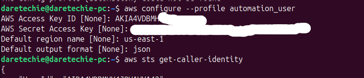
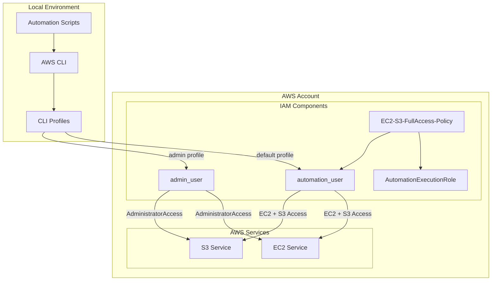

# AWS Authentication Setup for EC2 and S3 Automation



## 📋 Table of Contents

- [Overview](#overview)
- [Architecture Diagram](#architecture-diagram)
- [Prerequisites](#prerequisites)
- [Step-by-Step Implementation](#step-by-step-implementation)
- [Configuration Files](#configuration-files)
- [Testing and Verification](#testing-and-verification)
- [Usage Examples](#usage-examples)
- [Troubleshooting Guide](#troubleshooting-guide)
- [Security Best Practices](#security-best-practices)
- [Project Structure](#project-structure)

## 🎯 Overview

This project demonstrates how to set up secure AWS CLI authentication for automation scripts that manage EC2 instances and S3 buckets. The implementation follows AWS security best practices by creating dedicated IAM users with specific permissions rather than using root user credentials.

Before we begin, let's understand why we're building this authentication system. Think of AWS as a massive digital warehouse with different sections (EC2 for virtual computers, S3 for storage). To access this warehouse programmatically, we need proper identification and permissions - just like an employee needs both an ID badge and specific clearance levels to access different areas of a building.

### What We Built

- **IAM Policy**: Custom policy granting full EC2 and S3 access
- **IAM Role**: Reusable permission container for automation tasks
- **IAM Users**: Dedicated users for automation and administrative tasks
- **AWS CLI Profiles**: Multiple profiles for different use cases
- **Secure Authentication**: Programmatic access without root user exposure

### Business Value

- ✅ **Security**: Eliminates root user access key risks
- ✅ **Scalability**: Easily manage multiple environments
- ✅ **Automation**: Enables script-based resource management
- ✅ **Compliance**: Follows AWS Well-Architected principles
- ✅ **Audit Trail**: Clear separation of duties and access logging

## 🏗️ Architecture Diagram



## 📋 Prerequisites

### System Requirements

- **Operating System**: Linux, macOS, or Windows
- **Python**: 3.7+ (for AWS CLI)
- **Internet Connection**: Required for AWS CLI installation and API calls

### AWS Account Requirements

- Active AWS account with billing enabled
- Root user access (temporary, for initial setup only)
- Understanding of IAM concepts

### Tools Needed

- Terminal/Command Prompt access
- Text editor (for configuration review)
- Secure credential storage method

## 🔧 Step-by-Step Implementation

### Phase 1: IAM Policy Creation

**Purpose**: Define permissions blueprint for automation tasks

1. **Navigate to IAM Console**

   ```
   AWS Console → Services → IAM → Policies → Create policy
   ```

2. **Create Policy JSON**

   ```json
   {
     "Version": "2012-10-17",
     "Statement": [
       {
         "Effect": "Allow",
         "Action": ["ec2:*", "s3:*"],
         "Resource": "*"
       }
     ]
   }
   ```

3. **Policy Configuration**
   - **Name**: `EC2-S3-FullAccess-Policy`
   - **Description**: `Full access to EC2 and S3 services for automation tasks`


### Phase 2: IAM Role Setup

**Purpose**: Create reusable permission container

1. **Role Configuration**

   - **Trusted Entity**: AWS service (EC2)
   - **Permissions**: Attach `EC2-S3-FullAccess-Policy`
   - **Role Name**: `AutomationExecutionRole`

2. **Trust Relationship**
   ```json
   {
     "Version": "2012-10-17",
     "Statement": [
       {
         "Effect": "Allow",
         "Principal": {
           "Service": "ec2.amazonaws.com"
         },
         "Action": "sts:AssumeRole"
       }
     ]
   }
   ```


### Phase 3: IAM Users Creation

#### 3A: Automation User

1. **User Configuration**

   - **Username**: `automation_user`
   - **Access Type**: Programmatic access
   - **Permissions**: Attach `EC2-S3-FullAccess-Policy`

2. **Security Tags**
   ```
   Purpose: Automation
   Project: EC2-S3-Management
   Environment: Production
   ```

#### 3B: Administrative User

1. **User Configuration**

   - **Username**: `admin_user`
   - **Access Type**: Programmatic access
   - **Permissions**: `AdministratorAccess` (AWS managed policy)

2. **Security Tags**
   ```
   Role: Administrator
   Purpose: Account Management
   ```


### Phase 4: AWS CLI Installation

#### Linux Installation

```bash
# Download AWS CLI v2
curl "https://awscli.amazonaws.com/awscli-exe-linux-x86_64.zip" -o "awscliv2.zip"

# Extract installer
unzip awscliv2.zip

# Install
sudo ./aws/install

# Verify installation
aws --version
```

#### macOS Installation

```bash
# Using Homebrew (recommended)
brew install awscli

# Or download PKG installer from AWS website
# Verify installation
aws --version
```

#### Windows Installation

1. Download MSI installer from [AWS CLI Downloads](https://awscli.amazonaws.com/AWSCLIV2.msi)
2. Run installer with administrator privileges
3. Verify installation:
   ```cmd
   aws --version
   ```

### Phase 5: AWS CLI Configuration

#### Default Profile (Automation User)

```bash
aws configure
```

**Configuration Values:**

```
AWS Access Key ID: [automation_user access key]
AWS Secret Access Key: [automation_user secret key]
Default region name: us-east-1
Default output format: json
```

#### Admin Profile

```bash
aws configure --profile admin
```

**Configuration Values:**

```
AWS Access Key ID: [admin_user access key]
AWS Secret Access Key: [admin_user secret key]
Default region name: us-east-1
Default output format: json
```

## 📁 Configuration Files

### AWS Credentials File

**Location**: `~/.aws/credentials` (Linux/Mac) or `%USERPROFILE%\.aws\credentials` (Windows)

```ini
[default]
aws_access_key_id = [AUTOMATION_USER_ACCESS_KEY]
aws_secret_access_key = [AUTOMATION_USER_SECRET_KEY]

[admin]
aws_access_key_id = [ADMIN_USER_ACCESS_KEY]
aws_secret_access_key = [ADMIN_USER_SECRET_KEY]

[testing]
aws_access_key_id = [TESTING_USER_ACCESS_KEY]
aws_secret_access_key = [TESTING_USER_SECRET_KEY]

[production]
aws_access_key_id = [PRODUCTION_USER_ACCESS_KEY]
aws_secret_access_key = [PRODUCTION_USER_SECRET_KEY]

[local]
aws_access_key_id = [LOCAL_USER_ACCESS_KEY]
aws_secret_access_key = [LOCAL_USER_SECRET_KEY]
```

### AWS Config File

**Location**: `~/.aws/config`

```ini
[default]
region = us-east-1
output = json

[profile admin]
region = us-east-1
output = json

[profile testing]
region = us-west-2
output = table

[profile production]
region = us-east-1
output = json

[profile local]
region = us-east-1
output = yaml
```

## 🧪 Testing and Verification

### Basic Connectivity Tests

```bash
# Test default profile (automation_user)
aws sts get-caller-identity

# Expected Output:
{
    "UserId": "AIDA4VDBMHY4JQWAWYA42",
    "Account": "869935103544",
    "Arn": "arn:aws:iam::869935103544:user/automation_user"
}
```

```bash
# Test admin profile
aws sts get-caller-identity --profile admin

# Expected Output:
{
    "UserId": "AIDA4VDBMHY4JQWAWESOME",
    "Account": "869935103544",
    "Arn": "arn:aws:iam::869935103544:user/admin_user"
}
```

### Permission Verification

```bash
# Test EC2 access (automation_user)
aws ec2 describe-regions --output table

# Test S3 access (automation_user)
aws s3 ls

# Test administrative access (admin_user)
aws iam list-users --profile admin
```

### Profile Management

```bash
# List all configured profiles
aws configure list-profiles

# View specific profile configuration
aws configure list --profile admin

# Test profile switching
export AWS_PROFILE=admin
aws sts get-caller-identity
unset AWS_PROFILE
```

## 💻 Usage Examples

### Automation Script Example

```bash
#!/bin/bash
# File: create-infrastructure.sh

set -e  # Exit on any error

# Configuration
PROFILE="default"  # Uses automation_user
REGION="us-east-1"
INSTANCE_TYPE="t2.micro"
BUCKET_PREFIX="automation-project"

echo "🚀 Starting AWS infrastructure creation..."

# Create EC2 instance
echo "📦 Creating EC2 instance..."
INSTANCE_ID=$(aws ec2 run-instances \
    --image-id ami-0c02fb55956c7d316 \
    --instance-type $INSTANCE_TYPE \
    --region $REGION \
    --query 'Instances[0].InstanceId' \
    --output text)

echo "✅ EC2 instance created: $INSTANCE_ID"

# Create S3 bucket
echo "🪣 Creating S3 bucket..."
BUCKET_NAME="${BUCKET_PREFIX}-$(date +%s)"
aws s3 mb s3://$BUCKET_NAME --region $REGION

echo "✅ S3 bucket created: $BUCKET_NAME"

# Tag resources
echo "🏷️ Tagging resources..."
aws ec2 create-tags \
    --resources $INSTANCE_ID \
    --tags Key=Project,Value=Automation Key=Environment,Value=Development

echo "🎉 Infrastructure creation completed!"
echo "📋 Summary:"
echo "   - EC2 Instance: $INSTANCE_ID"
echo "   - S3 Bucket: $BUCKET_NAME"
```

### Administrative Tasks Example

```bash
#!/bin/bash
# File: admin-tasks.sh

PROFILE="admin"

echo "👨‍💼 Running administrative tasks..."

# List all users
echo "📋 Current IAM Users:"
aws iam list-users --profile $PROFILE --query 'Users[*].[UserName,CreateDate]' --output table

# Check account summary
echo "📊 Account Summary:"
aws iam get-account-summary --profile $PROFILE

# List S3 buckets across account
echo "🪣 All S3 Buckets:"
aws s3 ls --profile $PROFILE

# Check billing (if enabled)
echo "💰 Cost and Usage (Last 30 days):"
aws ce get-cost-and-usage \
    --time-period Start=2025-07-23,End=2025-08-23 \
    --granularity MONTHLY \
    --metrics BlendedCost \
    --profile $PROFILE
```

### Environment-Specific Deployments

```bash
#!/bin/bash
# File: deploy-by-environment.sh

deploy_to_environment() {
    local env=$1
    local profile=$2

    echo "🚀 Deploying to $env environment using $profile profile..."

    # Create environment-specific resources
    aws ec2 run-instances \
        --image-id ami-0c02fb55956c7d316 \
        --instance-type t2.micro \
        --tag-specifications "ResourceType=instance,Tags=[{Key=Environment,Value=$env}]" \
        --profile $profile

    aws s3 mb s3://myapp-$env-$(date +%s) --profile $profile
}

# Deploy to different environments
deploy_to_environment "testing" "testing"
deploy_to_environment "production" "production"
deploy_to_environment "local" "local"
```

## 🔍 Troubleshooting Guide

### Common Issues and Solutions

#### 1. "The config profile (automation) could not be found"

**Symptom:**

```bash
$ aws sts get-caller-identity --profile automation
The config profile (automation) could not be found
```

**Cause**: Profile doesn't exist or is misconfigured

**Solution:**

```bash
# Check existing profiles
aws configure list-profiles

# Create missing profile
aws configure --profile automation

# Or verify config file
cat ~/.aws/config
cat ~/.aws/credentials
```

#### 2. "Unable to locate credentials"

**Symptom:**

```bash
$ aws s3 ls
Unable to locate credentials. You can configure credentials by running "aws configure".
```

**Cause**: No default credentials configured

**Solution:**

```bash
# Configure default profile
aws configure

# Or set environment variable
export AWS_PROFILE=automation

# Or specify profile explicitly
aws s3 ls --profile admin
```

#### 3. "An error occurred (UnauthorizedOperation)"

**Symptom:**

```bash
$ aws ec2 describe-instances
An error occurred (UnauthorizedOperation) when calling the DescribeInstances operation
```

**Cause**: Insufficient permissions

**Solution:**

```bash
# Check current user identity
aws sts get-caller-identity

# Verify IAM permissions in AWS Console
# Ensure proper policy attachment

# Test with different profile
aws ec2 describe-instances --profile admin
```

#### 4. "InvalidUserID.NotFound"

**Symptom:**

```bash
$ aws iam get-user
An error occurred (InvalidUserID.NotFound) when calling the GetUser operation
```

**Cause**: User doesn't exist or was deleted

**Solution:**

```bash
# Verify user identity
aws sts get-caller-identity

# Check if user exists (using admin profile)
aws iam list-users --profile admin

# Recreate user if necessary
```

#### 5. "AccessDenied" for S3 operations

**Symptom:**

```bash
$ aws s3 ls
An error occurred (AccessDenied) when calling the ListBuckets operation
```

**Cause**: Missing S3 permissions

**Solution:**

```bash
# Check current user's attached policies
aws iam list-attached-user-policies --user-name automation_user --profile admin

# Verify policy has S3 permissions
aws iam get-policy-version \
    --policy-arn arn:aws:iam::ACCOUNT:policy/EC2-S3-FullAccess-Policy \
    --version-id v1 \
    --profile admin
```

### Diagnostic Commands

```bash
# Complete system check
echo "=== AWS CLI Version ==="
aws --version

echo "=== Available Profiles ==="
aws configure list-profiles

echo "=== Current User Identity ==="
aws sts get-caller-identity

echo "=== Current Configuration ==="
aws configure list

echo "=== Test Basic Connectivity ==="
aws ec2 describe-regions --query 'Regions[0]' --output table

echo "=== Environment Variables ==="
env | grep AWS
```

### Log Analysis

```bash
# Enable AWS CLI debug logging
aws s3 ls --debug > aws-debug.log 2>&1

# Check CloudTrail logs (admin required)
aws logs describe-log-groups --profile admin

# Monitor API calls
aws logs filter-log-events \
    --log-group-name CloudTrail/APIGateway \
    --start-time $(date -d '1 hour ago' +%s)000 \
    --profile admin
```

## 🔒 Security Best Practices

### Credential Security

1. **Never Commit Credentials to Version Control**

   ```bash
   # Add to .gitignore
   echo "*.pem" >> .gitignore
   echo ".aws/" >> .gitignore
   echo "*.key" >> .gitignore
   ```

2. **Use Environment Variables for CI/CD**

   ```bash
   export AWS_ACCESS_KEY_ID=your_access_key
   export AWS_SECRET_ACCESS_KEY=your_secret_key
   export AWS_DEFAULT_REGION=us-east-1
   ```

3. **Regular Credential Rotation**

   ```bash
   # Create new access key
   aws iam create-access-key --user-name automation_user --profile admin

   # Update configuration
   aws configure set aws_access_key_id NEW_ACCESS_KEY
   aws configure set aws_secret_access_key NEW_SECRET_KEY

   # Delete old access key
   aws iam delete-access-key --user-name automation_user --access-key-id OLD_KEY --profile admin
   ```

### Access Control

1. **Principle of Least Privilege**

   ```json
   {
     "Version": "2012-10-17",
     "Statement": [
       {
         "Effect": "Allow",
         "Action": [
           "ec2:DescribeInstances",
           "ec2:RunInstances",
           "ec2:TerminateInstances",
           "s3:GetObject",
           "s3:PutObject",
           "s3:CreateBucket"
         ],
         "Resource": "*"
       }
     ]
   }
   ```

2. **Enable MFA for Admin Operations**
   ```json
   {
     "Version": "2012-10-17",
     "Statement": [
       {
         "Effect": "Allow",
         "Action": "*",
         "Resource": "*",
         "Condition": {
           "Bool": {
             "aws:MultiFactorAuthPresent": "true"
           }
         }
       }
     ]
   }
   ```

### Monitoring and Auditing

1. **Enable CloudTrail**

   ```bash
   aws cloudtrail create-trail \
       --name automation-audit-trail \
       --s3-bucket-name audit-logs-bucket \
       --profile admin
   ```

2. **Set Up CloudWatch Alarms**
   ```bash
   aws cloudwatch put-metric-alarm \
       --alarm-name "UnusualAPIActivity" \
       --alarm-description "Alert on unusual API call volume" \
       --metric-name CallCount \
       --namespace AWS/ApiGateway \
       --statistic Sum \
       --period 300 \
       --threshold 1000 \
       --comparison-operator GreaterThanThreshold \
       --profile admin
   ```

## 📂 Project Structure

```
aws-authentication-project/
├── README.md                 # This documentation
├── scripts/
│   ├── create-infrastructure.sh    # Main automation script
│   ├── admin-tasks.sh             # Administrative utilities
│   ├── cleanup-resources.sh       # Resource cleanup
│   └── deploy-by-environment.sh   # Environment-specific deployments
├── config/
│   ├── iam-policies/
│   │   ├── ec2-s3-policy.json     # Custom IAM policy
│   │   └── trust-relationship.json # Role trust policy
│   └── aws-cli/
│       ├── credentials.template    # Credentials template
│       └── config.template        # Config template
├── docs/
│   ├── architecture-diagram.png   # System architecture
│   ├── troubleshooting.md         # Extended troubleshooting
│   └── security-guidelines.md     # Security best practices
├── tests/
│   ├── test-connectivity.sh       # Connection tests
│   ├── test-permissions.sh        # Permission validation
│   └── integration-tests.sh       # End-to-end tests
└── examples/
    ├── basic-ec2-creation.sh      # Simple EC2 example
    ├── s3-bucket-management.sh    # S3 operations example
    └── multi-region-deployment.sh # Multi-region setup
```

## 🎯 Summary

This project successfully demonstrates a complete AWS authentication setup that:

- ✅ **Eliminates Security Risks**: No root user access keys
- ✅ **Enables Automation**: Programmatic access for scripts
- ✅ **Provides Flexibility**: Multiple profiles for different use cases
- ✅ **Follows Best Practices**: AWS security recommendations
- ✅ **Supports Scalability**: Easy to extend for more environments

### Key Achievements

1. **IAM Policy**: `EC2-S3-FullAccess-Policy` with appropriate permissions
2. **IAM Users**: `automation_user` and `admin_user` with distinct roles
3. **AWS CLI Profiles**: Organized profile structure for different needs
4. **Security**: Credential isolation and proper access controls
5. **Documentation**: Comprehensive troubleshooting and usage guides

### Next Steps

- Implement automated testing pipeline
- Add infrastructure as code (Terraform/CloudFormation)
- Set up monitoring and alerting
- Create CI/CD integration
- Expand to additional AWS services

---


