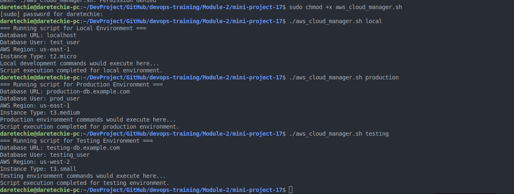

# AWS Cloud Manager: Understanding Environment Variables & Infrastructure Environments

## Project Overview

This mini-project serves as a comprehensive learning journey into two fundamental concepts that every cloud engineer must master: **Infrastructure Environments** and **Environment Variables**. While these terms share the word "environment," they represent distinctly different concepts that work together to create flexible, maintainable cloud solutions.

Think of this project as building the foundation for professional AWS automation. By the end, you'll understand how to create scripts that can seamlessly adapt to different deployment contexts without requiring code changes—a critical skill in modern DevOps practices.

## Understanding the Core Concepts

Before we dive into the hands-on work, let's make sure we have a solid foundation. Think of Infrastructure Environments as the different "stages" where your application lives and grows, like a theater production that moves from rehearsals to opening night. Each environment serves a distinct purpose in your software's journey.

Environment Variables, on the other hand, are like configuration switches that help your application adapt to wherever it's running. They're the secret to making your code flexible and reusable across different infrastructure environments.

## Learning Objectives

Through this hands-on project, you will develop a deep understanding of:

- How infrastructure environments represent different stages in your application lifecycle
- How environment variables provide dynamic configuration capabilities
- Why positional parameters make scripts flexible and user-friendly
- How proper input validation creates robust, professional-grade automation
- The relationship between local development, testing, and production environments
- How to integrate the AWS CLI to provision resources.

## Project Architecture

### Infrastructure Environments Explained

Our FinTech scenario demonstrates three distinct infrastructure environments, each serving a specific purpose in the software development lifecycle:

**Local Development Environment:** Your personal workspace (VirtualBox + Ubuntu, Mac Terminal, or EC2 "local" instance) where you experiment safely without affecting other developers or systems.

**Testing Environment:** AWS Account 1, where code undergoes rigorous testing in cloud conditions that mirror production but use dedicated testing resources to prevent any impact on live systems.

**Production Environment:** AWS Account 2, where your application serves real customers and handles live data with full security and performance requirements.

### Environment Variables in Action

Environment variables act as configuration switches that allow the same script to behave appropriately in each infrastructure environment. For example, our script will use the environment to decide what kind of EC2 instance to provision.

## Prerequisites

Before beginning this project, ensure you have access to one of the following development environments:

- **macOS:** Terminal application with bash shell
- **Windows:** VirtualBox with Ubuntu VM and terminal access
- **Cloud-based:** AWS EC2 instance (can be named "local-dev" for clarity)

You should also have basic familiarity with command-line operations and text editors like nano or vim.

You will also need the AWS CLI installed and configured with appropriate permissions to create EC2 instances.

## Step-by-Step Implementation Guide

### Phase 1: Foundation Setup

**Step 1: Create Your Workspace**

Choose and prepare your development environment. This becomes your "local" infrastructure environment for the entire project.

If you're using an EC2 instance, connect via SSH:

```bash
ssh -i your-key.pem ec2-user@your-instance-ip
```

**Step 2: Initialize Your Script File**

Create the foundation script that will evolve throughout this project:

```bash
nano aws_cloud_manager.sh
```

### Phase 2: Implementing the Script

The final script should incorporate all learned concepts with realistic environment-specific configurations and AWS CLI integration.

```bash
#!/bin/bash

# Set the environment from the first argument
ENVIRONMENT=$1

# Check if an environment is provided
if [ -z "$ENVIRONMENT" ]; then
  echo "Usage: $0 <local|testing|production>"
  exit 1
fi

echo "Selected environment: $ENVIRONMENT"

# ---
# AWS CLI Integration
# This section will be filled with AWS CLI commands
# to provision resources based on the environment.

# Note: Using AMI ami-0c55b159cbfafe1f0 (Amazon Linux 2 in us-east-1). 
# You may need to change this depending on your region.

case $ENVIRONMENT in
  local)
    echo "Running in local mode. No AWS resources will be provisioned."
    ;;
  testing)
    echo "Provisioning testing environment..."
    # Provision a t2.micro EC2 instance
    INSTANCE_ID=$(aws ec2 run-instances \
      --image-id ami-0c55b159cbfafe1f0 \
      --instance-type t2.micro \
      --tag-specifications 'ResourceType=instance,Tags=[{Key=Environment,Value=Testing}]' \
      --query 'Instances[0].InstanceId' \
      --output text)

    if [ $? -eq 0 ]; then
      echo "Successfully provisioned EC2 instance with ID: $INSTANCE_ID"
    else
      echo "Failed to provision EC2 instance."
      exit 1
    fi
    ;;
  production)
    echo "Provisioning production environment..."
    # Provision a t2.small EC2 instance
    INSTANCE_ID=$(aws ec2 run-instances \
      --image-id ami-0c55b159cbfafe1f0 \
      --instance-type t2.small \
      --tag-specifications 'ResourceType=instance,Tags=[{Key=Environment,Value=Production}]' \
      --query 'Instances[0].InstanceId' \
      --output text)

    if [ $? -eq 0 ]; then
      echo "Successfully provisioned EC2 instance with ID: $INSTANCE_ID"
    else
      echo "Failed to provision EC2 instance."
      exit 1
    fi
    ;;
  *)
    echo "Invalid environment. Please use 'local', 'testing', or 'production'."
    exit 1
    ;;
esac
```

## Testing and Validation

### Functional Testing

Test each environment configuration to ensure proper behavior:

```bash
# Make the script executable
chmod +x aws_cloud_manager.sh

# Test valid environments
./aws_cloud_manager.sh local
./aws_cloud_manager.sh testing
./aws_cloud_manager.sh production

# Test error conditions
./aws_cloud_manager.sh
./aws_cloud_manager.sh invalid_env
./aws_cloud_manager.sh testing production
```

### Expected Outputs

**Local Environment Output:**

```
Selected environment: local
Running in local mode. No AWS resources will be provisioned.
```

**Testing Environment Output:**
```
Selected environment: testing
Provisioning testing environment...
Successfully provisioned EC2 instance with ID: i-0123456789abcdef0
```

**Production Environment Output:**
```
Selected environment: production
Provisioning production environment...
Successfully provisioned EC2 instance with ID: i-0abcdef0123456789
```

**Error Condition Output:**

```
Usage: ./aws_cloud_manager.sh <local|testing|production>
```

## Troubleshooting Guide

### Common Issues and Solutions

**Issue: Permission Denied Error**

```
bash: ./aws_cloud_manager.sh: Permission denied
```

**Solution:** The script lacks execute permissions. Apply the correct permissions:

```bash
chmod +x aws_cloud_manager.sh
```

**Issue: "Command Not Found" Error**

```
./aws_cloud_manager.sh: command not found
```

**Root Cause Analysis:** Either the script doesn't exist in the current directory, or the shebang line is incorrect.
**Solution Steps:** Verify the script exists with `ls -la aws_cloud_manager.sh` and ensure the first line is exactly `#!/bin/bash`.

**Issue: AWS CLI errors**
If you encounter errors from the `aws` command, ensure that the AWS CLI is installed and configured correctly with credentials that have permission to launch EC2 instances.

## The script is [here](aws_cloud_manager.sh)

## Key Learning Outcomes

This project builds several critical competencies that directly apply to professional AWS engineering:

**Dynamic Configuration Management:** You've learned how environment variables enable the same codebase to operate across multiple infrastructure environments without modification, a fundamental principle in Infrastructure as Code.

**Robust Input Validation:** Professional scripts always validate user input to prevent unexpected failures and provide clear usage guidance, improving both reliability and user experience.

**Scalable Architecture Patterns:** The separation between infrastructure environments (local, testing, production) mirrors real-world enterprise deployments where different AWS accounts manage different stages of the application lifecycle.

**Maintainable Code Practices:** Using positional parameters instead of hard-coded values creates flexible, reusable scripts that adapt to changing requirements without code modifications.

## Real-World Applications

This foundational knowledge extends naturally to advanced AWS automation scenarios:

**Multi-Account AWS Deployments:** Use similar patterns to manage resources across development, staging, and production AWS accounts with appropriate configurations for each environment.

**Infrastructure as Code:** Apply these concepts with tools like Terraform or CloudFormation, where environment-specific variables control resource provisioning parameters.

**CI/CD Pipeline Integration:** Environment-aware scripts integrate seamlessly with automated deployment pipelines, enabling consistent deployments across different stages.

**Security and Compliance:** Environment-specific configurations ensure appropriate security controls apply in each infrastructure environment, maintaining compliance requirements.

## Future Enhancements

This project can be extended with these advanced features:

**Configuration File Support:** Extend the script to read environment-specific settings from external configuration files, a best practice that separates configuration from your code.

**Logging and Monitoring:** Implement comprehensive logging that tracks script execution across different environments for audit and troubleshooting purposes.

**Error Recovery:** Add sophisticated error handling that can recover from common AWS API failures and retry operations intelligently.

**Resource Decommissioning:** Add functionality to terminate the resources created by the script.

## Conclusion

Through this comprehensive mini-project, you've built a solid foundation in two critical concepts that underpin modern cloud engineering: infrastructure environments and environment variables. The aws_cloud_manager.sh script you've created demonstrates professional practices that scale from simple automation tasks to complex enterprise deployments.

The skills you've developed—dynamic configuration management, input validation, and environment-aware scripting—form the backbone of Infrastructure as Code practices that drive efficient, reliable cloud operations in organizations worldwide.

## Visual Aids


_Terminal output showing the script executing for all environment_