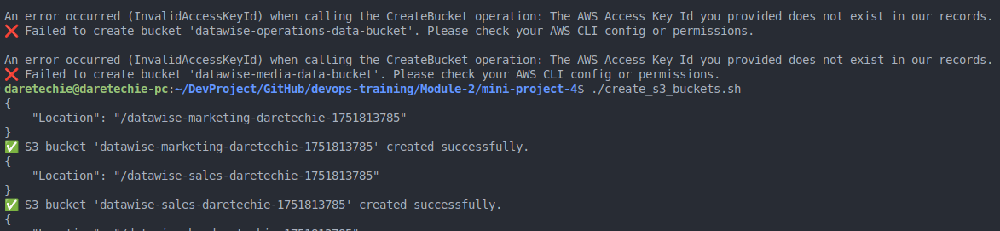
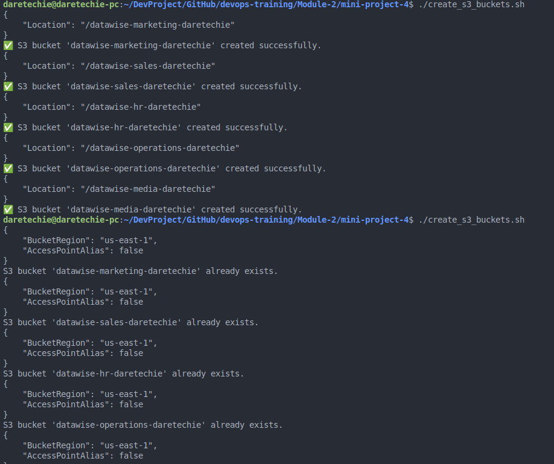
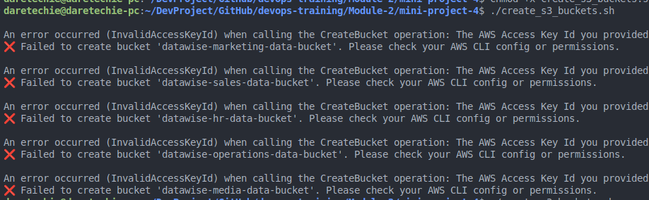

# 🧪 Error Handling in Shell Scripting

Error handling is critical for building reliable and maintainable Bash scripts. In this mini project, we focused on building a script to automate the creation of AWS S3 buckets for different departments, while accounting for potential errors like duplicate bucket names, invalid configurations, or AWS CLI failures.

---

## ✅ Project Script: Create S3 Buckets with Error Handling

```bash
#!/bin/bash

create_s3_buckets() {
    company="datawise"
    user=$(whoami)  # get your system username
    timestamp=$(date +%s)
    departments=("Marketing" "Sales" "HR" "Operations" "Media")

    for department in "${departments[@]}"; do
        bucket_name="${company,,}-${department,,}-${user,,}-${timestamp}"
        #bucket_name="${company,,}-${department,,}-${user}"

        # Check if bucket already exists
        if aws s3api head-bucket --bucket "$bucket_name" 2>/dev/null; then
            echo "S3 bucket '$bucket_name' already exists."
        else
            aws s3api create-bucket --bucket "$bucket_name" --region us-east-1
            if [ $? -eq 0 ]; then
                echo "✅ S3 bucket '$bucket_name' created successfully."
            else
                echo "❌ Failed to create bucket '$bucket_name'. Please check your AWS CLI config or permissions."
            fi
        fi
    done
}

create_s3_buckets

```



---

## 🎯 What This Script Demonstrates

- **Control flow:** `for` loop to iterate through department names
- **Conditional logic:** `if-else` to check for bucket existence
- **Error handling:** exit status `$?` used to verify if bucket creation succeeded
- **Idempotency:** prevents trying to recreate existing buckets
- **Feedback:** provides useful output messages for each condition

---

## 💡 Example Output (Plaintext)

```
{
    "Location": "/datawise-marketing-daretechie-1751813785"
}
✅ S3 bucket 'datawise-marketing-daretechie-1751813785' created successfully.
{
    "Location": "/datawise-sales-daretechie-1751813785"
}
✅ S3 bucket 'datawise-sales-daretechie-1751813785' created successfully.
{
    "Location": "/datawise-hr-daretechie-1751813785"
}
```



---


---

## 🧰 Troubleshooting Table

| Issue                           | Cause                                  | Solution                                                  |
| ------------------------------- | -------------------------------------- | --------------------------------------------------------- |
| `AccessDenied` or `AuthFailure` | Missing or invalid AWS credentials     | Run `aws configure` to set up your credentials            |
| `BucketAlreadyExists`           | Bucket name not globally unique        | Use naming conventions that incorporate your company name |
| `aws: command not found`        | AWS CLI not installed or not in \$PATH | Install AWS CLI and ensure it's in your system's path     |
| Script exits silently           | Errors suppressed or not handled       | Add `set -x` or echo outputs for debugging                |



---

## 🏁 Summary

This project highlighted how to:

- Use control flow to automate bulk resource creation
- Implement graceful error handling using exit codes
- Validate AWS operations before executing commands
- Display informative messages to users

By anticipating and managing errors, the script avoids crashes and improves the user experience. These practices are essential for scripting in real-world production environments where reliability and clarity are critical.
