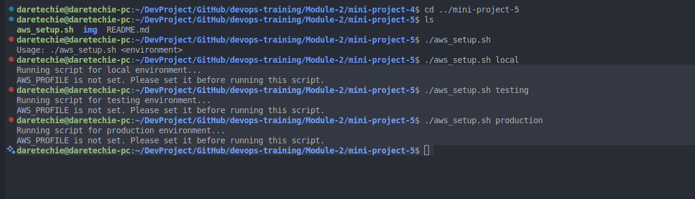

# 🛠️ Working with Functions in Shell Scripting

In this mini-project, you'll write a Bash script that automates the setup of EC2 instances and S3 buckets. The focus is on using **functions** to organize the logic, improve readability, and support reuse.

---

## 🎯 Project Objectives

- Check if a script has the required argument.
- Validate the argument against expected environment values.
- Verify that AWS CLI is installed.
- Confirm that the `AWS_PROFILE` environment variable is set.
- Use Bash **functions** to structure logic clearly.
- Understand how to configure AWS profiles for multiple environments.

---

## 📂 File Setup

### 1. **Create the Script File**

```bash
vim aws_setup.sh
```

### 2. **Make it Executable**

```bash
chmod +x aws_setup.sh
```

---

## ⚙️ Refactored Script Using Functions

```bash
#!/bin/bash

# ENVIRONMENT passed as an argument
ENVIRONMENT=$1

# Function to check if argument is passed
check_num_of_args() {
  if [ "$#" -ne 1 ]; then
    echo "Usage: $0 <environment>"
    exit 1
  fi
}

# Function to activate environment-specific logic
activate_infra_environment() {
  if [ "$ENVIRONMENT" == "local" ]; then
    echo "Running script for Local Environment..."
  elif [ "$ENVIRONMENT" == "testing" ]; then
    echo "Running script for Testing Environment..."
  elif [ "$ENVIRONMENT" == "production" ]; then
    echo "Running script for Production Environment..."
  else
    echo "Invalid environment specified. Please use 'local', 'testing', or 'production'."
    exit 2
  fi
}

# Function to check if AWS CLI is installed
check_aws_cli() {
  if ! command -v aws &> /dev/null; then
    echo "AWS CLI is not installed. Please install it before proceeding."
    return 1
  fi
}

# Function to check if AWS_PROFILE is set
check_aws_profile() {
  if [ -z "$AWS_PROFILE" ]; then
    echo "AWS profile environment variable is not set."
    return 1
  fi
}

# Function calls
check_num_of_args "$@"
activate_infra_environment
check_aws_cli
check_aws_profile
```



---

## 🔍 Code Explanation

- **Function Names** are descriptive and clarify script structure.
- **Function Calls** are placed at the end, mimicking professional shell scripting style.
- `"$@"` ensures proper argument passing to functions.

---

## ✅ Sample Output (Plaintext)

```
$ ./aws_setup.sh testing
Running script for Testing Environment...
```

```
$ ./aws_setup.sh
Usage: ./aws_setup.sh <environment>
```

```
$ ./aws_setup.sh staging
Invalid environment specified. Please use 'local', 'testing', or 'production'.
```


---

## 🧾 How to Create AWS Profiles for Testing & Production

Use the `aws configure --profile <name>` command to set up named AWS profiles:

```bash
aws configure --profile testing
aws configure --profile production
```

This command prompts you for:

- AWS Access Key ID
- AWS Secret Access Key
- Default Region Name
- Default Output Format

These settings will be saved in two files:

### `~/.aws/credentials`

```
[default]
aws_access_key_id = YOUR_ACCESS_KEY_ID
aws_secret_access_key = YOUR_SECRET_KEY

[testing]
aws_access_key_id = YOUR_TESTING_KEY_ID
aws_secret_access_key = YOUR_TESTING_SECRET_KEY

[production]
aws_access_key_id = YOUR_PRODUCTION_KEY_ID
aws_secret_access_key = YOUR_PRODUCTION_SECRET_KEY
```

### `~/.aws/config`

```
[default]
region = us-east-1
output = json

[profile testing]
region = us-west-1
output = json

[profile production]
region = us-west-2
output = json
```

Activate a specific profile for the current terminal session:

```bash
export AWS_PROFILE=testing
```


---

## ❗ Troubleshooting Tips

| Issue                                         | Cause                            | Fix                                            |
| --------------------------------------------- | -------------------------------- | ---------------------------------------------- |
| `Usage: ./aws_setup.sh <environment>`         | Missing required argument        | Pass environment like `local`, `testing`, etc. |
| `AWS CLI is not installed`                    | CLI not found in PATH            | Run: `sudo apt install awscli`                 |
| `AWS profile environment variable is not set` | Missing `AWS_PROFILE`            | Run: `export AWS_PROFILE=testing`              |
| Unrecognized environment value                | Invalid input like `dev` or `qa` | Use only: `local`, `testing`, or `production`  |

---

## 🧠 Additional Notes

- `command -v aws`: Tests if AWS CLI exists.
- `-z "$VAR"`: Tests if variable is empty.
- Use `return 1` in functions to gracefully exit without crashing the entire script.


---

## 🏁 Summary

✅ **What You Learned:**

- How to use **functions** to structure and organize Bash scripts.
- Input validation and command-line argument checking.
- AWS CLI detection and environment profile validation.
- How to configure multiple AWS profiles for different environments.
- Creating cleaner, modular, and reusable scripts.

This approach mirrors what professionals do in real-world DevOps automation workflows. Great work!

---
