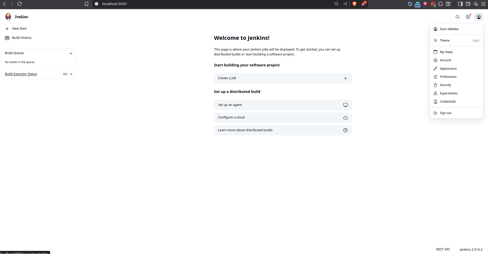

# 🚀 Introduction to Jenkins & CI/CD

## 🔄 What is CI/CD?

Continuous Integration (CI) and Continuous Delivery/Deployment (CD) represent a culture and a set of operating principles that enable application development teams to deliver code changes more frequently and reliably.

- **Continuous Integration (CI)** is the practice of automating the integration of code changes from multiple contributors into a single software project. Developers merge their changes back to the main branch as often as possible. Each merge triggers an automated build and test sequence.
- **Continuous Delivery/Deployment (CD)** is the practice of automating the entire software release process. CD ensures that you can release new changes to your customers quickly and sustainably.

The goal is to establish a streamlined pipeline that delivers faster, reduces manual errors, and produces reliable software updates.


---

## ⚙️ What is Jenkins?

Jenkins is a powerful, open-source automation server that acts as the engine for CI/CD pipelines. It helps automate the parts of software development related to building, testing, and deploying, facilitating continuous integration and continuous delivery.

Key features include:

- **Automation:** Automates the entire build, test, and deployment workflow.
- **Extensibility:** Integrates with countless tools like Git, Docker, and cloud providers through a vast ecosystem of plugins.
- **Pipelines-as-Code:** Allows you to define your entire CI/CD pipeline as a `Jenkinsfile`, which can be versioned and reviewed like any other code.



---

## 📌 Project Prerequisites

Before you begin, ensure you have:

- A solid understanding of Linux command-line basics.
- Access to an Ubuntu server or virtual machine (cloud or local).

---

## 🎯 Project Goals

By the end of this project, you will be able to:

- Understand core CI/CD principles.
- Install and configure a Jenkins server from scratch.
- Create and manage both Freestyle and Pipeline jobs.
- Connect Jenkins to a Git repository for automated builds.
- Execute an end-to-end pipeline, including Docker integration.

---

## 🛠️ Getting Started with Jenkins

### Step 1: Install Prerequisites

1.  **Update Package Repositories**
    First, update your server's package list to ensure you get the latest versions of software.

    ```bash
    sudo apt update
    ```

    

2.  **Install Java Development Kit (JDK)**
    Jenkins is a Java-based application, so it requires a compatible Java runtime environment.

    ```bash
    sudo apt install default-jdk-headless
    ```

    

3.  **Install Jenkins**
    Next, add the official Jenkins repository and install it using `apt`.

    ```bash
    # Add the Jenkins GPG key to your system's keychain
    wget -q -O - https://pkg.jenkins.io/debian-stable/jenkins.io.key | sudo apt-key add -

    # Add the Jenkins repository to your system's sources list
    sudo sh -c 'echo deb https://pkg.jenkins.io/debian-stable binary/ > /etc/apt/sources.list.d/jenkins.list'

    # Update the package list again to include the new repository
    sudo apt update

    # Install Jenkins
    sudo apt-get install jenkins
    ```

    

4.  **Verify the Jenkins Service**
    Check that the Jenkins service started automatically and is running.
    ```bash
    sudo systemctl status jenkins
    ```
    

---

### Step 2: Configure Jenkins via Web Console

1.  **Configure the Firewall**
    Allow traffic on port `8080`, the default port for Jenkins, through your firewall or cloud security group.
    

2.  **Access the Web Interface**
    Open your web browser and navigate to your server's IP address on port 8080:

    ```
    http://<your_public_ip>:8080
    ```

3.  **Unlock Jenkins**
    Retrieve the initial administrator password from the server. This password is required to complete the setup.

    ```bash
    sudo cat /var/lib/jenkins/secrets/initialAdminPassword
    ```

    Copy the password from the terminal and paste it into the "Administrator password" field in your browser.
    

4.  **Install Suggested Plugins**
    Choose the "Install suggested plugins" option. Jenkins will automatically install the most commonly used plugins for standard CI/CD workflows.
    

5.  **Create an Admin User**
    Create your own administrator account. This is more secure than continuing to use the initial admin password.
    

6.  **Log in to the Dashboard**
    Once the setup is complete, you will be taken to the Jenkins dashboard, where you can start creating automation jobs.

---

## 🧑‍💻 Creating Jenkins Jobs

### Freestyle Project

A Freestyle project is the original and most straightforward way to create a job in Jenkins. You configure everything—from source code management to build steps—directly in the web UI.

- **To Create:** Go to **New Item** → **Freestyle Project**.
- **Configuration:** Use the web forms to specify your Git repository, add build steps (e.g., `echo "Build successful"`), and configure post-build actions.
- **Use Case:** Ideal for simple, non-complex tasks.


### Pipeline Project

A Pipeline project defines your entire CI/CD workflow as code using a `Jenkinsfile`. This approach is more powerful, scalable, and allows you to version your pipeline alongside your application code.

- **To Create:** Go to **New Item** → **Pipeline**.
- **Configuration:** Write a pipeline script (either directly in the UI or by referencing a `Jenkinsfile` in your Git repository).
- **Use Case:** The standard for modern, complex, and automated CI/CD workflows.


#### Sample `Jenkinsfile`

Here is a simple Declarative Pipeline that checks out code, builds a Docker image, and runs a basic test.

```groovy
pipeline {
    agent any // Run this pipeline on any available agent

    stages {
        stage('Build') {
            steps {
                echo 'Building the application...'
                // Example: sh 'mvn clean install'
            }
        }
        stage('Test') {
            steps {
                echo 'Testing the application...'
                // Example: sh 'mvn test'
            }
        }
        stage('Deploy') {
            steps {
                echo 'Deploying the application...'
                // Example: sh './deploy.sh'
            }
        }
    }

    post {
        always {
            echo 'Pipeline finished.'
        }
        success {
            echo 'Pipeline executed successfully!'
        }
        failure {
            echo 'Pipeline failed.'
        }
    }
}
```

---

## 🐞 Troubleshooting Common Issues

| Issue                               | Common Cause                                     | Recommended Fix                                                                         |
| ----------------------------------- | ------------------------------------------------ | --------------------------------------------------------------------------------------- |
| `systemctl: service not found`      | Jenkins repository was not added correctly.      | Re-run the `wget` and `sh` commands to add the repo, then `sudo apt update`.            |
| Browser can’t connect to `:8080`    | Firewall or security group is blocking the port. | Create an inbound rule to allow TCP traffic on port 8080.                               |
| `initialAdminPassword` file missing | Jenkins did not install or start correctly.      | Reinstall Jenkins and check the service status with `systemctl`.                        |
| Plugin installation hangs           | Network connectivity or firewall issue.          | Ensure the server has internet access. Retry or install plugins manually.               |
| Build fails with Git error          | Git is not installed on the Jenkins server.      | Run `sudo apt install git` on the server.                                               |
| Permission denied during build      | The `jenkins` user lacks necessary permissions.  | Add the `jenkins` user to the required group (e.g., `sudo usermod -aG docker jenkins`). |

---

## ✅ Best Practices

- **Pipeline as Code:** Always use a `Jenkinsfile` stored in your source control repository.
- **Secure Jenkins:** Configure authentication and authorization. Never run Jenkins as the `root` user.
- **Use Plugins Wisely:** Only install plugins you need to avoid performance overhead and security vulnerabilities.
- **Regular Backups:** Regularly back up your Jenkins home directory (`/var/lib/jenkins`) to prevent data loss.
- **Distribute Builds:** For larger teams, use Jenkins agents (nodes) to distribute the build load.

---

## 🚀 Next Steps

After mastering the basics, challenge yourself by exploring:

- **Parameterized Builds:** Create flexible jobs that accept user input.
- **Multibranch Pipelines:** Automatically create pipelines for different branches in your repository.
- **Docker Integration:** Build, test, and deploy containerized applications.
- **Secrets Management:** Integrate Jenkins with tools like HashiCorp Vault to manage credentials securely.
