# GitHub Actions & CI/CD Complete Guide

A hands-on guide to implementing Continuous Integration and Continuous Deployment using GitHub Actions with a Node.js application. This guide walks through three progressive scenarios: basic CI, AWS EC2 deployment, and Docker Hub integration.

## Table of Contents

- [Understanding CI/CD](#understanding-cicd)
- [Prerequisites and Setup](#prerequisites-and-setup)
- [Scenario 1: Basic CI Pipeline](#scenario-1-basic-ci-pipeline)
- [Scenario 2: Real-World AWS EC2 Deployment](#scenario-2-real-world-aws-ec2-deployment)
- [Scenario 3: Docker Hub Integration](#scenario-3-docker-hub-integration)
- [GitHub Actions Core Concepts](#github-actions-core-concepts)
- [Comprehensive Troubleshooting](#comprehensive-troubleshooting)
- [Best Practices and Next Steps](#best-practices-and-next-steps)

## Demo Repository

You can find the completed project for this guide at the following repository:

[https://github.com/daretechie/node-ci-demo](https://github.com/daretechie/node-ci-demo)

## Understanding CI/CD

### The Restaurant Kitchen Analogy

Imagine running a busy restaurant kitchen where multiple chefs work together. Without proper coordination, orders get mixed up, dishes take too long, and quality suffers. CI/CD acts like a well-orchestrated kitchen system:

**Continuous Integration (CI)** is like having all chefs constantly combining their prep work into the main cooking station. Every ingredient (code change) gets tested and verified before it joins the main dish (main branch). This ensures that when Chef A adds seasoning and Chef B adds vegetables, they work together harmoniously.

**Continuous Deployment (CD)** is like having an automated system that immediately serves completed dishes to customers. Once a dish passes all quality checks in the kitchen, it automatically goes to the dining room without manual intervention.

### Real Benefits You'll Experience

- **Deploy multiple times per day**: Instead of weekly releases, push features as soon as they're ready
- **Catch bugs before customers do**: Automated tests run every time code changes, preventing broken features from reaching production
- **Reduce deployment anxiety**: Small, frequent changes are easier to troubleshoot than large, infrequent releases
- **Focus on coding, not deployment**: Automation handles the repetitive deployment tasks

```text
┌─────────────┐    ┌──────────────┐    ┌───────────────┐    ┌──────────────┐
│   Code      │    │    GitHub    │    │   GitHub      │    │    AWS EC2   │
│   Changes   │───▶│  Repository  │───▶│   Actions     │───▶│  Deployment  │
│   (Push)    │    │              │    │   (CI/CD)     │    │              │
└─────────────┘    └──────────────┘    └───────────────┘    └──────────────┘
```

_CI/CD Pipeline Overview_

## Prerequisites and Setup

Before diving into the hands-on scenarios, ensure your development environment includes these essential tools:

**Required Software and Accounts:**

- Git installed locally with basic command knowledge (clone, commit, push, pull)
- GitHub account with repository creation permissions
- Node.js and npm installed (verify with `node --version` and `npm --version`)
- Code editor like VS Code, Atom, or Sublime Text
- Terminal or command prompt access
- Stable internet connection for GitHub and cloud services

**For Advanced Scenarios:**

- AWS account with EC2 instance access
- Docker Desktop installed locally
- Docker Hub account for container registry
- Basic understanding of SSH and cloud computing concepts


## Scenario 1: Basic CI Pipeline

This foundational scenario demonstrates how to set up automated testing that runs every time code changes are pushed to GitHub. Think of this as setting up quality control checkpoints in our restaurant kitchen.

### Step 1: Create and Initialize the Node.js Application

Start by creating a new project directory and moving into it:

```bash
mkdir node-ci-demo && cd node-ci-demo
```

Initialize a Node.js project, which creates the package.json file that describes our application:

```bash
npm init -y
```

Install Express.js, a popular web framework that will help us create a simple web server:

```bash
npm install express
```

Create the main application file called `index.js` with this content:

```javascript
const express = require("express");
const app = express();
const port = process.env.PORT || 3000;

// Define a route that responds with a greeting
app.get("/", (req, res) => {
  res.send("Hello CI/CD World!");
});

// Start the server and listen on the specified port
app.listen(port, () => {
  console.log(`App listening at http://localhost:${port}`);
});
```

This creates a simple web server that responds with "Hello CI/CD World!" when someone visits the root URL. The `process.env.PORT` allows deployment platforms to specify which port to use.

Update the `package.json` scripts section to include start and test commands:

```json
{
  "scripts": {
    "start": "node index.js",
    "test": "echo \"Running tests...\" && exit 0"
  }
}
```

The test script currently just prints a message and exits successfully. In real applications, this would run actual test suites.


### Step 2: Push Code to GitHub

Initialize Git in your project directory:

```bash
git init
```

Connect your local repository to a GitHub repository (replace with your actual GitHub username and repository name):

```bash
git remote add origin https://github.com/<your-username>/node-ci-demo.git
```

Add all files to Git, create your first commit, and push to GitHub:

```bash
git add .
git commit -m "Initial commit with Node app"
git push -u origin main
```

At this point, your code is stored on GitHub and ready for automation. The `-u origin main` sets up tracking so future pushes only need `git push`.

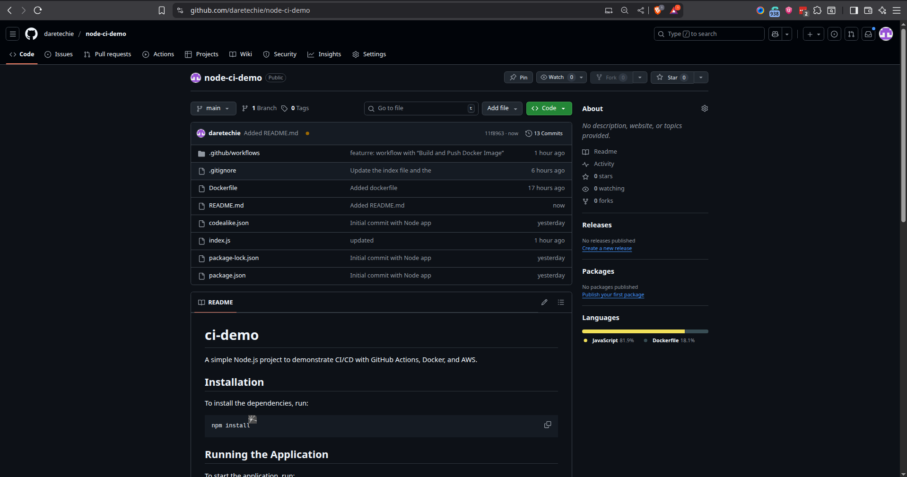

### Step 3: Create Your First GitHub Actions Workflow

Create the directory structure that GitHub Actions expects:

```bash
mkdir -p .github/workflows
```

The `.github/workflows` directory is special - GitHub automatically looks here for workflow files and runs them when triggered.

Create a workflow file called `.github/workflows/node.yml`:

```yaml
# This name appears in the GitHub Actions tab
name: Node.js CI

# Define when this workflow should run
on:
  push:
    branches: ["main"] # Run when code is pushed to main branch
  pull_request:
    branches: ["main"] # Run when pull requests target main branch

jobs:
  build:
    # Use Ubuntu as our virtual machine environment
    runs-on: ubuntu-latest

    # Test against multiple Node.js versions to ensure compatibility
    strategy:
      matrix:
        node-version: [14.x, 16.x]

    steps:
      # Download the repository code to the virtual machine
      - name: Checkout code
        uses: actions/checkout@v2

      # Install and configure Node.js
      - name: Setup Node.js
        uses: actions/setup-node@v2
        with:
          node-version: ${{ matrix.node-version }}

      # Install dependencies exactly as specified in package-lock.json
      - name: Install dependencies
        run: npm ci

      # Build the application if a build script exists
      - name: Run build
        run: npm run build --if-present

      # Execute the test suite
      - name: Run tests
        run: npm test
```

This workflow creates a "build" job that runs on Ubuntu and tests against Node.js versions 14 and 16. Each step has a descriptive name that appears in the GitHub Actions interface.

Commit and push the workflow file:

```bash
git add .github/workflows/node.yml
git commit -m "Add GitHub Actions workflow"
git push origin main
```

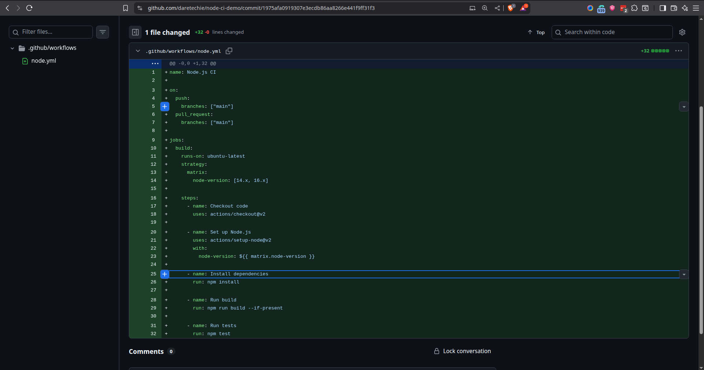

### Step 4: Verify the Workflow Execution

Navigate to your GitHub repository in a web browser and click on the "Actions" tab. You should see your workflow running or completed. Each step will show either a green checkmark (success) or red X (failure).

The workflow runs automatically because pushing to the main branch triggers the `on: push` event. GitHub provides detailed logs for each step, making it easy to debug issues.

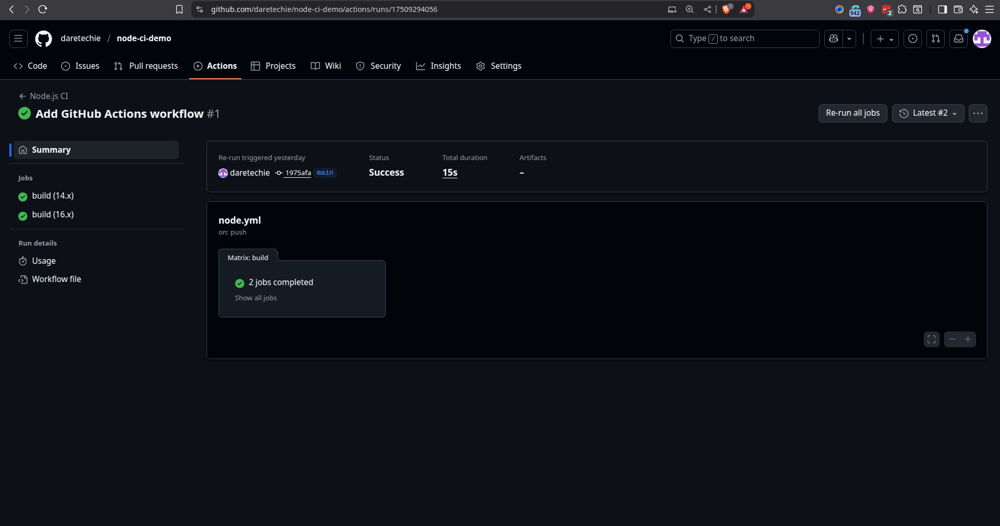

## Scenario 2: Real-World AWS EC2 Deployment

This scenario extends the basic CI pipeline to include deployment to an AWS EC2 instance. This simulates how many companies deploy applications to cloud infrastructure.

### Prerequisites for AWS Deployment

Set up the following components before proceeding:

**AWS EC2 Instance:**

- Launch an Ubuntu EC2 instance through the AWS Console
- Configure security group to allow inbound traffic on port 3000 (or your application port)
- Note the public IP address or DNS name
- Ensure you have the SSH private key file

**Docker Installation on EC2:**
Connect to your EC2 instance and install Docker:

```bash
sudo apt update
sudo apt install docker.io -y
sudo systemctl start docker
sudo systemctl enable docker
sudo usermod -aG docker ubuntu  # Add ubuntu user to docker group
```

**GitHub Secrets Configuration:**
Navigate to your GitHub repository, go to Settings → Secrets and variables → Actions, then add these secrets:

- `AWS_ACCESS_KEY_ID`: Your AWS access key
- `AWS_SECRET_ACCESS_KEY`: Your AWS secret key
- `EC2_HOST`: Your EC2 instance public IP or DNS
- `EC2_USER`: Usually "ubuntu" for Ubuntu instances
- `EC2_SSH_KEY`: Contents of your private key file

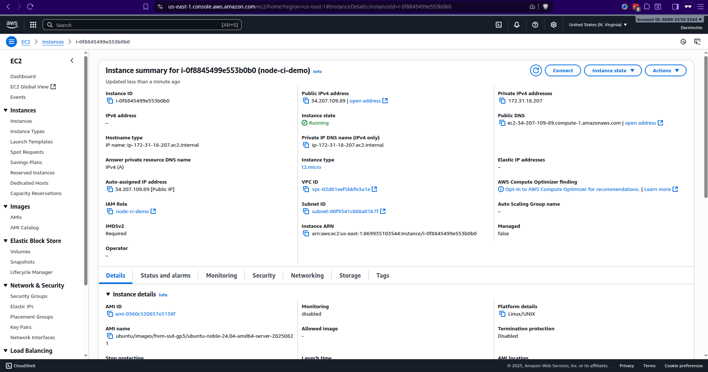

### Step 1: Dockerize the Application

Create a `Dockerfile` in your project root directory:

```dockerfile
# Use Node.js 16 on Alpine Linux for smaller image size
FROM node:16-alpine

# Set the working directory inside the container
WORKDIR /app

# Copy package files first to leverage Docker's layer caching
COPY package*.json ./
RUN npm install

# Copy the rest of the application code
COPY . .

# Expose port 3000 for web traffic
EXPOSE 3000

# Command to start the application
CMD ["npm", "start"]
```

This Dockerfile creates a container image with our Node.js application. The layered approach (copying package files first) means Docker can reuse layers when only application code changes, speeding up builds.

Test the Docker build locally to ensure it works:

```bash
docker build -t node-ci-demo .
docker run -p 3000:3000 node-ci-demo
```

Visit `http://localhost:3000` to verify the containerized application works correctly.

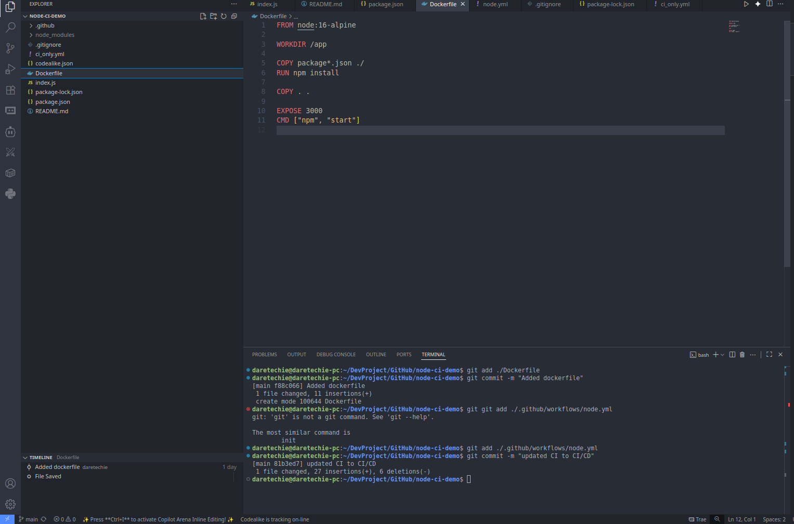

### Step 2: Update Workflow for Deployment

Replace your existing `.github/workflows/node.yml` with this enhanced version:

```yaml
name: Node.js CI/CD

on:
  push:
    branches: ["main"]

jobs:
  # First job: run tests to ensure code quality
  build:
    runs-on: ubuntu-latest
    steps:
      - name: Checkout code
        uses: actions/checkout@v2

      - name: Setup Node.js
        uses: actions/setup-node@v2
        with:
          node-version: 16

      - name: Install dependencies
        run: npm ci

      - name: Run tests
        run: npm test

  # Second job: deploy only if tests pass
  deploy:
    needs: build # This ensures deploy only runs after build succeeds
    runs-on: ubuntu-latest
    steps:
      - name: Checkout code
        uses: actions/checkout@v2

      # Configure SSH to connect to EC2 instance
      - name: Setup SSH
        uses: webfactory/ssh-agent@v0.5.4
        with:
          ssh-private-key: ${{ secrets.EC2_SSH_KEY }}

      # Connect to EC2 and deploy the application
      - name: Deploy to EC2
        run: |
          ssh -o StrictHostKeyChecking=no ${{ secrets.EC2_USER }}@${{ secrets.EC2_HOST }} << 'EOF'
          # Stop and remove existing container if it exists
          docker stop node-ci-demo || true
          docker rm node-ci-demo || true
          docker rmi node-ci-demo || true

          # Navigate to app directory (create if doesn't exist)
          cd ~/app || mkdir ~/app && cd ~/app

          # Get latest code from GitHub
          git clone https://github.com/${{ github.repository }} . || git pull

          # Build and run new container
          docker build -t node-ci-demo .
          docker run -d -p 3000:3000 --name node-ci-demo node-ci-demo
          EOF
```

The `needs: build` declaration ensures the deploy job only runs if the build job completes successfully. The SSH commands handle updating the application on the EC2 instance.

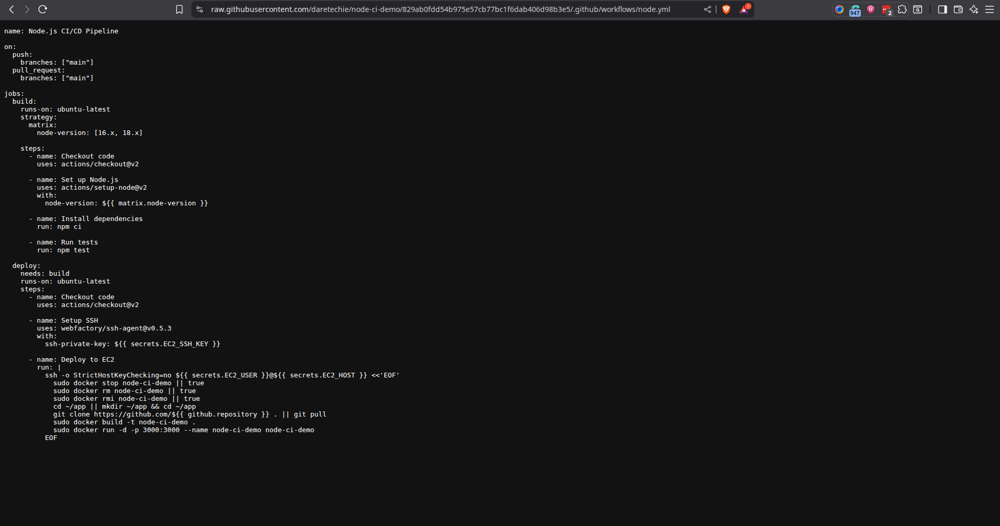

### Step 3: Verify Deployment

After pushing this updated workflow, GitHub Actions will:

1. Run the build job (install dependencies and run tests)
2. If tests pass, run the deploy job (connect to EC2 and update the running application)

Visit your EC2 instance's public IP in a web browser:

```
http://<EC2_PUBLIC_IP>:3000
```

You should see your application running with the latest changes. Each time you push code to the main branch, this process repeats automatically.

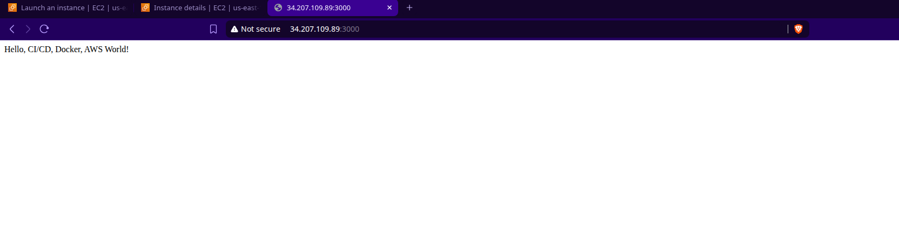

## Scenario 3: Docker Hub Integration

This final scenario demonstrates a production-ready approach using Docker Hub as a container registry. This separates the concerns of building containers and deploying them, following industry best practices.

### Prerequisites for Docker Hub Integration

Create accounts and configure secrets:

**Docker Hub Setup:**

- Create a Docker Hub account at hub.docker.com
- Create a new repository (e.g., "node-ci-demo")
- Generate an access token in Account Settings → Security

**Additional GitHub Secrets:**
Add these to your repository secrets:

- `DOCKER_USERNAME`: Your Docker Hub username
- `DOCKER_PASSWORD`: Your Docker Hub password or access token

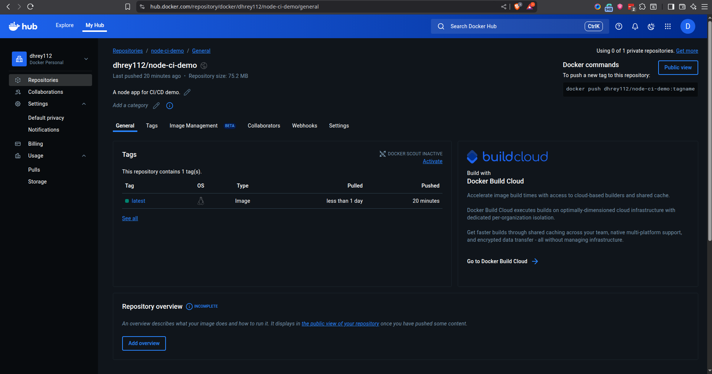

### Step 1: Enhanced Workflow with Docker Hub

Replace your workflow file with this production-ready version:

```yaml
name: Node.js CI/CD with Docker Hub

on:
  push:
    branches: ["main"]

jobs:
  # Test and build the application
  build:
    runs-on: ubuntu-latest
    steps:
      - name: Checkout code
        uses: actions/checkout@v2

      - name: Setup Node.js
        uses: actions/setup-node@v2
        with:
          node-version: 16

      - name: Install dependencies
        run: npm ci

      # Run tests before building container
      - name: Run tests
        run: npm test

      # Log into Docker Hub using stored credentials
      - name: Log in to Docker Hub
        run: echo "${{ secrets.DOCKER_PASSWORD }}" | docker login -u "${{ secrets.DOCKER_USERNAME }}" --password-stdin

      # Build container image and push to Docker Hub
      - name: Build and Push Docker Image
        run: |
          IMAGE_NAME=${{ secrets.DOCKER_USERNAME }}/node-ci-demo:latest
          docker build -t $IMAGE_NAME .
          docker push $IMAGE_NAME

  # Deploy the built image to EC2
  deploy:
    needs: build
    runs-on: ubuntu-latest
    steps:
      - name: Setup SSH
        uses: webfactory/ssh-agent@v0.5.4
        with:
          ssh-private-key: ${{ secrets.EC2_SSH_KEY }}

      # Deploy by pulling the image from Docker Hub
      - name: Deploy on EC2
        run: |
          ssh -o StrictHostKeyChecking=no ${{ secrets.EC2_USER }}@${{ secrets.EC2_HOST }} << 'EOF'
          # Clean up existing container
          docker stop node-ci-demo || true
          docker rm node-ci-demo || true
          docker rmi ${{ secrets.DOCKER_USERNAME }}/node-ci-demo:latest || true

          # Pull latest image from Docker Hub and run it
          docker pull ${{ secrets.DOCKER_USERNAME }}/node-ci-demo:latest
          docker run -d -p 3000:3000 --name node-ci-demo ${{ secrets.DOCKER_USERNAME }}/node-ci-demo:latest
          EOF
```

This approach provides several advantages:

- The container is built once and can be deployed to multiple environments
- Docker Hub serves as a versioned artifact repository
- Deployment becomes faster since it only needs to pull and run the pre-built image
- Other team members can pull and run the exact same container locally

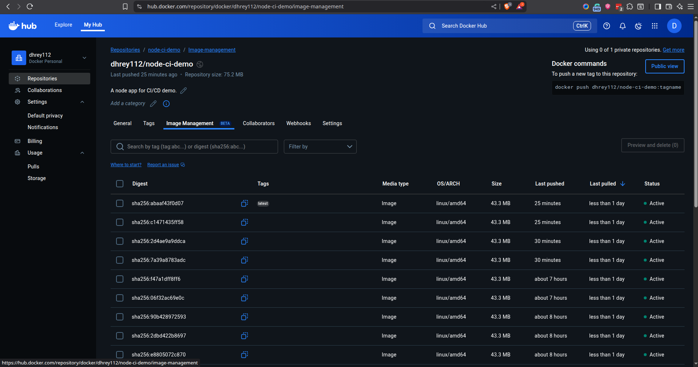

### Step 2: Verify the Complete Pipeline

After pushing this workflow, observe the complete pipeline:

1. **Code Push**: You push changes to GitHub
2. **CI Phase**: GitHub Actions runs tests and builds a Docker image
3. **Registry Phase**: The image gets pushed to Docker Hub
4. **CD Phase**: EC2 instance pulls the new image and restarts the application

This mirrors how major companies handle deployments - build once, deploy anywhere. Your application is now accessible at your EC2 public IP, running the latest code in a consistent container environment.

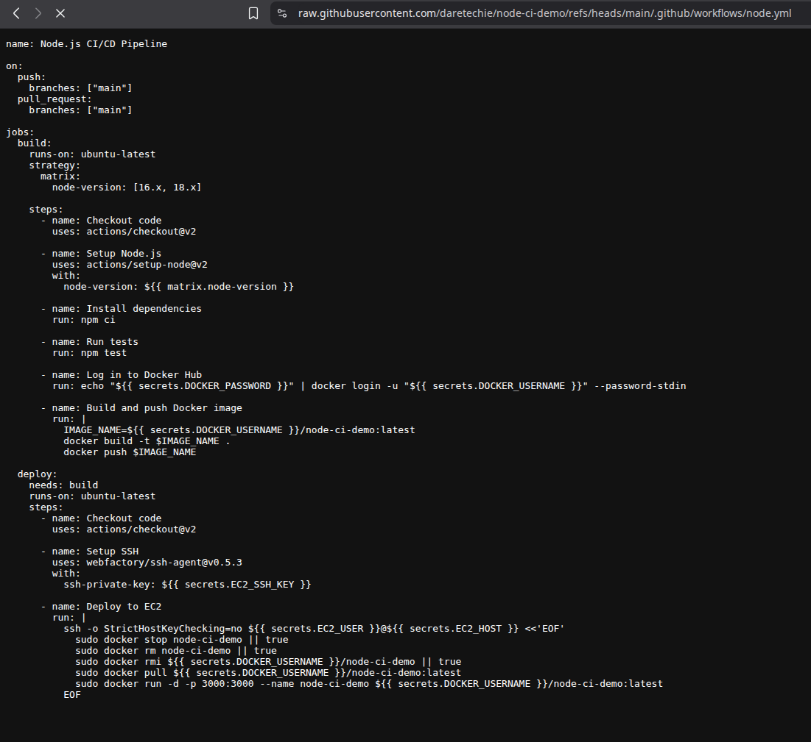

## GitHub Actions Core Concepts

Understanding these fundamental concepts will help you customize and extend your workflows:

### Workflow Architecture

A **workflow** is like a recipe that defines the entire automation process. It consists of one or more **jobs** that can run sequentially or in parallel. Each job contains multiple **steps** that execute **actions** or commands.

### Key Components Deep Dive

**Events** are triggers that start workflows. Common events include:

- `push`: When code is pushed to specific branches
- `pull_request`: When pull requests are created or updated
- `schedule`: Time-based triggers using cron syntax
- `workflow_dispatch`: Manual workflow triggers

**Jobs** are collections of steps that run on the same virtual machine. Jobs can depend on other jobs using the `needs` keyword, creating deployment pipelines where testing must pass before deployment begins.

**Steps** are individual tasks within a job. They can run shell commands or use pre-built **actions** from the GitHub Marketplace. Actions are reusable units of code that perform specific tasks like checking out code or setting up development environments.

**Runners** are virtual machines that execute your workflows. GitHub provides hosted runners with Ubuntu, Windows, and macOS environments, or you can use self-hosted runners for more control.

```text
GitHub Actions Workflow Structure:
├── Workflow (node.yml)
│   ├── Event Triggers (push, pull_request)
│   └── Jobs
│       ├── Build Job
│       │   ├── Checkout Code
│       │   ├── Setup Node.js
│       │   ├── Install Dependencies
│       │   └── Run Tests
│       └── Deploy Job
│           ├── Setup SSH
│           └── Deploy to EC2
```

\_GitHub Actions Architecture\*

## Comprehensive Troubleshooting

Learning to diagnose and fix common issues is crucial for maintaining reliable CI/CD pipelines. Here are the most frequent problems and their solutions:

### Workflow and Configuration Issues

**Problem**: Workflow doesn't trigger after pushing code
This often happens when the workflow file has syntax errors or is in the wrong location.

**Solutions**:

- Verify the file is located at `.github/workflows/filename.yml` in your repository root
- Use an online YAML validator to check for syntax errors
- Ensure branch names in the workflow match your actual branch names
- Check the Actions tab for any error messages about workflow parsing

**Problem**: `npm ci` command fails during dependency installation
This typically occurs when the package-lock.json file is missing or out of sync.

**Solutions**:

- Ensure `package-lock.json` exists in your repository and is committed
- Run `npm install` locally to generate or update the lock file
- If package-lock.json continues causing issues, temporarily switch to `npm install` in the workflow
- Delete node_modules and package-lock.json locally, then run `npm install` and commit the new lock file

### Docker and Deployment Issues

**Problem**: Docker build fails with permission or authentication errors
Container builds can fail due to various Docker-specific issues.

**Solutions**:

- For Docker Hub authentication errors, verify your username and password/token are correct in GitHub Secrets
- Regenerate Docker Hub access tokens if authentication continues failing
- Ensure the Docker Hub repository exists and your account has push permissions
- Check that Docker is properly installed and running on your EC2 instance

**Problem**: EC2 deployment fails with SSH connection errors
SSH connectivity issues are common when connecting to cloud instances.

**Solutions**:

- Verify the EC2 instance is running and accessible from the internet
- Check that your security group allows inbound SSH (port 22) connections
- Ensure the SSH private key in GitHub Secrets matches the key pair used for the EC2 instance
- Confirm the EC2_HOST variable contains the correct public IP or DNS name
- Test SSH connection manually from your local machine first

### Application Runtime Issues

**Problem**: Application container starts but isn't accessible
The container might be running but not properly exposed or configured.

**Solutions**:

- Verify the security group allows inbound traffic on your application port (typically 3000)
- Check that the Docker run command includes the correct port mapping (`-p 3000:3000`)
- Ensure your application listens on all interfaces (`0.0.0.0`) not just localhost
- Use `docker logs container-name` to check for application startup errors

**Problem**: Old application version still running after deployment
Caching issues can cause old containers or images to persist.

**Solutions**:

- Add explicit cleanup commands to stop and remove old containers before deploying new ones
- Include `docker system prune -f` occasionally to clean up unused images and containers
- Use specific image tags instead of `latest` to ensure proper versioning
- Verify that the `docker pull` command actually retrieves the newest image

### Debugging Strategies

When troubleshooting workflow issues, follow this systematic approach:

1. **Check the Actions Tab**: GitHub provides detailed logs for each workflow run, including expanded output for each step
2. **Enable Debug Logging**: Add `ACTIONS_STEP_DEBUG: true` to your workflow environment variables for more verbose output
3. **Add Debug Steps**: Insert temporary steps that print environment information or file contents
4. **Test Locally**: Verify that Docker builds and application functionality work on your local machine before debugging the CI/CD pipeline
5. **Incremental Changes**: Make one change at a time to isolate which modification causes issues

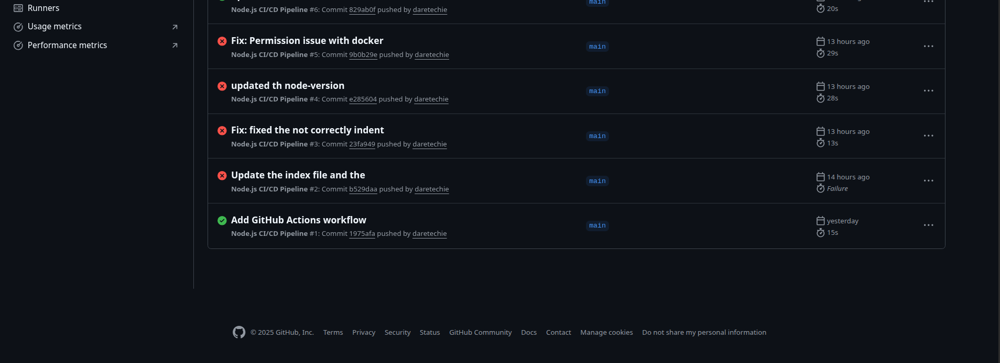

## Best Practices and Next Steps

### Security Best Practices

Always store sensitive information like API keys, passwords, and SSH keys in GitHub Secrets rather than hardcoding them in workflow files. Use principle of least privilege when creating access keys - grant only the minimum permissions necessary for the deployment process.

Pin action versions to specific releases (like `@v3`) rather than using `@main` to ensure consistent, predictable behavior. Regularly review and rotate access keys and tokens to minimize security risks.

### Performance Optimization

Use caching strategically to speed up workflows. GitHub Actions can cache dependencies between runs, significantly reducing build times. Enable npm caching by adding `cache: 'npm'` to the setup-node action.

Structure workflows to fail fast - run quick tests before expensive operations like building Docker images. Use parallel jobs for independent operations like running different test suites.

### Maintainability and Scale

Write descriptive names for jobs and steps to make workflow logs easier to understand. Add comments to complex workflow sections explaining the purpose and any non-obvious logic.

Consider creating reusable workflows or custom actions for repeated patterns across multiple repositories. This reduces duplication and ensures consistent deployment processes across projects.

### Advanced Scenarios to Explore

**Multi-Environment Deployments**: Extend the pipeline to deploy to staging environments before production, allowing for additional testing and validation.

**Blue-Green Deployments**: Implement zero-downtime deployment strategies by running multiple versions of your application simultaneously.

**Infrastructure as Code**: Use tools like Terraform or AWS CloudFormation in your CI/CD pipeline to manage infrastructure changes alongside application deployments.

**Monitoring and Alerting**: Integrate monitoring tools and notification systems to alert teams when deployments fail or when applications experience issues.

**Security Scanning**: Add security scanning steps that check for vulnerabilities in dependencies or container images before deployment.

### Learning Resources and Community

The GitHub Actions ecosystem includes extensive documentation, community-contributed actions, and learning resources. The GitHub Marketplace contains thousands of pre-built actions for common tasks like deployment to various cloud platforms, running security scans, and integrating with external services.

Engage with the GitHub Community Forums to ask questions, share experiences, and learn from other developers implementing CI/CD pipelines. Many open source projects publish their workflow files, providing real-world examples of advanced CI/CD patterns.

Consider exploring GitHub Learning Lab for interactive, hands-on courses that cover advanced GitHub Actions topics. The official GitHub Actions documentation provides comprehensive reference material for all features and capabilities.

Remember that CI/CD is a journey, not a destination. Start with simple automation like running tests on every push, then gradually add more sophisticated deployment strategies as your team's confidence and requirements grow. Each improvement makes your development process more reliable and efficient, ultimately leading to better software and happier users.


