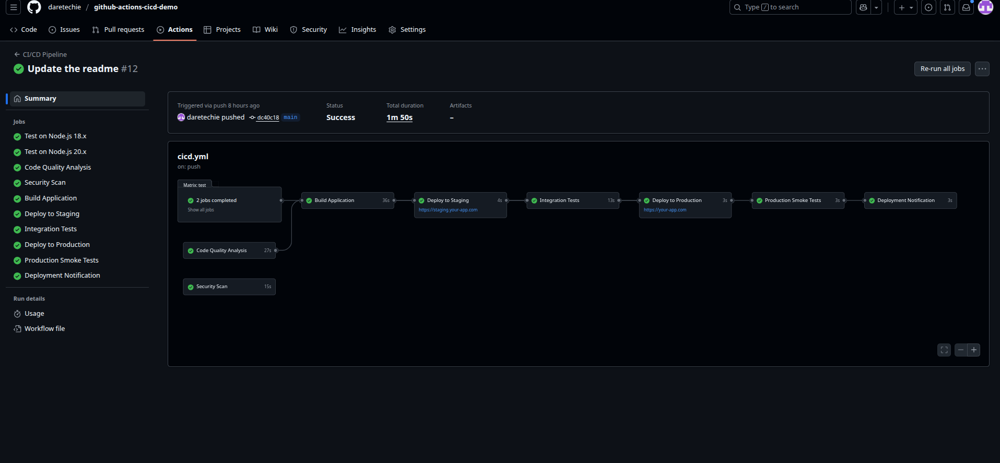
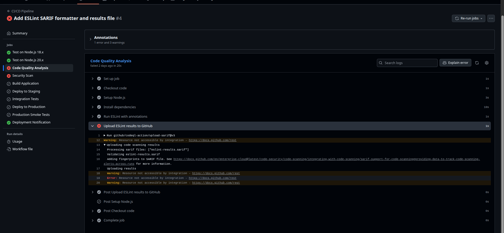
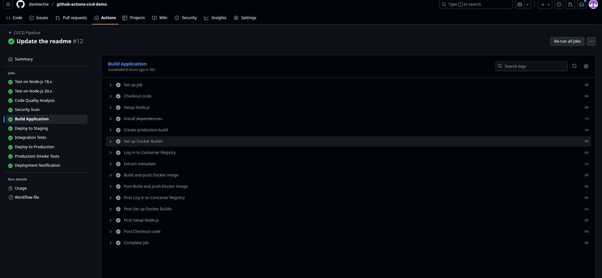
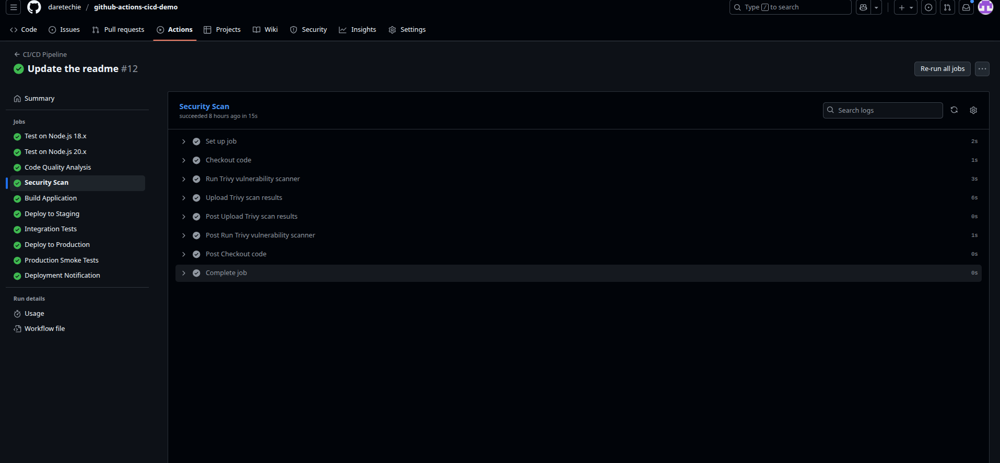

# GitHub Actions CI/CD Demo

[](https://github.com/daretechie/github-actions-cicd-demo/actions/workflows/cicd.yml)

This repository, [daretechie/github-actions-cicd-demo](https://github.com/daretechie/github-actions-cicd-demo), demonstrates a complete Continuous Integration and Continuous Deployment (CI/CD) pipeline using GitHub Actions, specifically tailored to meet the requirements of the course project.

## Overview

The CI/CD pipeline is defined in the `.github/workflows/cicd.yml` file and consists of several jobs that are triggered on push and pull requests to the `main` and `develop` branches. The pipeline automates the testing, code quality analysis, security scanning, building, and deployment of a Node.js application, adhering to the specific requirements of the assignment.

## Table of Contents

- CI/CD Pipeline Breakdown
  - 1. `test` - Multi-Version Testing
  - 2. `code-quality` - Static Code Analysis
  - 3. `security` - Vulnerability Scanning
  - 4. `build` - Docker Image Creation
  - 5. `deploy` - Staging and Production Deployment
- Verifying the Workflow
- Troubleshooting

## CI/CD Pipeline Breakdown

The pipeline is composed of the following jobs, with features implemented as per the project requirements:

### 1. `test` - Multi-Version Testing

- **Purpose:** Runs unit tests and code coverage reports across multiple Node.js versions.
- **Implementation Details:**
  - **Build Matrix:** This job uses a build matrix to test the application against the required Node.js versions: `12.x`, `14.x`, and `16.x`.
  - **Dependency Caching:** To optimize build times, npm dependencies are cached. The cache key is generated based on the hash of the `package-lock.json` file, ensuring that dependencies are re-downloaded only when the lock file changes. This is implemented as follows:
    ```yaml
    - name: Cache Node modules
      uses: actions/cache@v3
      with:
        path: ~/.npm
        key: ${{ runner.os }}-node-${{ hashFiles('**/package-lock.json') }}
        restore-keys: |
          ${{ runner.os }}-node-
    ```

### 2. `code-quality` - Static Code Analysis

- **Purpose:** Performs static code analysis to ensure code quality and adherence to coding standards.
- **Implementation Details:**
  - **ESLint Integration:** This job uses ESLint to lint the codebase.
  - **Fail on Error:** The workflow is configured to fail if ESLint finds any errors, ensuring that only code that meets the quality standards can proceed in the pipeline. This is achieved by removing the `continue-on-error: true` flag from the ESLint step.

### 3. `security` - Vulnerability Scanning

- **Purpose:** Scans the project for known vulnerabilities.
- **Details:** This job uses Trivy to scan the filesystem for vulnerabilities and uploads the results to GitHub Code Scanning as a SARIF file.

### 4. `build` - Docker Image Creation

- **Purpose:** Builds and packages the application into a Docker image.
- **Details:** This job builds a Docker image, tags it with the branch name and commit SHA, and pushes it to the GitHub Container Registry (ghcr.io).

### 5. `deploy` - Staging and Production Deployment

- **Purpose:** Deploys the application to staging and production environments.
- **Details:** The pipeline includes simulated deployments to both staging and production environments, with integration and smoke tests to verify the deployments.

## Verifying the Workflow

To verify that the pipeline is running successfully, navigate to the "Actions" tab in your GitHub repository. You should see a list of workflow runs. A successful run will have a green checkmark next to it.

You can click on a workflow run to see the details of each job.

**Successful workflow run with the correct Node.js versions:**



**Screenshot of a failed `code-quality` job due to linting errors:**



**Screenshot of the `build` job details, showing the pushed Docker image:**



**Screenshot of the security scan results:**



## Troubleshooting

During the setup of this CI/CD pipeline, several issues were encountered and resolved:

### 1. SARIF Upload Failure

- **Error:** `Error: Resource not accessible by integration`
- **Cause:** The workflow lacked the necessary permissions to upload SARIF files to GitHub Code Scanning.
- **Resolution:** Added the `security-events: write` permission to the `security` job in the `.github/workflows/cicd.yml` file.

```yaml
permissions:
  security-events: write
  actions: read
  contents: read
```

### 2. Docker Cache Export Failure

- **Error:** `ERROR: failed to build: Cache export is not supported for the docker driver.`
- **Cause:** The default Docker driver in GitHub Actions does not support cache export.
- **Resolution:** Added the `docker/setup-buildx-action@v3` step to the `build` job to set up a different buildx driver that supports cache export.

```yaml
- name: Set up Docker Buildx
  uses: docker/setup-buildx-action@v3
```

### 3. Docker Image Push Failure

- **Error:** `denied: installation not allowed to Create organization package`
- **Cause:** The `GITHUB_TOKEN` did not have the necessary permissions to create packages (container images) in the GitHub Container Registry.
- **Resolution:** Added the `packages: write` permission to the `build` job in the `.github/workflows/cicd.yml` file.

```yaml
permissions:
  contents: read
  packages: write
```
