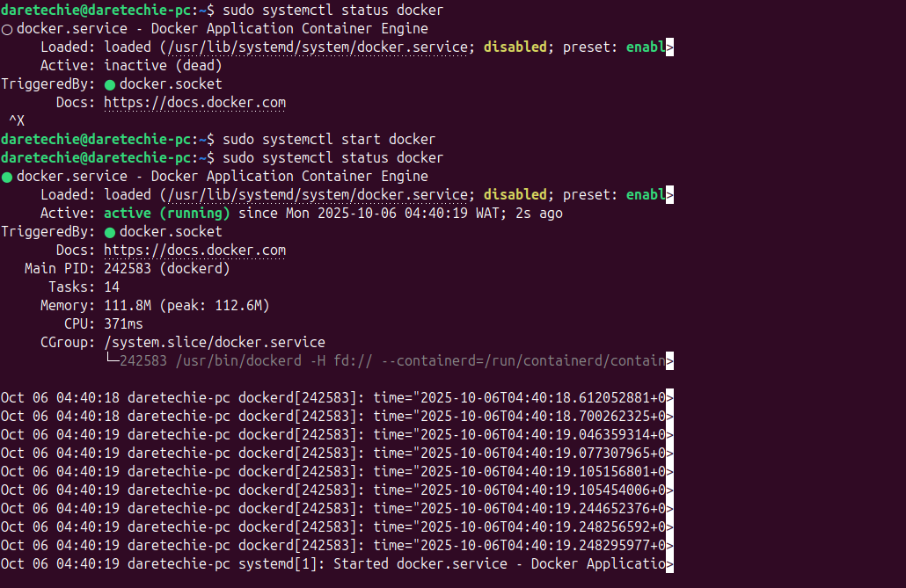
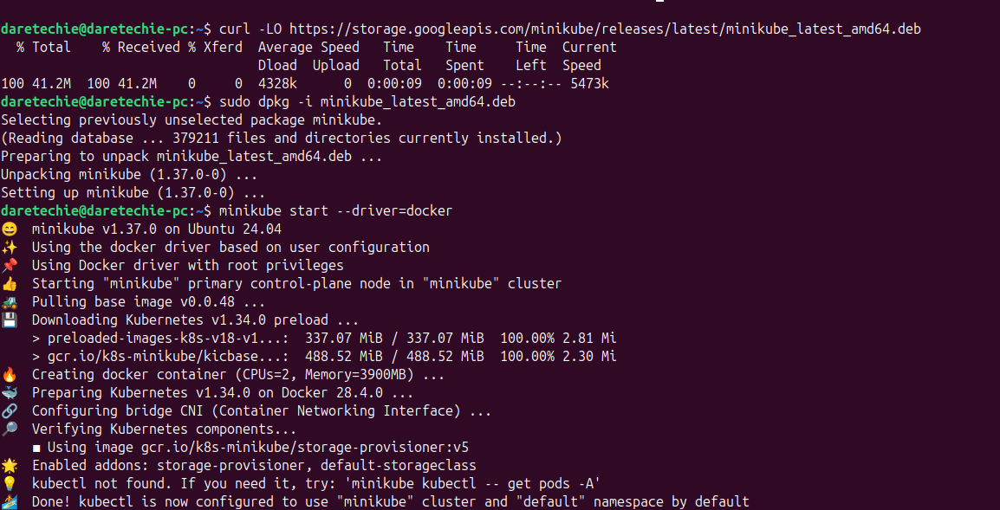
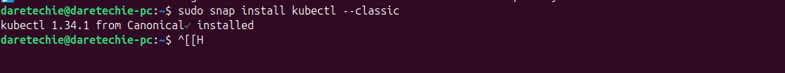
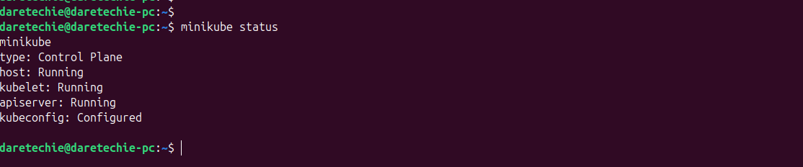
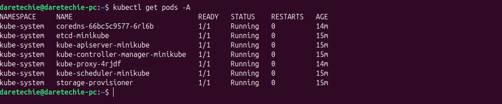

# Setting up Minikube for Local Kubernetes Development

## Overview

This guide provides a step-by-step walkthrough for setting up Minikube on your local machine. Minikube allows you to run a single-node Kubernetes cluster locally, providing an excellent environment for learning Kubernetes, developing, and testing applications.

## Table of Contents

- [Project Goals](#project-goals)
- [Prerequisites](#prerequisites)
- [Core Concepts](#core-concepts)
  - [What is Kubernetes?](#what-is-kubernetes)
  - [What is Minikube?](#what-is-minikube)
- [Installation Guide](#installation-guide)
  - [Installing on Windows](#installing-on-windows)
  - [Installing on Linux](#installing-on-linux)
- [Verifying the Installation](#verifying-the-installation)
- [Basic Minikube Usage](#basic-minikube-usage)
- [Troubleshooting](#troubleshooting)
- [Evidence for Submission](#evidence-for-submission)

## Project Goals

By the end of this project, you will have:

- A comprehensive understanding of Kubernetes and its fundamental concepts.
- Hands-on experience setting up a local Kubernetes cluster using Minikube.
- The ability to build and deploy simple applications on your local cluster.

## Prerequisites

- **CPU:** 2 or more
- **Memory:** 2GB of free memory
- **Disk Space:** 20GB of free disk space
- **Internet Connection:** Required for downloading Minikube, Docker, and container images.
- **Containerization Software:** Docker installed and running on your machine.

## Core Concepts

### What is Kubernetes?

Kubernetes is an open-source container orchestration platform that automates the deployment, scaling, and management of containerized applications. It groups containers that make up an application into logical units for easy management and discovery.

### What is Minikube?

Minikube is a tool that makes it easy to run Kubernetes locally. It runs a single-node Kubernetes cluster inside a Virtual Machine (VM) or a Docker container on your personal computer. This is ideal for users looking to try out Kubernetes or to develop with it day-to-day.

## Installation Guide

### Installing on Windows

#### Step 1: Install Chocolatey (Package Manager)

If you don't have Chocolatey, a package manager for Windows, install it by following the [official instructions](https://chocolatey.org/install).

#### Step 2: Install Minikube

Open a PowerShell terminal as **Administrator** and run the following command:

```bash
choco install minikube
```

#### Successful Minikube Installation on Windows


#### Step 3: Install Docker Desktop

Minikube requires a container driver. We will use Docker. If you don't have it, install [Docker Desktop for Windows](https://docs.docker.com/desktop/install/windows-install/).

#### Step 4: Start Minikube

Once Docker Desktop is running, start the Minikube cluster:

```bash
minikube start --driver=docker
```

#### Starting Minikube on Windows


### Installing on Linux

#### Step 1: Install Docker

First, we need to install Docker, which will act as the driver for Minikube.

1.  **Update package lists:**
    ```bash
    sudo apt-get update
    ```
2.  **Install prerequisite packages:**
    ```bash
    sudo apt-get install -y ca-certificates curl gnupg
    ```
3.  **Add Docker’s official GPG key:**
    ```bash
    sudo install -m 0755 -d /etc/apt/keyrings
    curl -fsSL https://download.docker.com/linux/ubuntu/gpg | sudo gpg --dearmor -o /etc/apt/keyrings/docker.gpg
    sudo chmod a+r /etc/apt/keyrings/docker.gpg
    ```
4.  **Set up the Docker repository:**
    ```bash
    echo \
      "deb [arch=$(dpkg --print-architecture) signed-by=/etc/apt/keyrings/docker.gpg] https://download.docker.com/linux/ubuntu \
      $(. /etc/os-release && echo "$VERSION_CODENAME") stable" | \
      sudo tee /etc/apt/sources.list.d/docker.list > /dev/null
    ```
5.  **Install Docker Engine:**
    ```bash
    sudo apt-get update
    sudo apt-get install -y docker-ce docker-ce-cli containerd.io docker-buildx-plugin docker-compose-plugin
    ```
6.  **Verify Docker Installation:**

    ```bash
    sudo systemctl status docker
    ```

    #### Docker Service Status

    

#### Step 2: Install Minikube

1.  **Download the Minikube binary:**
    ```bash
    curl -LO https://storage.googleapis.com/minikube/releases/latest/minikube-linux-amd64
    ```
2.  **Install Minikube:**

    ```bash
    sudo install minikube-linux-amd64 /usr/local/bin/minikube
    ```

    #### Successful Minikube Installation on Linux

    

#### Step 3: Install kubectl

While Minikube includes a version of `kubectl`, it's best practice to install `kubectl` separately to interact with your cluster. You can do this via snap:

```bash
sudo snap install kubectl --classic
```

#### Successful kubectl Installation



#### Step 4: Start Minikube

Start the Minikube cluster using the Docker driver:

```bash
minikube start --driver=docker
```

#### Starting Minikube on Linux


## Verifying the Installation

Once Minikube has started, you can check the status of your local cluster.

```bash
minikube status
```

#### Output of `minikube status`



You can also use `kubectl`, the Kubernetes command-line tool, which is automatically installed with Minikube.

```bash
kubectl get pods -A
```

#### Output of `kubectl get pods -A`



## Basic Minikube Usage

Here are a few essential commands for managing your Minikube cluster:

- **Stop the cluster:**
  ```bash
  minikube stop
  ```
- **Delete the cluster:**
  ```bash
  minikube delete
  ```
- **Access the Kubernetes dashboard:**
  ```bash
  minikube dashboard
  ```
- **SSH into the Minikube VM/container:**
  ```bash
  minikube ssh
  ```

## Troubleshooting

- **Minikube fails to start:**

  - **Solution:** Ensure your system meets the prerequisites (CPU, memory, disk space). Make sure Docker is running correctly. Try running `minikube delete` and then `minikube start` again.

- **Docker driver issues:**

  - **Solution:** Verify that the Docker service is active. On Linux, you might need to run Docker commands with `sudo` or add your user to the `docker` group: `sudo usermod -aG docker $USER && newgrp docker`.

- **Insufficient Resources:**
  - **Solution:** If you encounter resource-related errors, you can start Minikube with specific memory and CPU allocations:
    ```bash
    minikube start --memory 4096 --cpus 2
    ```
