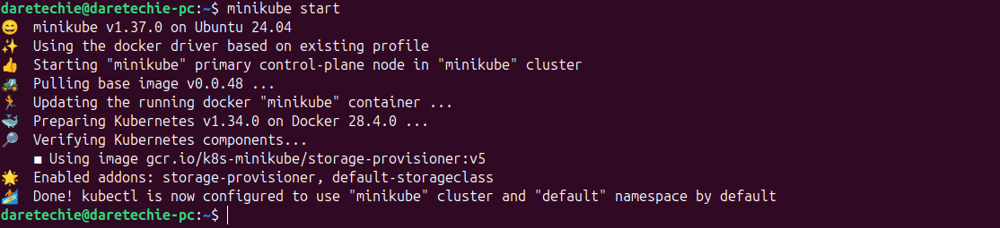
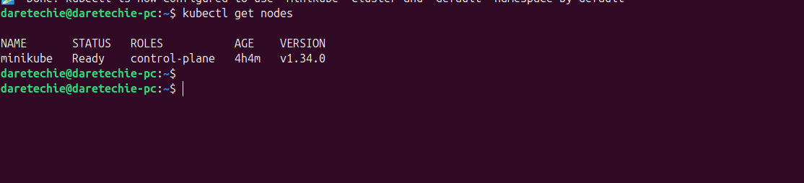
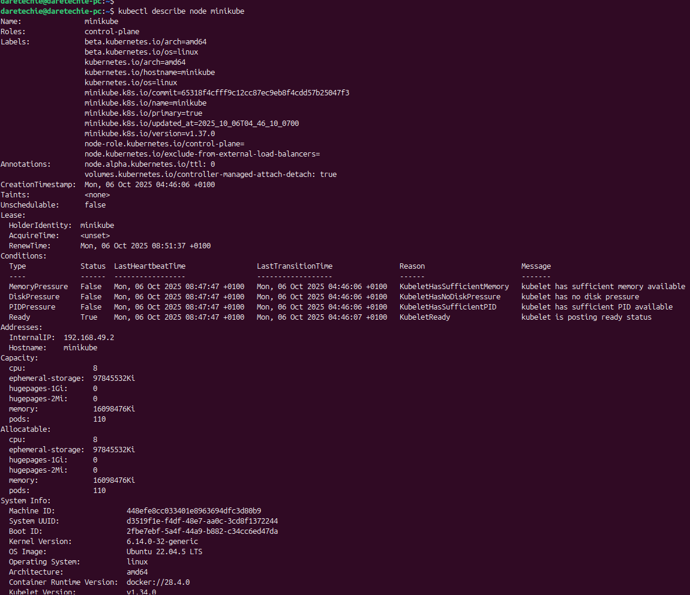
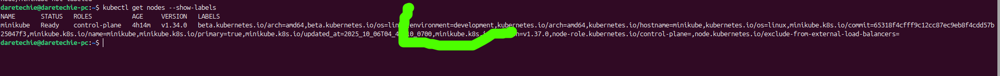

# Working with Kubernetes Nodes in Minikube

## Overview

This guide provides a beginner-friendly introduction to Kubernetes nodes and how to manage them using a local Minikube cluster. You will learn how to start, stop, and inspect the node that powers your local Kubernetes environment, as well as understand key concepts like labels and taints.

## Table of Contents

- [Project Goals](#project-goals)
- [Prerequisites](#prerequisites)
- [Core Concepts](#core-concepts)
  - [What is a Kubernetes Node?](#what-is-a-kubernetes-node)
- [Managing the Minikube Cluster and Node](#managing-the-minikube-cluster-and-node)
  - [Step 1: Start the Minikube Cluster](#step-1-start-the-minikube-cluster)
  - [Step 2: View Node Information](#step-2-view-node-information)
  - [Step 3: Inspect a Node in Detail](#step-3-inspect-a-node-in-detail)
- [Understanding Node Details](#understanding-node-details)
  - [Node Labels](#node-labels)
  - [Node Resources (Capacity and Allocatable)](#node-resources-capacity-and-allocatable)
  - [Taints and Tolerations](#taints-and-tolerations)
- [Working with Node Labels](#working-with-node-labels)
  - [Step 4: Add a Custom Label to a Node](#step-4-add-a-custom-label-to-a-node)
- [Node Scaling and Upgrades in Minikube](#node-scaling-and-upgrades-in-minikube)
  - [Understanding Minikube's Single-Node Architecture](#understanding-minikubes-single-node-architecture)
  - [Upgrading Kubernetes Version](#upgrading-kubernetes-version)
- [Cluster Cleanup](#cluster-cleanup)
- [Troubleshooting](#troubleshooting)
- [Evidence for Submission](#evidence-for-submission)

## Project Goals

By the end of this project, you will be able to:

- Understand the role of a node in a Kubernetes cluster.
- Use `kubectl` to inspect node details, including labels, capacity, and taints.
- Add custom labels to a node for better organization.
- Confidently perform basic lifecycle operations on your Minikube cluster.

## Prerequisites

- **Minikube Installed:** You must have a working Minikube installation.
- **Docker Running:** The Docker service must be active on your machine.

## Core Concepts

### What is a Kubernetes Node?

In Kubernetes, a **node** is a worker machine where your containers are deployed. It can be a virtual or physical machine. Each node is managed by the control plane and contains the services necessary to run **Pods**, which are the smallest deployable units in Kubernetes. In our Minikube setup, the entire cluster runs on a single node.

## Managing the Minikube Cluster and Node

### Step 1: Start the Minikube Cluster

If your cluster isn't running, open your terminal and start it:

```bash
minikube start
```

_Evidence: Capture a screenshot of the `minikube start` output._


### Step 2: View Node Information

Use `kubectl` to view the nodes in your cluster. You will see a single node for your Minikube setup.

```bash
kubectl get nodes
```

This command lists all nodes, their status (e.g., `Ready`), roles, age, and Kubernetes version.

_Evidence: Capture a screenshot of the `kubectl get nodes` output._


### Step 3: Inspect a Node in Detail

To get a comprehensive overview of your node, use the `describe` command. This is crucial for understanding the node's properties.

```bash
kubectl describe node minikube
```

_(Replace `minikube` if your node has a different name)._

This command provides detailed information, which we will explore in the next section.

_Evidence: Capture a screenshot of the output from the `kubectl describe node` command._


## Understanding Node Details

The `describe node` command output contains valuable information. Let's break down a few key parts.

### Node Labels

**Labels** are key/value pairs that are attached to Kubernetes objects, such as nodes. They are used to organize and to select subsets of objects. For example, a node could be labeled with `disktype=ssd` or `environment=production`. The Kubernetes scheduler can use these labels to decide where to place pods.

In the `describe node` output, look for the `Labels` section. You will see several default labels.

### Node Resources (Capacity and Allocatable)

This section shows the total resources available on the node (`Capacity`) and the resources available for pods to consume (`Allocatable`). The difference between capacity and allocatable is reserved for the operating system and Kubernetes system daemons.

- **Capacity:** The total amount of CPU, memory, and storage on the node.
- **Allocatable:** The amount of resources that are available for pods.

Understanding this is key to managing application performance and resource quotas.

### Taints and Tolerations

- A **Taint** is applied to a node to repel a set of pods.
- A **Toleration** is applied to a pod to allow it to be scheduled on a node with a matching taint.

This mechanism ensures that pods are not scheduled onto inappropriate nodes. For example, a node with a dedicated GPU might be tainted to only allow pods that require a GPU. In the `describe node` output, you can see if any `Taints` are applied.

## Working with Node Labels

Labels are a fundamental part of Kubernetes. Let's practice by adding one.

### Step 4: Add a Custom Label to a Node

You can add your own labels to a node to categorize it. Let's add a label to identify this node as being for development purposes.

```bash
kubectl label nodes minikube environment=development
```

To verify that the label was added, you can view the labels for the node:

```bash
kubectl get nodes --show-labels
```

You should see your new `environment=development` label in the list.

_Evidence: Capture a screenshot showing the output of the `kubectl get nodes --show-labels` command. In your submission, you can highlight or draw a box around the `environment=development` label to make it easy to spot._


## Node Scaling and Upgrades in Minikube

### Understanding Minikube's Single-Node Architecture

By default, Minikube creates a single-node cluster. This is intentional, as Minikube is designed for local development and testing, not for production workloads. This single-node setup means you cannot scale your cluster by adding more nodes as you would in a production environment (e.g., with `kubeadm` or a cloud provider). The primary goal is to have a lightweight, portable Kubernetes environment that runs on your local machine.

While you can't add more nodes to a single Minikube cluster, you can simulate a multi-node environment by creating multiple Minikube clusters (profiles), as described in the "Managing Multiple Clusters with Profiles" section.

### Upgrading Kubernetes Version

Minikube makes it easy to test different versions of Kubernetes. You can create a new cluster with a specific Kubernetes version or upgrade your existing cluster.

**To start a cluster with a specific Kubernetes version:**

```bash
minikube start --kubernetes-version=v1.25.3
```

You can find available Kubernetes versions on the official Kubernetes release page.

**To upgrade the Kubernetes version of an existing Minikube cluster:**

You can use the `minikube start` command again with a newer `--kubernetes-version`. Minikube will handle the upgrade process. For example, if your cluster is running v1.25.3 and you want to upgrade to v1.26.0, you would run:

```bash
minikube start --kubernetes-version=v1.26.0
```

This approach allows you to keep your development environment in sync with your production environment's Kubernetes version.

## Cluster Cleanup

After you are done, you can stop or delete your cluster.

- **Stopping the cluster** preserves its state:
  ```bash
  minikube stop
  ```
- **Deleting the cluster** removes it completely:
  ```bash
  minikube delete
  ```

## Managing Multiple Clusters with Profiles

Yes, you can run more than one Minikube cluster on the same machine. Minikube uses **profiles** to manage different clusters. By default, you use a profile named `minikube`, but you can create and manage others.

### Creating a New Cluster Profile

To create a new cluster, use the `-p` (or `--profile`) flag with the `start` command.

```bash
# Create a new cluster named 'test-cluster'
minikube start -p test-cluster
```

This will create a completely separate cluster. Your `kubectl` context will automatically be switched to this new cluster.

### Interacting with a Specific Profile

To run any command against a specific cluster, use the `-p` flag.

```bash
# Stop the new cluster
minikube stop -p test-cluster

# Delete the new cluster
minikube delete -p test-cluster
```

### Switching Between Profiles

You can list all your profiles and switch your `kubectl` context between them.

```bash
# List all profiles
minikube profile list

# Switch your kubectl context to the default minikube cluster
minikube profile minikube
```

This feature is incredibly useful for testing different Kubernetes versions or configurations simultaneously.

## Troubleshooting

- **`kubectl` command not found:**

  - **Solution:** Ensure `kubectl` is installed and in your system's PATH, or use `minikube kubectl -- <command>`.

- **Node is not in `Ready` state:**

  - **Solution:** Run `minikube status` and `minikube logs` to diagnose the issue. The problem is often related to resource constraints or Docker issues.

- **Error connecting to the server:**
  - **Solution:** Your cluster may not be running. Use `minikube start` to activate it.
