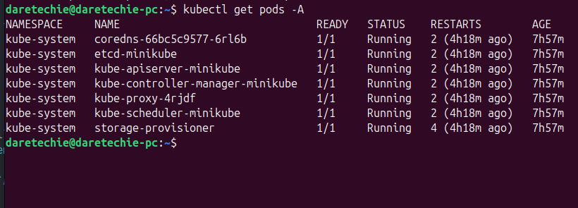
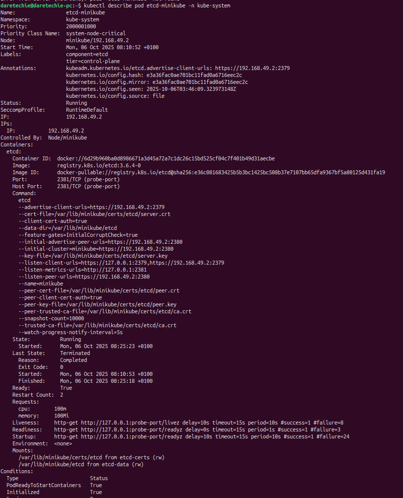
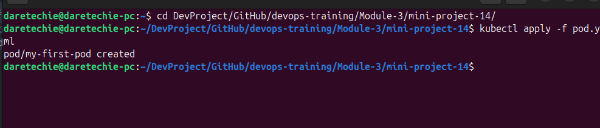
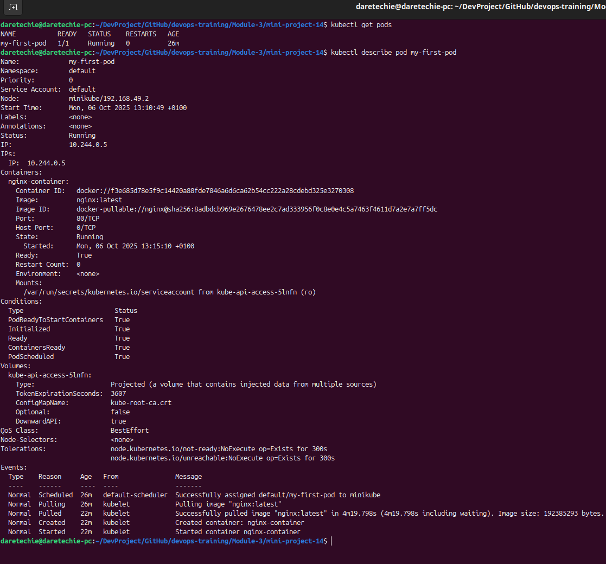
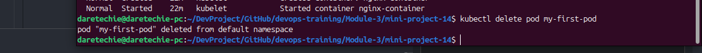

# Working with Kubernetes Pods

## Overview

This guide provides a beginner-friendly introduction to Kubernetes Pods, the fundamental building blocks of Kubernetes applications. You will learn how to list, inspect, create, and delete Pods in your local Minikube cluster.

## Table of Contents

- [Project Goals](#project-goals)
- [Prerequisites](#prerequisites)
- [Core Concepts](#core-concepts)
  - [What is a Kubernetes Pod?](#what-is-a-kubernetes-pod)
  - [What is a Container?](#what-is-a-container)
- [Part 1: Managing Existing Pods](#part-1-managing-existing-pods)
  - [Step 1: List All Pods](#step-1-list-all-pods)
  - [Step 2: Inspect a System Pod](#step-2-inspect-a-system-pod)
- [Part 2: Creating and Managing Your Own Pod](#part-2-creating-and-managing-your-own-pod)
  - [Step 3: Create a Pod Definition File](#step-3-create-a-pod-definition-file)
  - [Step 4: Create the Pod](#step-4-create-the-pod)
  - [Step 5: Verify and Inspect the New Pod](#step-5-verify-and-inspect-the-new-pod)
  - [Step 6: Delete the Pod](#step-6-delete-the-pod)
- [Troubleshooting](#troubleshooting)
- [Evidence for Submission](#evidence-for-submission)

## Project Goals

By the end of this project, you will be able to:

- Understand the role and purpose of Pods in Kubernetes.
- Use `kubectl` to list and inspect Pods across the cluster.
- Create a Pod from a YAML manifest file.
- Delete a Pod from your cluster.

## Prerequisites

- **Minikube Cluster Running:** You must have a running Minikube cluster.
- **`kubectl` Configured:** Your `kubectl` command-line tool should be configured to interact with your Minikube cluster.

## Core Concepts

### What is a Kubernetes Pod?

A **Pod** is the smallest and simplest unit in the Kubernetes object model that you create or deploy. It represents a single instance of a running process in your cluster. A Pod can contain one or more **containers** that are located on the same host machine and can share resources like networking and storage.

### What is a Container?

A **container** is a lightweight, standalone, executable package of software that includes everything needed to run an application: code, runtime, system tools, system libraries, and settings. Containers run inside Pods.

## Part 1: Managing Existing Pods

Your Minikube cluster already runs several Pods for its own system components. Let's explore them.

### Step 1: List All Pods

Use the `kubectl get pods` command with the `-A` flag to list all Pods in all namespaces.

```bash
kubectl get pods -A
```

This command gives you an overview of all the running processes in your cluster, including system Pods in the `kube-system` namespace.

#### Output of `kubectl get pods -A`



### Step 2: Inspect a System Pod

To get detailed information about a specific Pod, use the `kubectl describe pod` command. Let's inspect one of the `kube-system` Pods (e.g., `kube-scheduler-minikube`).

```bash
kubectl describe pod kube-scheduler-minikube -n kube-system
```

_(Replace `kube-scheduler-minikube` with a Pod name from your output if it's different)_.

This command shows you events, container information, IP address, and the current state of the Pod.

#### Output of `kubectl describe pod kube-scheduler-minikube -n kube-system`



## Part 2: Creating and Managing Your Own Pod

Now, let's create our own application Pod.

### Step 3: Create a Pod Definition File

In Kubernetes, we define the desired state of our applications using YAML manifest files. Create a new file named `pod.yaml` and add the following content. This file defines a simple Pod running an Nginx web server.

```yaml
apiVersion: v1
kind: Pod
metadata:
  name: my-first-pod
spec:
  containers:
    - name: nginx
      image: nginx:lastest
      ports:
        - containerPort: 80
```

### Step 4: Create the Pod

Use the `kubectl apply` command to create the Pod in your cluster from the `pod.yaml` file.

```bash
kubectl apply -f pod.yaml
```

#### Output of `kubectl apply -f pod.yaml`



### Step 5: Verify and Inspect the New Pod

Check the status of your newly created Pod.

```bash
kubectl get pods
```

Once the status is `Running`, inspect it with the `describe` command.

```bash
kubectl describe pod my-first-pod
```

#### Output of `kubectl get pods` and `kubectl describe pod my-first-pod`



### Step 6: Delete the Pod

Once you are finished, you can delete the Pod using the `kubectl delete` command.

```bash
kubectl delete -f pod.yaml
```

or

```bash
kubectl delete pod my-first-pod
```

#### Output of `kubectl delete pod my-first-pod`



## Troubleshooting

- **Pod is stuck in `Pending` state:** This often means the scheduler cannot find a node with enough resources. Use `kubectl describe pod <pod-name>` to see the events and diagnose the issue.
- **Pod is in `ImagePullBackOff` or `ErrImagePull` state:** Kubernetes cannot pull the container image. Check for typos in the image name (`nginx:lastest` in our case) or network issues.
- **Pod is in `CrashLoopBackOff` state:** The container is starting and then crashing repeatedly. Use `kubectl logs <pod-name>` to see the container logs and find the cause of the crash.
