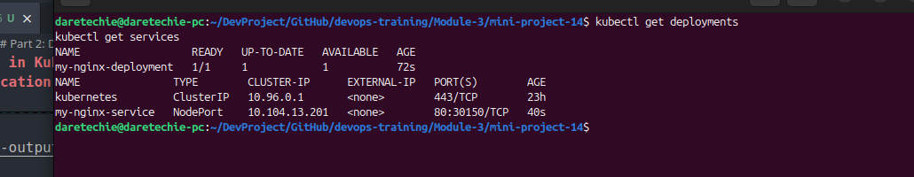
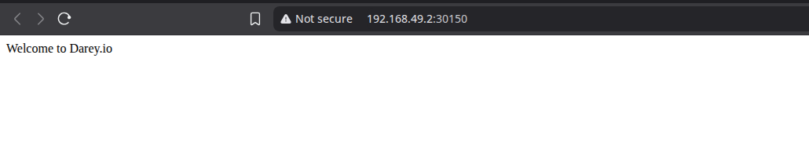

# Mini-Project 15: Deploying Applications in Kubernetes

This mini-project demonstrates the process of deploying applications in a Kubernetes cluster using Minikube. It covers creating Deployments and Services using both imperative `kubectl` commands and declarative YAML files.

## Table of Contents

- [Prerequisites](#prerequisites)
- [Part 1: Deploying a Sample Application with `kubectl`](#part-1-deploying-a-sample-application-with-kubectl)
  - [Step 1: Create a Deployment](#step-1-create-a-deployment)
  - [Step 2: Expose the Deployment as a Service](#step-2-expose-the-deployment-as-a-service)
  - [Step 3: Verify the Service](#step-3-verify-the-service)
  - [Step 4: Access the Service](#step-4-access-the-service)
- [Part 2: Deploying a Custom Nginx Application with YAML](#part-2-deploying-a-custom-nginx-application-with-yaml)
  - [Step 1: Create the Deployment YAML File](#step-1-create-the-deployment-yaml-file)
  - [Step 2: Create the Service YAML File](#step-2-create-the-service-yaml-file)
  - [Step 3: Apply the YAML Files](#step-3-apply-the-yaml-files)
  - [Step 4: Verify the Deployment and Service](#step-4-verify-the-deployment-and-service)
  - [Step 5: Access the Nginx Application](#step-5-access-the-nginx-application)
- [Troubleshooting](#troubleshooting)
- [Submission Checklist](#submission-checklist)

## Prerequisites

Before you begin, ensure you have the following installed and configured:

- **Minikube:** A local Kubernetes environment.
- **kubectl:** The Kubernetes command-line tool.
- **Docker:** To manage container images.

## Part 1: Deploying a Sample Application with `kubectl`

In this part, we will deploy a sample application directly using `kubectl` commands.

### Step 1: Create a Deployment

Create a new Kubernetes Deployment named `hello-minikube` using the `kicbase/echo-server:1.0` image.

```bash
kubectl create deployment hello-minikube --image=kicbase/echo-server:1.0
```

### Step 2: Expose the Deployment as a Service

Expose the `hello-minikube` Deployment as a NodePort Service on port 8080.

```bash
kubectl expose deployment hello-minikube --type=NodePort --port=8080
```

### Step 3: Verify the Service

Check the status of the `hello-minikube` Service.

```bash
kubectl get services hello-minikube
```

**Demonstration of `kubectl get services` output:**


### Step 4: Access the Service

Open the `hello-minikube` Service in your web browser.

```bash
minikube service hello-minikube
```

**Demonstration of the running application in the browser:**


## Part 2: Deploying a Custom Nginx Application with YAML

In this part, we will deploy a custom Nginx application using declarative YAML files.

### Step 1: Create the Deployment YAML File

1.  Create a new directory named `my-nginx-yaml`.
2.  Inside the `my-nginx-yaml` directory, create a new file named `nginx-deployment.yaml`.
3.  Paste the following content into the `nginx-deployment.yaml` file:

```yaml
apiVersion: apps/v1
kind: Deployment
metadata:
  name: my-nginx-deployment
spec:
  replicas: 1
  selector:
    matchLabels:
      app: my-nginx
  template:
    metadata:
      labels:
        app: my-nginx
    spec:
      containers:
        - name: my-nginx
          image: dareyregistry/my-nginx:1.0
          ports:
            - containerPort: 80
```

**Note:** You can replace `dareyregistry/my-nginx:1.0` with your own custom Nginx image from a previous project.

### Step 2: Create the Service YAML File

1.  In the same `my-nginx-yaml` directory, create a new file named `nginx-service.yaml`.
2.  Paste the following content into the `nginx-service.yaml` file:

```yaml
apiVersion: v1
kind: Service
metadata:
  name: my-nginx-service
spec:
  selector:
    app: my-nginx
  ports:
    - protocol: TCP
      port: 80
      targetPort: 80
  type: NodePort
```

### Step 3: Apply the YAML Files

Apply the Deployment and Service configurations to your Kubernetes cluster.

```bash
kubectl apply -f my-nginx-yaml/nginx-deployment.yaml
kubectl apply -f my-nginx-yaml/nginx-service.yaml
```

**Demonstration of `kubectl apply` output:**


### Step 4: Verify the Deployment and Service

Verify that the Deployment and Service have been created successfully.

```bash
kubectl get deployments
kubectl get services
```

**Demonstration of `kubectl get deployments` and `kubectl get services` output:**


### Step 5: Access the Nginx Application

Get the URL for the `my-nginx-service` and open it in your browser.

```bash
minikube service my-nginx-service --url
```

Follow the IP address provided by the command to access your application.

**Demonstration of the Nginx application running in the browser:**


## Troubleshooting

- **`ImagePullBackOff` Error:** This error indicates that Kubernetes cannot pull the container image. Check that the image name and tag are correct and that the image is available in the specified registry.
- **`CrashLoopBackOff` Error:** This error means that the container is starting and then crashing repeatedly. Use `kubectl logs <pod-name>` to check the container logs for errors.
- **Service Not Accessible:** If you cannot access the Service, ensure that the Service's selector matches the labels of the Pods in your Deployment. Also, check the `targetPort` in the Service definition to make sure it matches the `containerPort` in the D
