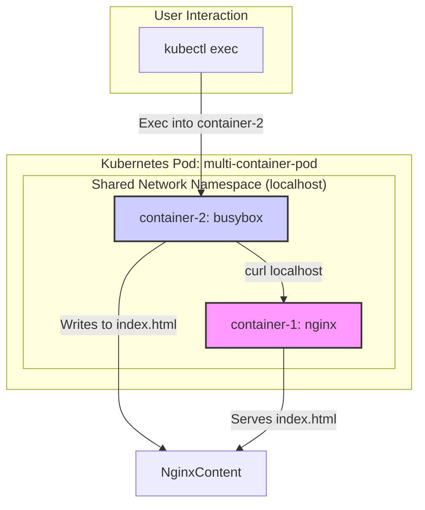
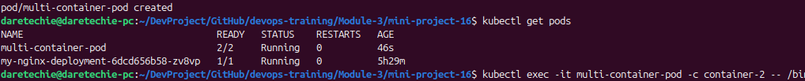
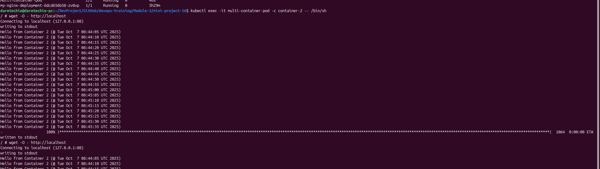

# Kubernetes Pod Networking: Multi-Container Pod Communication


## 📋 Table of Contents

- [Overview](#overview)
- [Architecture Diagram](#architecture-diagram)
- [Prerequisites](#prerequisites)
- [Step-by-Step Implementation](#step-by-step-implementation)
- [Verification and Evidence](#verification-and-evidence)
- [Troubleshooting Guide](#troubleshooting-guide)
- [Cleanup](#cleanup)
- [Key Takeaways](#key-takeaways)

## 🎯 Overview

This project provides a hands-on demonstration of a fundamental Kubernetes networking concept: **shared network namespaces in multi-container Pods**. By deploying a Pod with two different containers—an Nginx web server and a BusyBox utility container—we will illustrate how they can seamlessly communicate with each other using the `localhost` interface.

### What We Are Building

- **A Multi-Container Pod**: A single Kubernetes Pod that runs two containers.
- **Inter-Container Communication**: One container (`busybox`) will modify a file served by the other container (`nginx`).
- **Shared Network Namespace**: We will verify that both containers share the same network environment, allowing them to communicate as if they were on the same machine.

### Business Value

- ✅ **Efficient Communication**: Enables high-performance, low-latency communication between tightly coupled containerized applications.
- ✅ **Simplified Service Discovery**: Containers in the same Pod can find each other on `localhost`, eliminating the need for complex service discovery mechanisms.
- ✅ **Resource Sharing**: Allows containers to share resources like network and storage, leading to more efficient resource utilization.
- ✅ **Atomic Deployment and Scaling**: Pods are the atomic unit of scaling in Kubernetes. Grouping containers in a Pod ensures they are always deployed and scaled together.

## 🏗️ Architecture Diagram



## 📋 Prerequisites

### System Requirements

- **Operating System**: Linux, macOS, or Windows.
- **Container Runtime**: Docker or a similar container runtime.

### Tools Needed

- **Minikube**: A running Minikube cluster.
- **kubectl**: The Kubernetes command-line tool, configured to communicate with your Minikube cluster.

### 🔧 Step-by-Step Implementation

#### Phase 1: Define the Multi-Container Pod with a Shared Volume

**Purpose**: To create a YAML manifest that defines the Pod, its containers, and a shared volume for communication.

1.  **Create the YAML File**: Create a file named `my-nginx-yaml/multi-container-pod.yaml`.
2.  **Add the YAML Configuration**: Paste the following configuration into the file.

    ```yaml
    apiVersion: v1
    kind: Pod
    metadata:
      name: multi-container-pod
    spec:
      volumes:
        - name: nginx-content
          emptyDir: {}
      containers:
        - name: container-1
          image: nginx:alpine
          volumeMounts:
            - name: nginx-content
              mountPath: /usr/share/nginx/html
        - name: container-2
          image: busybox
          command:
            - "/bin/sh"
            - "-c"
            - 'while true; do echo "Hello from Container 2 (@ $(date))" >> /usr/share/nginx/html/index.html; sleep 5; done'
          volumeMounts:
            - name: nginx-content
              mountPath: /usr/share/nginx/html
    ```

    **Key Changes in this YAML:**

    - **`spec.volumes`**: We define a volume named `nginx-content` of type `emptyDir`. An `emptyDir` volume is created when the Pod is assigned to a node and exists as long as that Pod is running on that node.
    - **`spec.containers.volumeMounts`**: In each container, we mount the `nginx-content` volume at the path `/usr/share/nginx/html`. This ensures both containers are reading from and writing to the same directory.
    - **Improved Command**: The command in `container-2` now includes a timestamp to make it obvious that the content is being updated dynamically. The sleep interval is also reduced to 5 seconds.

#### Phase 2: Deploy and Verify the Pod

**Purpose**: To deploy the Pod and ensure it is running correctly.

1.  **Apply the Configuration**:
    _(If you have an old version of the pod, delete it first with `kubectl delete pod multi-container-pod`)_

    ```bash
    kubectl apply -f my-nginx-yaml/multi-container-pod.yaml
    ```

2.  **Check Pod Status**:
    ```bash
    kubectl get pods
    ```
    _Wait for the status to show `Running`._

#### Phase 3: Test Inter-Container Communication

**Purpose**: To confirm that the two containers are sharing the filesystem and can communicate.

1.  **Exec into the BusyBox Container**:

    ```bash
    kubectl exec -it multi-container-pod -c container-2 -- /bin/sh
    ```

2.  **Access the Nginx Server**:
    _Inside the BusyBox container's shell, wait about 10 seconds for the first write to occur, then run:_
    ```sh
    # Access the Nginx server using wget
    wget -O - http://localhost
    ```
    You should now see an output that includes the line: `Hello from Container 2 (@ <timestamp>)`. You can run the `wget` command multiple times to see the file content grow.

## 🧪 Verification

To verify the successful completion of this project, please provide the following screenshots:

1.  **Pod Creation and Status**: Screenshot showing the `kubectl apply` and `kubectl get pods` commands.

    

2.  **Exec and Wget Output**: Screenshot of the terminal after running `kubectl exec` and `wget -O - http://localhost` showing the custom message.

    

## 🔍 Troubleshooting Guide

### Common Issues and Solutions

| Problem                                   | Cause                                                                                                                                | Solution                                                                                                                                                 |
| ----------------------------------------- | ------------------------------------------------------------------------------------------------------------------------------------ | -------------------------------------------------------------------------------------------------------------------------------------------------------- |
| **`wget` shows default Nginx page**       | The containers are not sharing a filesystem. This happens if the `volumes` and `volumeMounts` are not correctly defined in the YAML. | Ensure your `pod.yaml` includes the `volumes` section with an `emptyDir` and that both containers have a `volumeMounts` section pointing to that volume. |
| **Pod is `Pending`**                      | The cluster lacks sufficient resources (CPU, memory) to schedule the Pod.                                                            | Use `kubectl describe pod multi-container-pod` to check the "Events" section for scheduler messages. You may need to stop other Pods.                    |
| **Pod is `ImagePullBackOff`**             | Kubernetes failed to pull the container image from the registry.                                                                     | Check for typos in the image name (`nginx:alpine`, `busybox`). Ensure your cluster has internet access.                                                  |
| **Pod is `CrashLoopBackOff`**             | The container starts but exits with an error repeatedly.                                                                             | Use `kubectl logs multi-container-pod -c <container-name>` to check for application errors. Verify the `command` in the YAML file.                       |
| **`apk: not found` or `curl: not found`** | The default `busybox` image is very minimal and does not include the `apk` package manager or `curl`.                                | Use `wget` which is included in the `busybox` image. The command is `wget -O - http://localhost`.                                                        |

## 🧹 Cleanup

To avoid leaving unused resources in your cluster, delete the Pod using the same YAML file you used to create it.

```bash
kubectl delete -f my-nginx-yaml/multi-container-pod.yaml
```

## 🎯 Key Takeaways

- **Pods are the Atomic Unit**: Pods are the smallest deployable units in Kubernetes. All containers within a Pod are scheduled together and share the same lifecycle.
- **Shared Volumes are Key for Interaction**: For containers to share files, a `Volume` must be defined at the Pod level and mounted into each container. `emptyDir` is a simple way to create a temporary, shared directory.
- **Shared Network Namespace**: Containers in a Pod share a network namespace, meaning they can communicate over `localhost` and share the same IP address and port space.
- **The Sidecar Pattern**: This project is a simple example of the "sidecar" pattern, where a primary container (Nginx) is assisted by a secondary container (BusyBox). This is a powerful pattern for logging, monitoring, and data synchronization.
