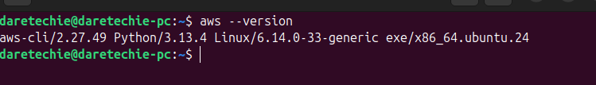
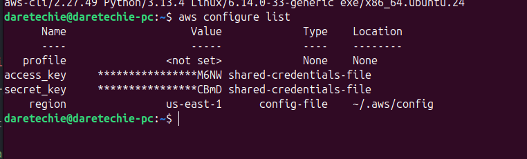
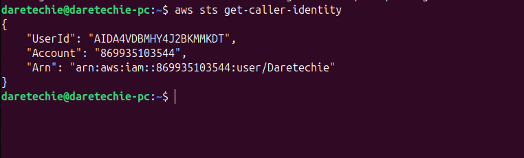
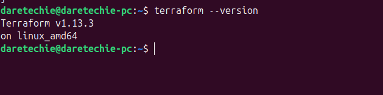
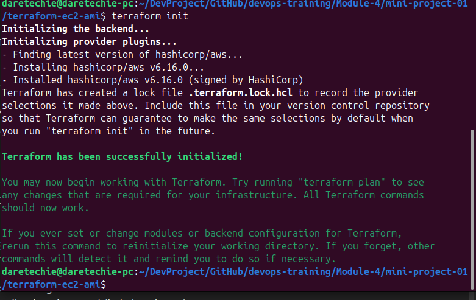
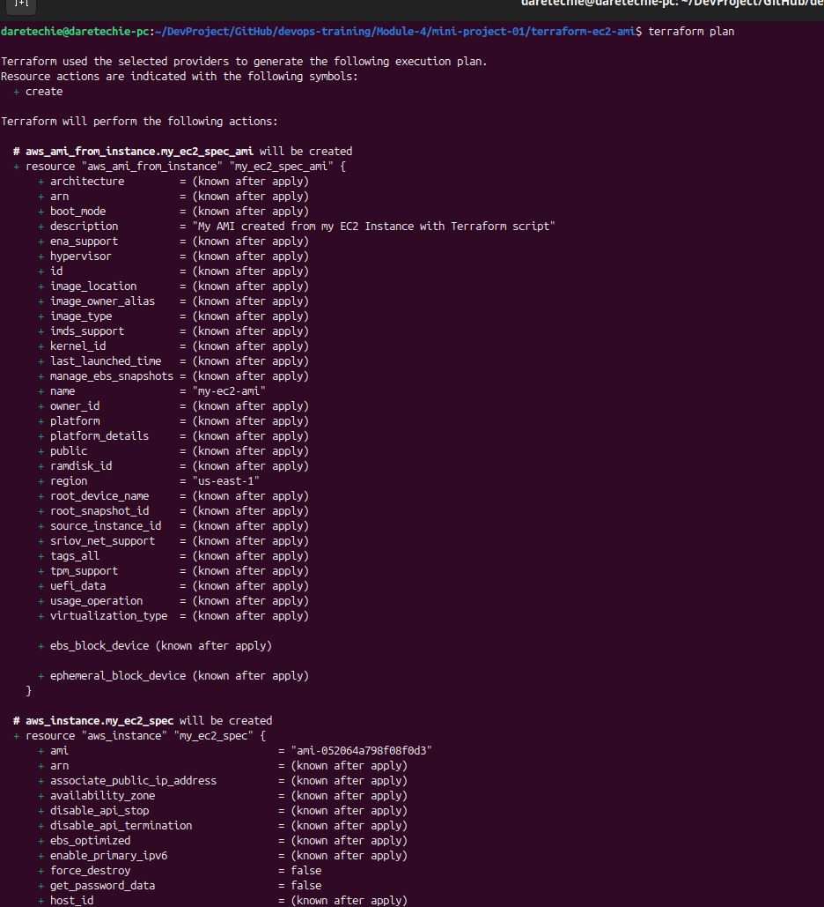
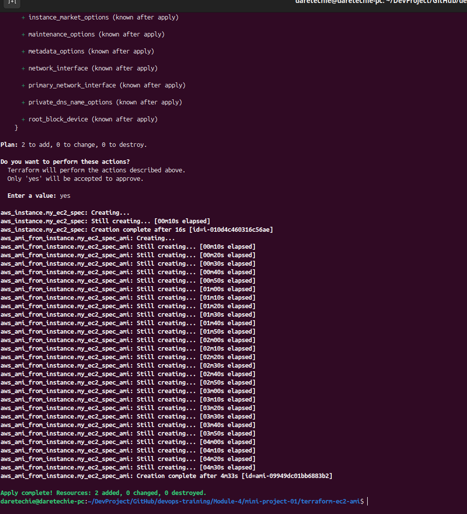
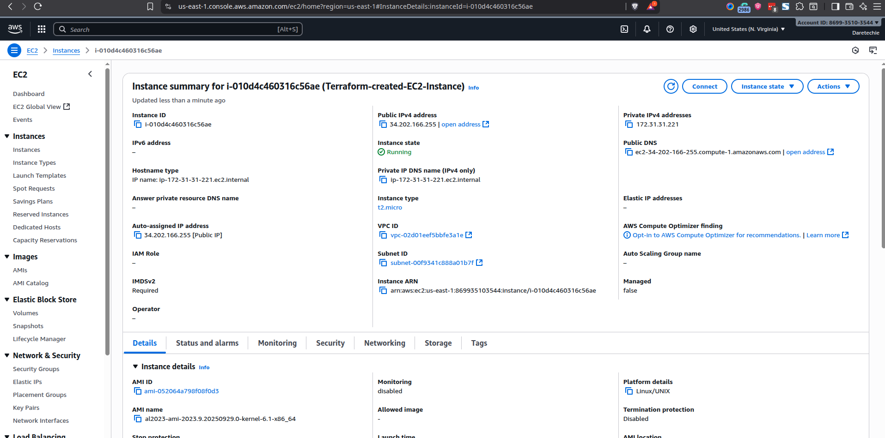
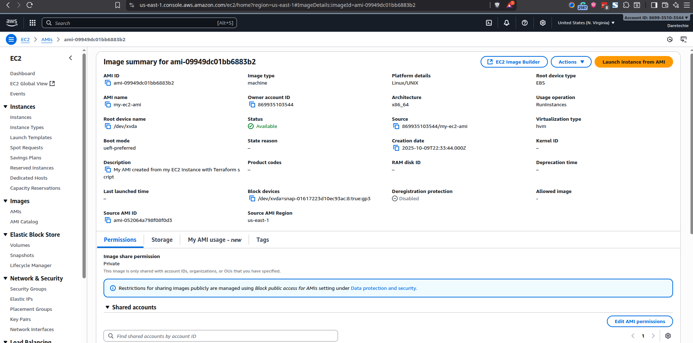
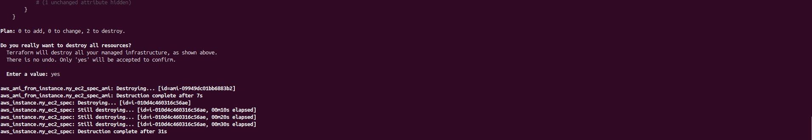

# Project Report: Automating EC2 & AMI Creation with Terraform

## 1. Project Overview

For this project, I used Terraform to automate the provisioning of an AWS EC2 instance and then created a custom Amazon Machine Image (AMI) from that instance. This report documents the steps I took, the evidence of the created resources, and the process for cleaning up the environment.

My primary goal was to apply Infrastructure as Code (IaC) principles to create a reusable server template, demonstrating a foundational DevOps skill.

---

## 2. Prerequisite Verification

I began by ensuring my local environment was correctly configured to interact with AWS.

1.  **AWS CLI Version**: I first confirmed the AWS CLI was installed.

    ```bash
    aws --version
    ```

    _Evidence below shows the installed AWS CLI version._
    

2.  **AWS CLI Configuration**: I then verified that the CLI was configured with my credentials.

    ```bash
    aws configure list
    ```

    _Evidence below shows my AWS CLI configuration._
    

3.  **AWS Authentication**: I ran `sts get-caller-identity` to ensure my credentials were valid and authentication to my AWS account was successful.

    ```bash
    aws sts get-caller-identity
    ```

    _Evidence below confirms my identity and successful authentication._
    

4.  **Terraform Version**: Finally, I confirmed that Terraform was installed and ready.
    ```bash
    terraform --version
    ```
    _Evidence below shows the installed Terraform version._
    

---

## 3. My Implementation Steps

With the prerequisites confirmed, I proceeded with the implementation.

### Step 1: Project Setup

I created a new directory for the project to keep the configuration files organized.

```bash
mkdir terraform-ec2-ami
cd terraform-ec2-ami
```

### Step 2: Writing the Terraform Configuration

I created a `main.tf` file and wrote the following script. The script defines the AWS provider, an EC2 instance resource, and a resource to create an AMI from that instance.

```terraform
provider "aws" {
  region = "us-east-1"
}

# This resource defines the EC2 instance I want to create.image
resource "aws_instance" "my_ec2_spec" {
  # I chose a standard Amazon Linux 2 AMI for the us-east-1 region.
  ami           = "ami-052064a798f08f0d3"
  instance_type = "t2.micro"

  tags = {
    Name = "Terraform-created-EC2-Instance"
  }
}

# This resource creates a custom AMI from the instance defined above.
resource "aws_ami_from_instance" "my_ec2_spec_ami" {
  name               = "my-ec2-ami-from-terraform"
  source_instance_id = aws_instance.my_ec2_spec.id

  tags = {
    Name = "My-Custom-AMI"
  }
}
```

image

### Step 3: Running the Terraform Workflow

I followed the standard Terraform workflow to deploy the infrastructure.

1.  **`terraform init`**: I initialized the project, which downloaded the AWS provider plugin.
    _Evidence of successful initialization._
    

2.  **`terraform plan`**: I ran a plan to review the changes before applying them. The plan correctly showed that two resources (the EC2 instance and the AMI) would be created.
    _Evidence of the execution plan._
    

3.  **`terraform apply`**: I applied the configuration, and after I confirmed with `yes`, Terraform began creating the resources.
    _Evidence of the successful apply command._
    

---

## 4. Evidence of Created Resources

After the `apply` command completed, I logged into the AWS Management Console to verify the resources were created as expected.

1.  **EC2 Instance Verification**: I navigated to the EC2 dashboard and found the instance named `Terraform-created-EC2-Instance` running correctly.
    _Evidence: Screenshot from the AWS Console showing the running EC2 instance._
    

2.  **Custom AMI Verification**: I then went to the AMIs section and confirmed that the new AMI, `my-ec2-ami-from-terraform`, was successfully created.
    _Evidence: Screenshot from the AWS Console showing the new custom AMI._
    

---

## 5. Challenges Encountered (Troubleshooting)

During the project, I anticipated some potential errors. For example, an `InvalidAMIID.NotFound` error could occur if the AMI ID was incorrect for the chosen region. To mitigate this, I ensured the AMI ID was valid for `us-east-1`. I also knew to use `aws_ami_from_instance` instead of `aws_ami` to avoid an `Unsupported argument` error for `source_instance_id`.

---

## 6. Resource Cleanup

To avoid incurring costs, I cleaned up all the resources created during this project using the `destroy` command.

1.  **`terraform destroy`**: I ran the destroy command and confirmed with `yes` to terminate the EC2 instance and deregister the AMI.
    _Evidence of the successful destroy operation._
    

This project was a successful exercise in using Terraform to automate infrastructure provisioning on AWS.
