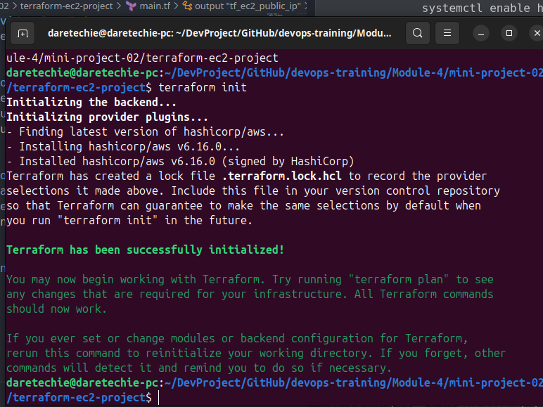
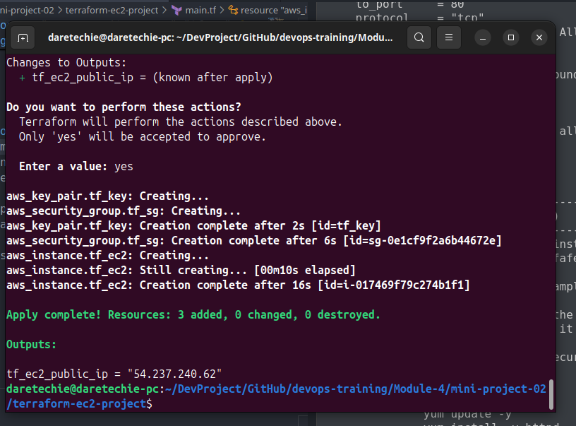
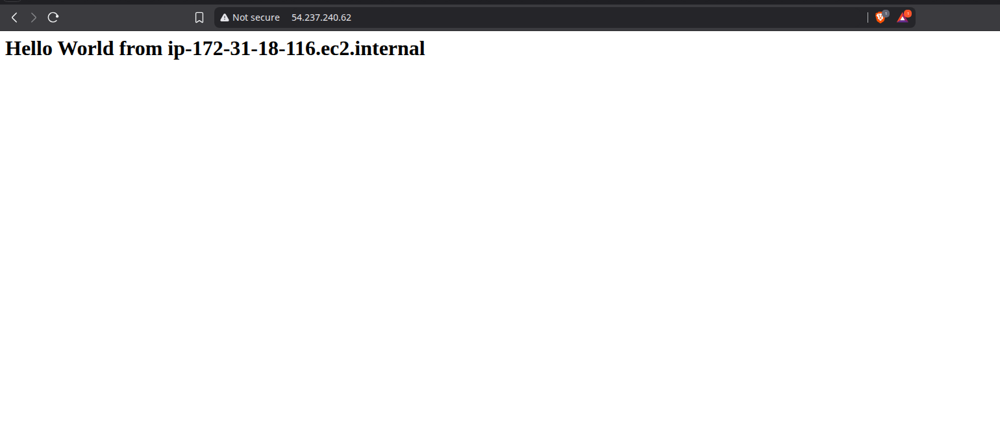

# Project Report: Deploying a Web Server with Terraform

## 1. Project Overview

The goal of this project was to use Terraform to automate the deployment of a complete, functional web server on AWS. This involved provisioning an EC2 instance, creating a security group to allow web traffic, associating an SSH key pair, and using a user data script to install and start an Apache web server.

This project demonstrates a full, self-contained Infrastructure as Code (IaC) setup where all components are defined and managed by Terraform.

---

## 2. Prerequisite Verification

I started by ensuring my local environment was correctly configured for the task.

1.  **AWS CLI Version**: Confirmed the AWS CLI was installed.

    ```bash
    aws --version
    ```

    _Evidence below shows the installed AWS CLI version._
    

2.  **AWS CLI Configuration**: Verified the CLI was configured with my credentials.

    ```bash
    aws configure list
    ```

    _Evidence below shows my AWS CLI configuration._
    

3.  **AWS Authentication**: Ensured my credentials were valid and authentication was successful.

    ```bash
    aws sts get-caller-identity
    ```

    _Evidence below confirms my identity and successful authentication._
    

4.  **Terraform Version**: Confirmed that Terraform was installed.
    ```bash
    terraform --version
    ```
    _Evidence below shows the installed Terraform version._
    

---

## 3. My Implementation Steps

With the prerequisites verified, I proceeded with the implementation.

### Step 1: Project Setup

I created a new directory for the project to keep the configuration files organized.

```bash
mkdir terraform-web-server
cd terraform-web-server
```

### Step 2: Writing the Terraform Configuration

I created a `main.tf` file containing the complete infrastructure definition. This single file defines the provider, a key pair, a security group, the EC2 instance itself, and an output for the public IP.

```terraform
# Defines the provider we are using (AWS) and the target region.
provider "aws" {
  region = "us-east-1"
}

# Creates an AWS key pair resource from a local public key file.
# This allows for secure SSH access to the instance.
resource "aws_key_pair" "tf_key" {
  key_name   = "tf_key"
  public_key = file("~/.ssh/id_ed25519.pub")
}

# Creates a security group to control traffic to the EC2 instance.
resource "aws_security_group" "tf_sg" {
  name        = "web-server-sg"
  description = "Allow SSH and HTTP inbound traffic"

  # Ingress rule to allow SSH traffic (port 22) from any IP.
  ingress {
    from_port   = 22
    to_port     = 22
    protocol    = "tcp"
    cidr_blocks = ["0.0.0.0/0"]
  }

  # Ingress rule to allow HTTP traffic (port 80) from any IP.
  ingress {
    from_port   = 80
    to_port     = 80
    protocol    = "tcp"
    cidr_blocks = ["0.0.0.0/0"]
  }

  # Egress rule to allow all outbound traffic from the instance.
  egress {
    from_port   = 0
    to_port     = 0
    protocol    = "-1"
    cidr_blocks = ["0.0.0.0/0"]
  }
}

# Defines the EC2 instance.
resource "aws_instance" "tf_ec2" {
  ami           = "ami-052064a798f08f0d3" # Amazon Linux 2 AMI for us-east-1
  instance_type = "t2.micro"
  key_name      = aws_key_pair.tf_key.key_name

  # Associates the security group created above with this instance.
  vpc_security_group_ids = [aws_security_group.tf_sg.id]

  # This script runs on instance launch to set up the web server.
  user_data = <<-EOF
              #!/bin/bash
              sudo yum update -y
              sudo yum install -y httpd
              sudo systemctl start httpd
              sudo systemctl enable httpd
              echo "<h1>Hello World from $(hostname -f)</h1>" > /var/www/html/index.html
              EOF

  tags = {
    Name = "Terraform-Web-Server"
  }
}

# Outputs the public IP address of the instance after it's created.
output "tf_ec2_public_ip" {
  description = "Public IP of the EC2 instance"
  value       = aws_instance.tf_ec2.public_ip
}
```

### Step 3: Running the Terraform Workflow

I followed the standard Terraform workflow to deploy the infrastructure.

1.  **`terraform init`**: I initialized the project to download the AWS provider plugin.
    _Evidence of successful initialization._
    

2.  **`terraform plan`**: I ran a plan to review the changes. The plan correctly showed that four resources (key pair, security group, EC2 instance, and null resource for output) would be created.
    _Evidence of the execution plan._
    

3.  **`terraform apply`**: I applied the configuration. After I confirmed with `yes`, Terraform created the resources in the correct order.
    _Evidence of the successful apply command._
    

---

## 4. Evidence of Created Resources

After the `apply` command completed, I verified that the resources were created and functioning as expected.

1.  **EC2 Instance Verification**: I navigated to the EC2 dashboard in the AWS Console and found the instance named `Terraform-Web-Server` running correctly.
    _Evidence: Screenshot from the AWS Console showing the running EC2 instance._
    

2.  **Web Server Verification**: I copied the `tf_ec2_public_ip` value from the Terraform output and pasted it into my browser. The "Hello World" page loaded successfully.
    _Evidence: Screenshot of the web page loaded in the browser._
    

---

## 5. Challenges Encountered (Troubleshooting)

A common issue in this setup is a **Connection Timed Out** error when trying to access the web server. This is almost always caused by one of two things:

- **Incorrect Security Group Rules**: The `ingress` rule for port 80 might be missing or configured incorrectly. I ensured my `tf_sg` resource explicitly allowed inbound TCP traffic on port 80 from `0.0.0.0/0`.
- **User Data Script Failure**: The web server might not have installed or started correctly. To debug this, I would SSH into the instance (`ssh -i ~/.ssh/id_ed25519 ec2-user@<public_ip>`) and check the cloud-init logs at `/var/log/cloud-init-output.log` for any errors.

---

## 6. Resource Cleanup

To avoid incurring costs, I cleaned up all created resources using the `destroy` command.

1.  **`terraform destroy`**: I ran the destroy command and confirmed with `yes`. Terraform then terminated the EC2 instance and deleted the security group and key pair.
    _Evidence of the successful destroy operation._
    

This project successfully demonstrated how to provision and configure a full web server stack on AWS using a single, self-contained Terraform configuration.
