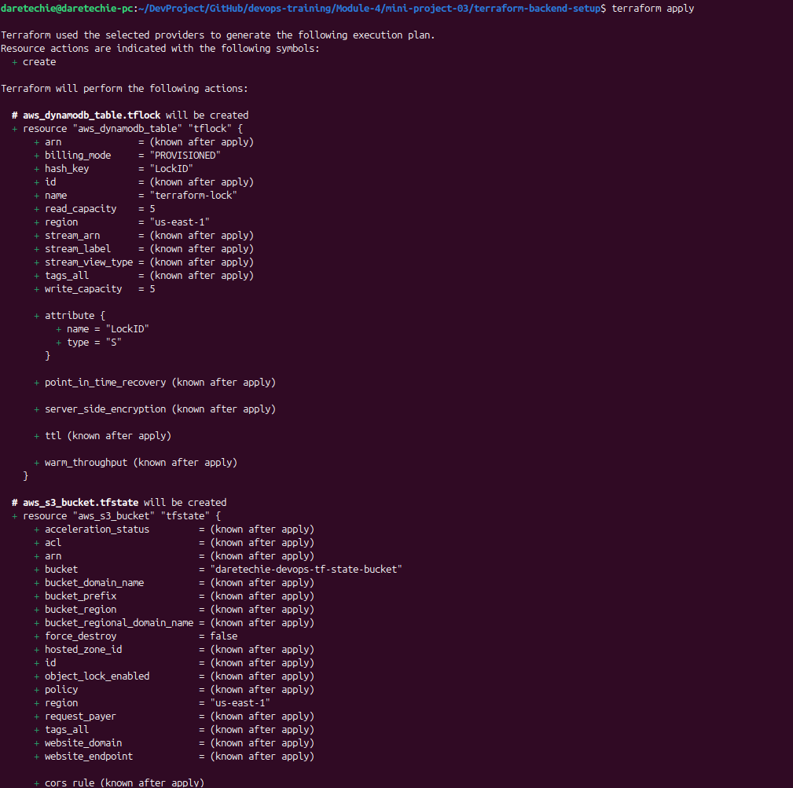
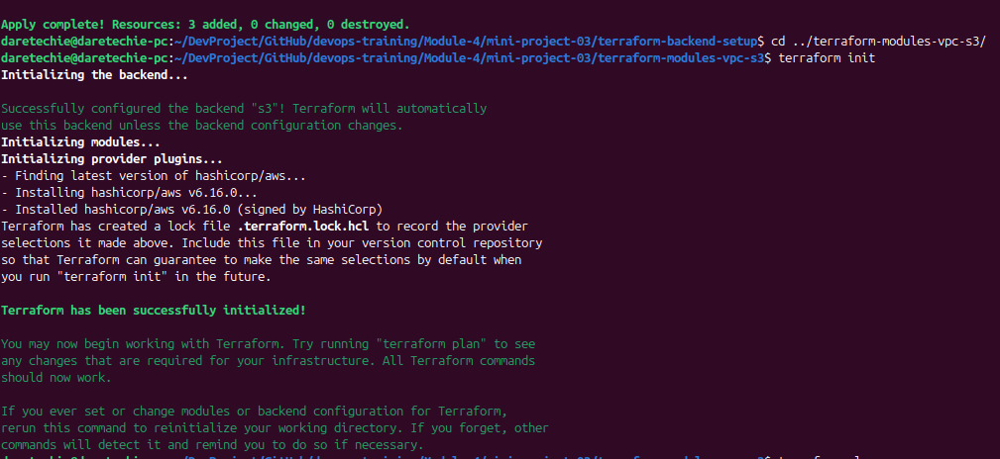
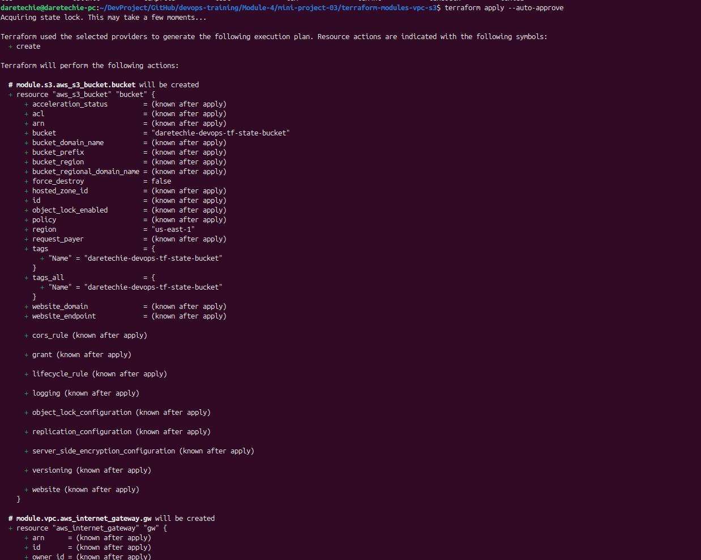
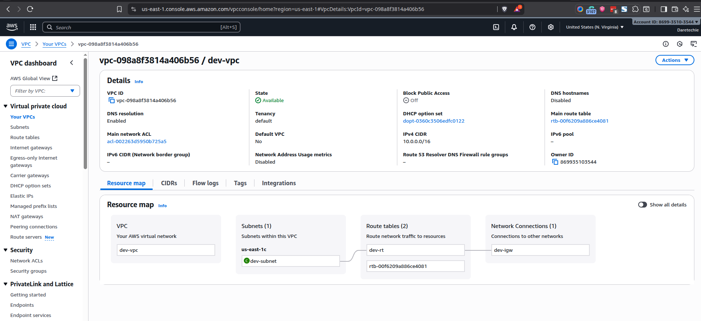
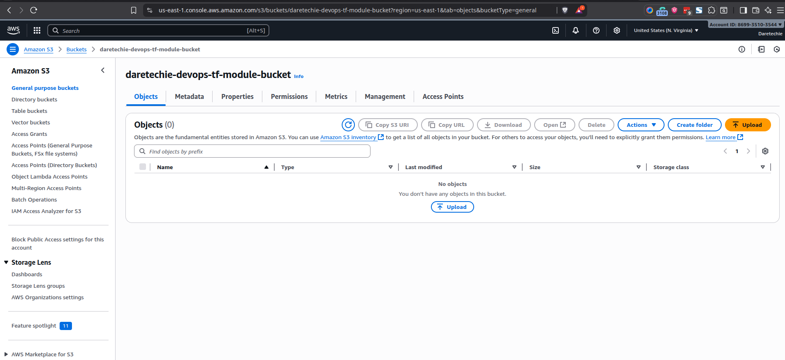
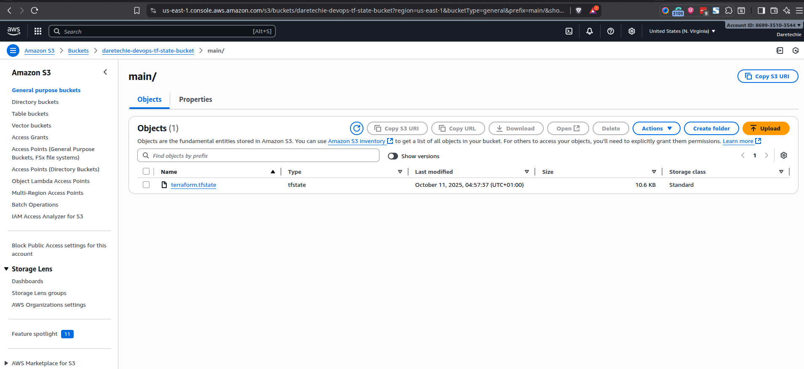

# Mini Project: Terraform Modules and S3 Backend

## 1. Project Overview

This project is a hands-on exercise to master two foundational concepts in Terraform: **reusable modules** and **remote state management** with an S3 backend. We will build a modular infrastructure to provision an AWS VPC and an S3 bucket. More importantly, we will configure our project to store the Terraform state file remotely in a separate, securely managed S3 bucket, which is the standard practice for any collaborative or production-grade environment.

### Project Architecture

The architecture involves two key parts:

1.  **Backend Infrastructure**: A dedicated S3 bucket to store our Terraform state and a DynamoDB table for state locking. This is created once and managed separately, ensuring a stable backend for our main project.
2.  **Main Infrastructure**: The primary Terraform project that uses reusable modules to create a VPC and an application-specific S3 bucket. This project is configured to store its state in the backend S3 bucket created in the first step.

This separation is a best practice that enhances security, collaboration, and state integrity.

### Learning Objectives

- Understand and create reusable Terraform modules.
- Learn the importance of remote state management.
- Implement a production-grade S3 backend with a DynamoDB table for state locking.
- Troubleshoot common Terraform errors related to backend configuration and resource conflicts.
- Structure a Terraform project for clarity and scalability.

## 2. Prerequisites

- **AWS CLI**: Installed and configured with administrator access credentials.
- **Terraform**: Installed on your local machine.

## 3. Step-by-Step Implementation Guide

This guide follows a production-grade approach where the backend infrastructure is managed as code.

### Phase 1: Setting Up the Backend Infrastructure

First, we create the S3 bucket and DynamoDB table that will store our Terraform state. This is a one-time setup per environment.

1.  **Create the project structure:**

    ```bash
    mkdir -p terraform-backend-setup
    cd terraform-backend-setup
    touch main.tf
    ```

2.  **Define the backend resources in `main.tf`:**

    **`terraform-backend-setup/main.tf`**

    ```terraform
    provider "aws" {
      region = "us-east-1"
    }

    # Use a globally unique name for your state bucket
    variable "tfstate_bucket_name" {
      description = "The name of the S3 bucket for Terraform state"
      type        = string
      default     = "daretechie-devops-tf-state-bucket"
    }

    resource "aws_s3_bucket" "tfstate" {
      bucket = var.tfstate_bucket_name
    }

    # Enable versioning to keep a history of your state file
    resource "aws_s3_bucket_versioning" "tfstate_versioning" {
      bucket = aws_s3_bucket.tfstate.id
      versioning_configuration {
        status = "Enabled"
      }
    }

    # Create a DynamoDB table for state locking to prevent concurrent modifications
    resource "aws_dynamodb_table" "tflock" {
      name           = "terraform-lock"
      read_capacity  = 5
      write_capacity = 5
      hash_key       = "LockID"

      attribute {
        name = "LockID"
        type = "S"
      }
    }
    ```

3.  **Create the backend resources:**

    ```bash
    # Initialize this configuration (uses local state)
    terraform init

    # Apply the changes to create the S3 bucket and DynamoDB table
    terraform apply --auto-approve
    ```

### Phase 2: Building the Main Infrastructure Project

Now we create our main project that will consume the backend and build the VPC and S3 bucket using modules.

1.  **Create the project structure:**

    ```bash
    mkdir -p terraform-modules-vpc-s3/modules/{vpc,s3}
    cd terraform-modules-vpc-s3
    touch main.tf variables.tf terraform.tfvars backend.tf
    touch modules/vpc/main.tf modules/vpc/variables.tf
    touch modules/s3/main.tf modules/s3/variables.tf
    ```

2.  **Configure the Backend:**
    Create `backend.tf` to tell this project where to store its state.

    **`terraform-modules-vpc-s3/backend.tf`**

    ```terraform
    terraform {
      backend "s3" {
        bucket         = "daretechie-devops-tf-state-bucket" # Must match the name from Phase 1
        key            = "main/terraform.tfstate"
        region         = "us-east-1"
        encrypt        = true
        dynamodb_table = "terraform-lock"
      }
    }
    ```

3.  **Create the VPC Module:**

    **`modules/vpc/variables.tf`**

    ```terraform
    variable "vpc_cidr_block" {
      description = "CIDR block for the VPC"
      type        = string
    }
    variable "env_prefix" {
      description = "Environment prefix"
      type        = string
    }
    ```

    **`modules/vpc/main.tf`**

    ```terraform
    resource "aws_vpc" "main" {
      cidr_block = var.vpc_cidr_block
      tags = {
        Name = "${var.env_prefix}-vpc"
      }
    }
    ```

4.  **Create the S3 Module:**

    **`modules/s3/variables.tf`**

    ```terraform
    variable "bucket_name" {
      description = "Name of the S3 bucket"
      type        = string
    }
    ```

    **`modules/s3/main.tf`**

    ```terraform
    resource "aws_s3_bucket" "bucket" {
      bucket = var.bucket_name
      acl    = "private"
    }
    ```

5.  **Configure the Root Module:**
    This is where we use our modules.

    **`variables.tf`**

    ```terraform
    variable "vpc_cidr_block" {
      description = "CIDR block for the VPC"
      type        = string
    }
    variable "bucket_name" {
      description = "Name of the S3 bucket"
      type        = string
    }
    variable "env_prefix" {
      description = "Environment prefix"
      type        = string
    }
    ```

    **`terraform.tfvars`**

    ```terraform
    vpc_cidr_block = "10.0.0.0/16"
    bucket_name    = "daretechie-devops-tf-module-bucket" # A unique name for the application bucket
    env_prefix     = "dev"
    ```

    **`main.tf`**

    ```terraform
    provider "aws" {
      region = "us-east-1"
    }

    module "vpc" {
      source         = "./modules/vpc"
      vpc_cidr_block = var.vpc_cidr_block
      env_prefix     = var.env_prefix
    }

    module "s3_bucket" {
      source      = "./modules/s3"
      bucket_name = var.bucket_name
    }
    ```

6.  **Initialize and Apply the Main Project:**

    ```bash
    # This will initialize the S3 backend
    terraform init

    # This will create the VPC and the application S3 bucket
    terraform apply --auto-approve
    ```

## 4. Evidence for Grading

To verify the successful completion of this project, please provide the following screenshots.

### 4.1. Backend Creation


**Description:** Screenshot of the terminal after successfully running `terraform apply` in the `terraform-backend-setup` directory.

### 4.2. Main Project Initialization


**Description:** Screenshot of the terminal after running `terraform init` in the `terraform-modules-vpc-s3` directory, showing the message "Successfully configured the backend "s3"".

### 4.3. Main Project Apply


**Description:** Screenshot of the terminal after successfully running `terraform apply` for the main project, showing the creation of the VPC and S3 bucket.

### 4.4. VPC in AWS Console


**Description:** Screenshot of the AWS VPC Dashboard showing the newly created VPC with the name `dev-vpc`.

### 4.5. Application S3 Bucket in AWS Console


**Description:** Screenshot of the AWS S3 Dashboard showing the newly created application bucket (`daretechie-devops-tf-module-bucket`).

### 4.6. Terraform State File in Backend Bucket


**Description:** Screenshot of the AWS S3 Dashboard showing the backend bucket (`daretechie-devops-tf-state-bucket`) containing the `main/terraform.tfstate` file.

## 5. Troubleshooting Guide

Here are solutions to common issues encountered during this project.

- **Error:** `S3 bucket "daretechie-devops-tf-state-bucket" does not exist`

  - **Cause:** You ran `terraform init` for the main project before creating the backend resources.
  - **Solution:** Navigate to the `terraform-backend-setup` directory and run `terraform apply` to create the S3 bucket and DynamoDB table first.

- **Error:** `creating S3 Bucket (...): BucketAlreadyExists`

  - **Cause:** The `bucket_name` in your `terraform.tfvars` file is the same as your backend S3 bucket name. These must be different.
  - **Solution:** Change the `bucket_name` in `terraform-modules-vpc-s3/terraform.tfvars` to a different, unique name (e.g., `daretechie-devops-tf-module-bucket`).

- **Error:** `Invalid module source address`
  - **Cause:** A typo in the `source` path for a module in your `main.tf` file.
  - **Solution:** Ensure the path is correct and prefixed with `./` for local modules (e.g., `source = "./modules/vpc"`).

## 6. Alternative Method: Manual Backend Creation (Non-Production)

This manual method, using the AWS CLI, is useful for quick tests or learning exercises. However, it is **not recommended for production or collaborative environments** because it is not easily reproducible and is prone to human error. The production-grade approach is to manage the backend infrastructure with a separate Terraform configuration, as shown in Phase 1 of this guide.

> Before we start writing the code, we need to create an S3 bucket to store the Terraform state file. This has to be done manually or with a separate, simple Terraform configuration, because the backend is configured before any resources are created.
>
> **For this exercise, we will create it manually using the AWS CLI.**
>
> 1.  **Choose a unique bucket name.** Bucket names must be globally unique. We'll use `daretechie-devops-tf-state-bucket` as an example. Replace it with your own unique name.
> 2.  **Create the S3 bucket.**
>
>     ```bash
>     aws s3api create-bucket --bucket daretechie-devops-tf-state-bucket --region us-east-1
>     ```
>
> 3.  **Enable versioning on the bucket** to keep the history of your state file.
>
>     ```bash
>     aws s3api put-bucket-versioning --bucket daretechie-devops-tf-state-bucket --versioning-configuration Status=Enabled
>     ```
>
> 4.  **Create a DynamoDB table for state locking.** This is a best practice to prevent concurrent runs of Terraform from corrupting your state.
>
>     ```bash
>     aws dynamodb create-table \
>         --table-name terraform-lock \
>         --attribute-definitions AttributeName=LockID,AttributeType=S \
>         --key-schema AttributeName=LockID,KeyType=HASH \
>         --provisioned-throughput ReadCapacityUnits=5,WriteCapacityUnits=5
>     ```

## 7. Cleanup

To avoid ongoing AWS charges, destroy all the resources you created. You must destroy them in the reverse order of creation.

1.  **Destroy the main infrastructure:**

    ```bash
    cd terraform-modules-vpc-s3
    terraform destroy --auto-approve
    ```

2.  **Destroy the backend infrastructure:**

    ```bash
    cd ../terraform-backend-setup
    terraform destroy --auto-approve
    ```
